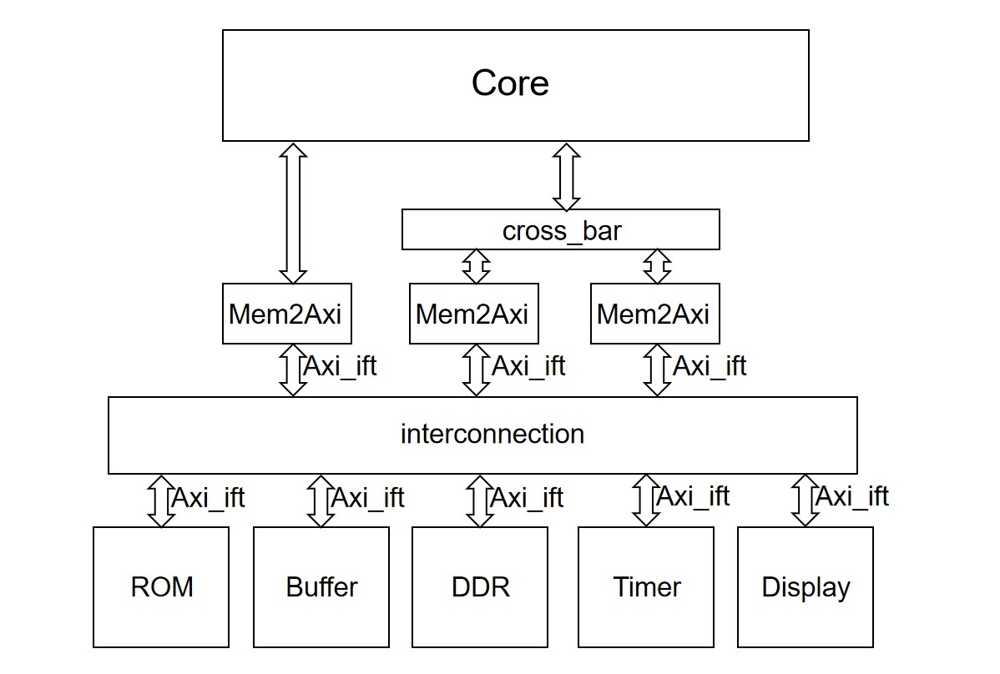

# 实验 0：综合实验

## 实验目的

- 学习 OS 在硬件层面的抽象
- 完善自己的 CPU Core，运行起自己编写的 binary 程序

## 实验环境

- **HDL**：Verilog SystemVerilog
- **IDE**：Vivado
- **开发板**：Nexys A7
- **软件辅助环境**：Ubuntu 20.04, 22.04

## 工具管理

为了方便同学们编译安装各类工具链，比如 spike、verilator 等，我们使用 gitsubmodule 机制管理这些工具链仓库。这些仓库被我们管理在 repo 文件目录下：
```
.
└── repo
    ├── Makefile
    ├── opensbi
    ├── patch
    ├── riscv-isa-cosim
    ├── riscv-openocd
    ├── sys-3-project
    └── verilator
```
* patch: 该文件夹是其他仓库在编译安装之前需要做的修改补丁，运行 makefile 编译这些仓库的时候会自动加入这些补丁
* Makefile: 用于编译安装各个工具链的脚本
* opensbi: 运行 make fw_jump 即可编译 opensbi 得到 fw_jump.bin 用于在 qemu、spike 模拟 kernel 的时候充当 sbi，编译得到的 fw_jump.bin 保存在 sys-3-project/spike 文件夹中
* riscv-openocd: 运行 make openocd 即可编译安装 openocd 到 /usr/local/bin 中
* riscv-isa-cosim: 运行 make ip_gen 得到差分测试需要的 ip 文件夹，部分同学因为是 mac 机器无法使用我们已经编译好的 ip 文件夹，这个时候可以运行 make ip_gen 自行编译；运行 make spike 编译安装 spike 模拟器
* verilator: 运行 make verilator 编译安装 verilator 工具
* sys-3-project: 实验依赖的其他代码，我们之后详细介绍

同学们如果想要编译某一个工具链，比如工具 openocd，首先运行`git submodule update --init repo/riscv-openocd`，该命令会将 riscv-openocd 仓库 clone 到 repo/riscv-openocd 文件夹，然后在 repo 文件夹下运行 make openocd 即可编译安装 openocd 工具。如果想要一次性同步所有的子模块，可以直接运行`git submodule update --init`，但是考虑到很多同学 clone 常常有困难，还是按需 git submodule 吧。

## 工程管理

为了方便同学们进行文件管理、也为了杜绝部分同学肆意修改提供的代码绕过测试点，我们在 sys2 的文件结构的基础上做了如下的调整，将我们提供的代码挪到了 sys-3-project 仓库，同学们需要先`git submodule update --init repo/sys-3-project`得到该仓库，然后才可以使用里面的代码进行后续编程，当前文件结构如下：
```
.
├── repo
│   ├── Makefile
│   ├── opensbi
│   ├── patch
│   ├── riscv-isa-cosim
│   ├── riscv-openocd
│   ├── sys-3-project
│   │   ├── general
│   │   ├── include
│   │   ├── ip
│   │   ├── sim
│   │   ├── spike
│   │   ├── syn
│   │   ├── tcl
│   │   └── testcode
│   │       ├── bootload
│   │       ├── compress_elf
│   │       ├── dummy
│   │       ├── kernel -> ../../../src/project/kernel
│   │       ├── link.ld
│   │       ├── Makefile
│   │       ├── mini_sbi
│   │       ├── rom
│   │       └── testcase
│   └── verilator
└── src
    ├── lab0
    │   ├── kernel
    │   │   └── lib
    │   │       ├── div.S
    │   │       ├── Makefile
    │   │       ├── muldi3.S
    │   │       └── riscv-asm.h
    │   └── submit
    │       └── Core.sv
    └── project
        ├── include
        ├── kernel
        ├── Makefile
        └── submit
```
### sys-3-project 文件结构介绍
sys-3-project 用于提供我们实现提供好的代码，并且按照代码的功能进行了分门别类：一方面同学们写的代码不会和我们提供的代码混在一起，方便同学们定位自己需要的代码，以及将注意力集中在自己编写的代码上；另一方面也防止部分同学擅自修改代码，来绕过我们的测试点。不同实验的代码都在这个仓库中，其中 lab0 的代码在分支 lab0 中，lab1 在分支 lab1 中，以此类推，大家可以运行`git checkout 分支名`切换到对应分支。

#### 硬件部分
* include: 提供的一些头文件
* general: 提供给同学们的既用于仿真、也用于综合的代码
* sim: 仅用于仿真的 v、sv、cpp 代码
* ip: 用于差分测试的 spike 静态链接库和头文件，和 sim 文件配合进行差分测试。当前 ip 文件夹提供的静态链接库是 x86 架构的，如果部分同学不是 x86 的机器，请在 repo 文件夹运行 make ip_gen 自行编译静态链接库
* spike: spike 模拟器运行测试 kernel 时充当 sbi 的 fw_jump.bin，也可以在 repo 文件夹运行 make fw_jump 自行编译
* syn: 仅用于综合的 v、xcd、ucf、sv 代码
* tcl: vivado 用于综合的脚本

#### 软件部分
* testcode/dummy: 空的 dummy.hex 文件，用于初始化不需要不需要初始化的内存
* testcode/rom: 不下板综合时使用，代码功能为从 0 地址跳入 0x80000000 地址，初始化 0-0x1000 的内存
* testcode/minisbi: 充当 kernel 运行时的 sbi，初始化 0x800000000-0x80200000 的内存
* testcode/kernel: Makefile 编译的时候自动产生，是一个指向同学们自己编写的 kernel 代码的软链接
* testcode/bootloader: 下板综合时使用，功能是将 0x10000-0x14000 存储的 minisbi，kernel 的内容载入到 0x800000000 的内存中，初始化 0-0x10000 的内存
* testcode/compress_elf: 用于将 minisbi、kernel 编译得到的 elf 压缩为初始化 0x10000-0x14000 的 elf.hex
* testcode/testcase: 初始化 0-0x1000 的内存，进行简单的功能测试

编译方式如下，不过多数时候不需要手动执行 Makefile 进行编译：
* 运行 make sim 得到 testcode/rom、testcode/minisbi、testcode/kernel 的编译结果，之后 rom.hex、dummy.hex、kernel.hex 用于分别初始化三块内存
* 运行 make board 得到 testcode/bootloader、testcode/compress_elf、testcode/minisbi、testcode/kernel 的编译结果，之后 bootloader.hex、elf.hex、dummy.hex 用于分别初始化三块内存
* 运行 make -C testcase TESTCASE=xxx，编译其中指定的测试样例，例如 TESTCASE=sample，编译 sample 文件夹的测试样例，得到 sample.hex，如果需要得到综合下板的测试样例，则运行 make -C testcase board TESTCASE=xxx，这样执行完毕可以顺利死循环在 pass 指令处

### 工作区管理

对于 lab0 而言，src/lab0 仅用于提供提供了需要补全的代码，或者需要使用的额外代码；src/project 是用于编译综合的工作区，project 文件夹哥哥文件夹作用如下：
* include: 用于存放用户自己编写的头文件
* kernel: 用于实现用户自己的 kernel 部分的代码，即 kernel 软件部分请在这个文件夹下实现
* submit: 用于实现用户自己的硬件部分代码，包括编写自定义模块和补全我们提供的模块
* Makefile: 编译综合的脚本

#### Makefile 脚本功能
* make verilator: 进行不下板仿真，执行 repo/sys-3-project/testcode 执行 make sim 得到的测试代码
* make boadr_sim: 进行下板仿真，执行 repo/sys-3-project/testcode 执行 make board 得到的测试代码
* make verilate_testcase: 进行不下板仿真，执行 repo/sys-3-project/testcode/testcase 执行 make 得到的测试代码
* make board_sim_testcase: 进行下板仿真，执行  repo/sys-3-project/testcode/testcase 执行 make board 得到的测试代码
* make wave: gtkwave 查看波形
* make bitstream: 生成 bit 流
* make vivado: 打开 vivado

希望这些脚本的改动可以方便大家编译安装工具、进行仿真测试、进行综合下板，不过更希望大家可以仔细阅读这些脚本，从中学习到更多的知识。如果大家有更好的管理方法来提高脚本的质量，也欢迎和助教们联系

## 框架改动

### 硬件部分

之前 sys2-lab6 的 FSM 给同学们带来了大量的困扰，为了方便同学们编程，也为了方便之后引入 cache，该框架移除了 FSM，并将解决结构竞争这个任务交给了 interconnect 模块。大家只需要将 core 的内存请求输入 Mem2Axi 模块和 crossbar 模块，此外 switch 导致的内存请求无效仍然需要实现（cache 引入后就不需要实现了）。

现在的硬件框架如下图：


### 软件部分

现在的 kernel 除了需要把内存、进程大小改小之外不需要做任何其他的功能调整了。

* rd time 问题已经在 CSRModule 模块加入了 mcounteren 寄存器解决了该问题
* m 指令扩展只需要将 src/lab0 的 kernel/lib 的内容拷贝到 src/project/kernel/lib 进行编译即可，该部分代码可以提供软件乘法
* bss 不能自动初始化为 0 的问题在 testcode/bootloader 中解决了

## 验收要求和其他实现细节

详见 sys2 的文档
