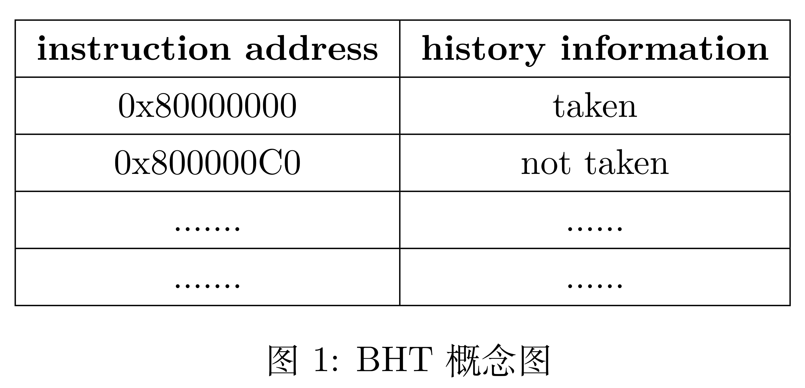
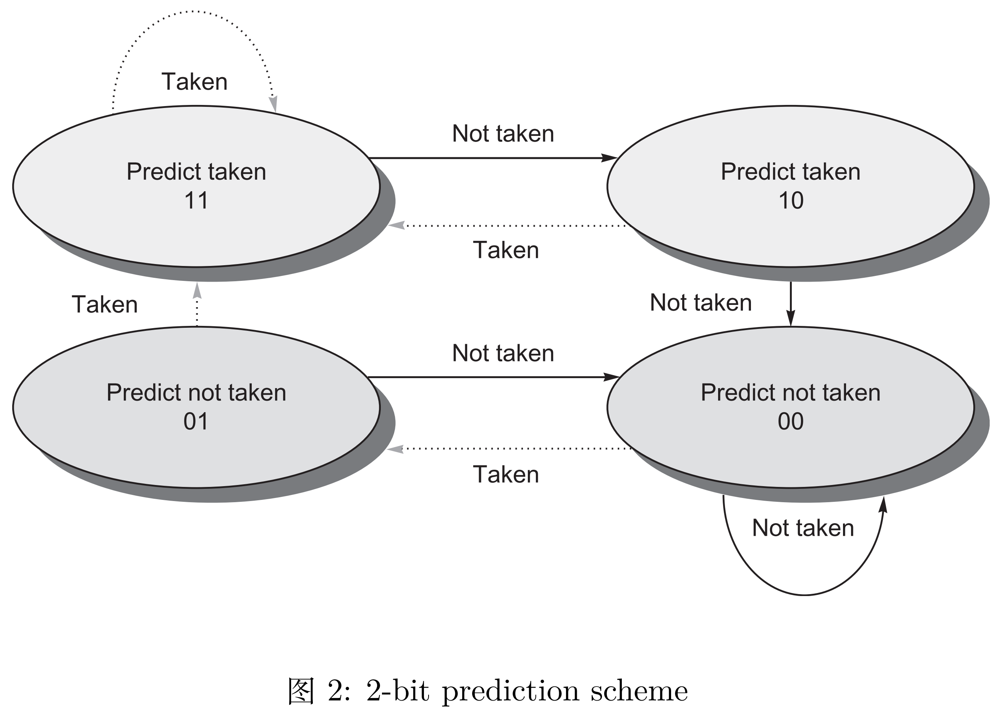
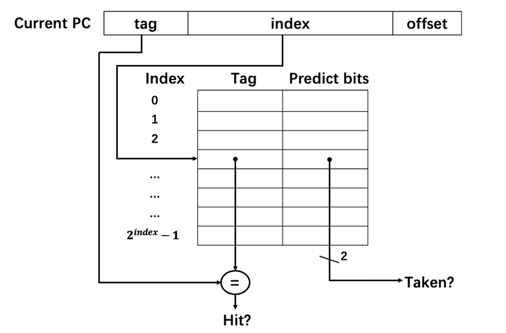
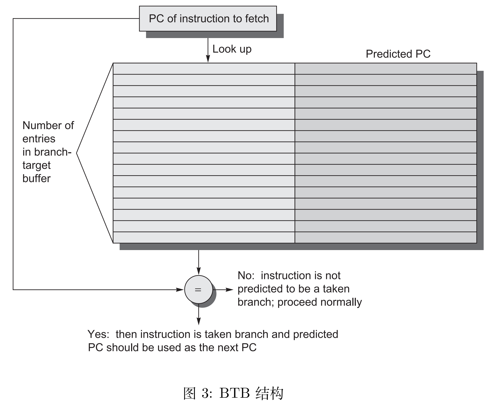
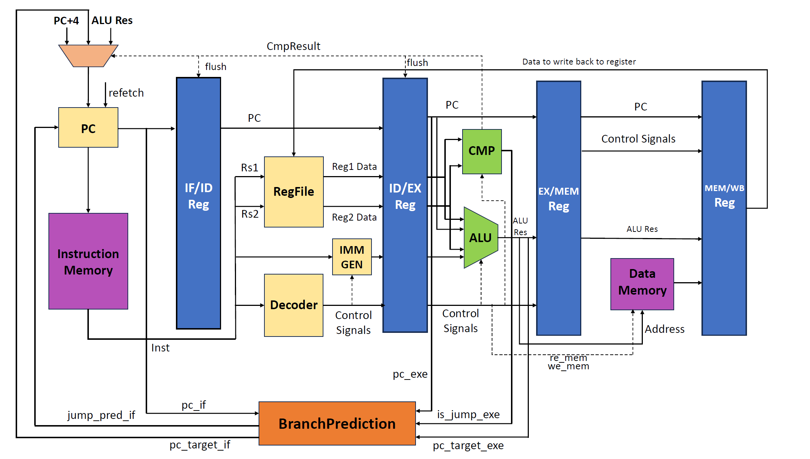
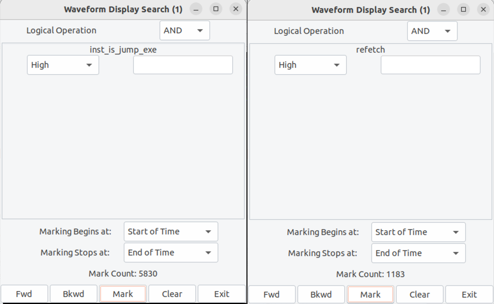

# 实验 1：动态分支预测

!!! info "26.03.11 发布、26.04.03 截止验收与提交（三周）"

## 实验目的

- 了解分支预测原理
- 实现以 BHT 和 BTB 为基础的动态分支预测

## 实验环境

- **HDL**：Verilog、SystemVerilog
- **IDE**：Vivado
- **开发板**：NEXYS A7 (XC7A100T-1CSG324C)

## 实验原理

### 动态分支预测

动态分支预测利用了运行时以往是否发生跳转的信息对未来的分支跳转进行预测。它会比 predict not taken 这样简单的静态分支预测要更加高效，准确率更高。本次实验需要大家实现 BHT 和 BTB 相结合的动态分支预测技术。

### BHT

branch-history table (BHT)，又名 branch-prediction buffer，它是一小块包含了跳转地址和历史跳转信息的 buffer。我们在遇到跳转指令的时候，通过对比之前保存在 buffer 中的跳转地址和相应的跳转信息来决定当前这条跳转指令是否应该发生跳转。buffer 基本信息如下图所示：



BHT 的跳转地址可以是完整的指令地址，也可以是 PC 的低地址部分（也就是相当于做了一个 hash）。历史信息最简单的形式是用 1-bit 来表示当前分支跳转指令之前有没有发生跳转，如果历史分支跳转是 taken 的话，那么当前的分支跳转指令也选择跳转。反之，亦然。当然，我们没有办法保证每次的分支预测都是正确的，如果遇到分支预测错误，需要重新 fetch 后面的指令，并修改 BHT 中的历史跳转信息。

本次实验我们会使用 2-bit 来表示历史跳转信息，从而提高预测的准确性。2-bit 的预测策略可以用一个状态机来表示，不过需要注意的是，这个状态机是保存在 BHT 中的每个表项中的，也就是说每一条分支跳转指令都会有一个 2-bit 的状态机来表示历史跳转信息。状态机如下图 2 所示：



由于存储空间有限，不能为全部的地址建立一个单独的表项，所以我们可以将地址中的低部分作为索引，然后将高部分作为 tag（用于确定该表项是否是该地址），来尽可能节省空间并降低冲突：



### BTB

看了 BHT 的基本介绍，大家可能会疑惑 BHT 中预测分支跳转是 taken 的情况下如何拿到跳转的目标 PC，BTB 就是来解决这一问题的。

branch-target buffer (BTB)，也叫 branch-target cache，用来保存预测的分支跳转目标地址。与 BHT 相结合，如果预测当前分支发生跳转，就根据当前的分支跳转指令的 PC，从 BTB 里拿到对应的目标跳转地址作为下一条指令地址。其基本结构就是一张 look-up table，如下图 3 所示：



可以看到，表的左边记录的是访问过的分支指令的 PC，表的右边记录的是分支指令的目标地址。每次 BHT 预测当前分支是 taken 的情况下，通过查 BTB 来获取分支指令跳转的目标地址，从而不会形成任何的 stall 或者 flush。在更新 BTB 所维护的表的时候，要注意每次记录的是 taken 的分支指令及对应的跳转目标地址，如果分支指令不 taken，也不需要记录，指令按顺序 fetch 下一条指令即可。

## 实验内容

### 环境准备

系统三延续了绝大部分系统二的环境配置，所以不需要有很多的环境配置操作，只需要把仓库克隆下来，编译一下 ip 核即可。
```bash
git clone https://git.zju.edu.cn/zju-sys/sys3/sys3-sp26.git
cd sys3-sp26
git submodule update --init repo/sys-project
git submodule update --init repo/riscv-isa-cosim
cd repo/sys-project
git checkout sys3-lab1
cd ..
make ip_gen
```

### 框架模块介绍

上述提到的 BHT 和 BTB 在本次实验中集成在了 BranchPrediction.sv 这一个模块中，两个表项都合在了一个结构中，现在还需要同学们补全 BTB 和 BHT 管理的状态机，以及将 BranchPrediction.sv 模块连接到流水线中，模块的接口和内部的数据结构介绍如下：

```SystemVerilog
module BranchPrediction #(
    parameter DEPTH      = 32,
    parameter ADDR_WIDTH = 64,
    parameter STATE_NUM  = 2
) (
    input                   clk,
    input                   rst,
    input  [ADDR_WIDTH-1:0] pc_if,          // The current PC，for indexing the table entrance
    output                  jump_pred_if,   // BHT predict to jump or not
    output [ADDR_WIDTH-1:0] pc_target_if,   // BHT gives the predicted target PC

    // The EXE phase carries out the confirmation and correction of jumps,
    // and the update of BHT and BTB
    input [ADDR_WIDTH-1:0] pc_exe,
    input [ADDR_WIDTH-1:0] pc_target_exe,   // The true target jump PC, for updating BTB
    input                  is_jump_exe,     // The true jumping result，for updating BHT
    input                  inst_is_jump_exe // The current whether a jump/branch instruction or not
);

    localparam INDEX_BEGIN = 2;
    localparam INDEX_LEN = $clog2(DEPTH);
    localparam INDEX_END = INDEX_BEGIN + INDEX_LEN - 1;
    localparam TAG_BEGIN = INDEX_END + 1;
    localparam TAG_END = ADDR_WIDTH - 1;
    localparam TAG_LEN = TAG_END - TAG_BEGIN + 1;

    typedef logic [TAG_LEN-1:0] tag_t;
    typedef logic [INDEX_LEN-1:0] index_t;
    typedef logic [STATE_NUM-1:0] state_t;
    typedef logic [ADDR_WIDTH-1:0] addr_t;

    typedef struct {
        tag_t   tag;
        addr_t  target;             // BTB: Jump target address
        state_t state;              // BHT: State bits
        logic   valid;
    } BTBLine;                      // BHT Line

    BTBLine btb       [DEPTH-1:0];  //BTB with BHT

    tag_t   tag_exe;
    index_t index_exe;
    BTBLine btb_exe;
    assign tag_exe   = pc_exe[TAG_END:TAG_BEGIN];
    assign index_exe = pc_exe[INDEX_END:INDEX_BEGIN];
    assign btb_exe   = btb[index_exe];


    tag_t   tag_if;
    index_t index_if;
    BTBLine btb_if;
    assign tag_if   = pc_if[TAG_END:TAG_BEGIN];
    assign index_if = pc_if[INDEX_END:INDEX_BEGIN];
    assign btb_if   = btb[index_if];

    //TODO: Fill your code here.

endmodule
```

使用该框架利用 BHT 和 BTB 进行分支预测的流程主要有：

- 在 IF 阶段进行预测，得到是否需要跳转以及预测跳转的目标地址，并进行取指
- 流过 ID 阶段
- 在 EX 阶段可以确定到底是否需要跳转
    - 如果是跳转指令且 BTB/BHT 表中没有对应项，则添加（state 00）
    - 针对跳转指令是否发生跳转更新 BTB/BHT 表项
    - 设计一个模块，在分支预测错误的情况下，通知 PC 切换为正确的地址。



### 实验要求

在本实验中，同学们需要在 src/project/submit 文件夹中添加 src/ 文件夹中给出的 BranchPrediction.sv 并完善该模块的设计，然后将模块接入流水线，实现动态分支预测并通过仿真测试。在验收过程中要**指出使用了 BTB 和 BHT 的跳转指令位置，展示 PC 的变化和 BHT 状态变化**。

!!! note
    如果对于给出的 BranchPrediction.sv 框架并不满意，同学们也可以完全自行设计动态分支预测的模块，只要能够实现 BHT 和 BTB 的功能即可。

### 测试方式

除了运行基础的 testcase 以及运行 kernel 之外，我们还提供了一个复杂程度介于二者之间的测试，即通过冒泡排序和选择排序来测试分支预测的正确性。

执行

```bash
make verilate_sort
```

即可运行排序测试。正确情况下 `make verilate_sort 2>/dev/null` 你应该可以看到：

```text
...
2 12 14 6 13 15 16 10 0 18 11 19 9 1 7 5 4 3 8 17
0 1 2 3 4 5 6 7 8 9 10 11 12 13 14 15 16 17 18 19
7 3 0 13 2 6 5 9 10 4 18 11 14 16 1 17 19 15 8 12
19 18 17 16 15 14 13 12 11 10 9 8 7 6 5 4 3 2 1 0
[+] sort test succeed!
[error] PC SIM 0000000000000000, DUT 0000000080000618
...
```

将 sys2 project 中的 kernel 拷贝到 sys3 project 中，执行

```bash
make kernel 2>/dev/null
```

即可运行上学期编写的操作系统。

!!! abstract "本实验中你需要完成"

    1. 完善 BranchPrediction.sv 模块的设计，将其接入流水线中
    2. 仿真通过排序测试（`make verilate_sort`），通过最多可获得此次实验的一半分数
    3. 成功运行 kernel (`make kernel`)，通过最多可获得此次实验的全部分数

> 需要注意的是，如果无法完全完成本次实验，只完成 BranchPrediction.sv 模块但没有接入流水线或者只上交实验报告也是可以拿到部分分数的。请同学们不要完全放弃本次实验。

## 思考题

1. 在报告里分析排序测试中分支预测成功和预测失败时的相关波形
2. 分析并呈现自己的 Core 中 pc 相关更新逻辑
3. 修改分支预测器中状态预测的比特数，比如从 2 比特改为 1 比特，或者 3 比特。然后修改相应的分支预测逻辑，计算分支预测的成功率。尝试探讨分支预测成功率和分支预测状态比特数的关系，并给出你的结论。

> 在 `verilate_sort` 测试中计算成功率即可

hint：统计运行的指令条数可以在 GTKWave 中对信号的高电平进行搜索计数。

- 选中一个信号，点击 Search；
- 选中 Pattern Search 1；
- 在选项中将“Don't Care”改为“High”；
- 点击 Mark



如图，分支预测进行了 5830 次，其中有 1183 次分支预测出现了错误。成功率为

$$
(5830-1183)/5830=79.70\%
$$

4. 间接跳转与分支预测器的局限性

考虑如下一段程序，函数 `foo` 在三处不同位置被调用：
```asm
0x100: JAL  x1, foo      # call site A，返回地址 = 0x104
...
0x200: JAL  x1, foo      # call site B，返回地址 = 0x204
...
0x300: JAL  x1, foo      # call site C，返回地址 = 0x304
...
foo:
    ...
0x500: JALR x0, x1, 0   # ret
```

请回答以下问题：

(1) 分析上述 `ret` 指令（`JALR x0, x1, 0`）在 BTB 中对应几个表项？程序按 A→B→C 顺序依次调用 foo 时，每次 ret 的 BTB 预测结果分别是什么？预测准确率如何？

(2) 对比 `JAL x1, foo` 这类直接跳转指令，说明为什么 BTB 对 ret 的预测效果存在结构性局限，其根本原因是什么？

(3) 针对上述局限性，工业界在微架构层面提出了一种专用硬件结构 Return Address Stack 来解决此问题。请描述该结构的工作原理（push/pop 时机、存储内容），并分析其相比 BTB 预测 ret 的优势，以及该结构自身的局限性。

!!! tip "注意保留自己 系统II综合实验 的硬件部分代码"

## 实验提交

请在学在浙大上的report和验收入口分别提交以下文件：

- 实验报告（.pdf）
- submit 文件夹压缩包 (.zip)
