# 实验 2：Cache

!!! info "25.03.19 发布、25.04.09 截止验收与提交（三周）"

!!! warning
    在开始本实验前，请务必备份一份 lab1 或者系统二综合实验的代码，用于对比 cache 的效果，以及减轻同学们后面 lab6 实现 MMU 的负担（ 否则大家就要在加 cache 的前提下写 MMU 了，实验指导的版本是没有加 Cache 的，需要自行设计噢 ）

## 实验目的

- 理解 cache 在 CPU 中的作用
- 了解 cache 与流水线和内存的交互机制
- 理解存储层次（Memory Hierarchy）

## 实验环境

- **HDL**：Verilog、SystemVerilog
- **IDE**：Vivado
- **开发板**：Nexys A7

## 实验原理

### Cache 模块

Cache 作为 CPU 和内存之间的存储结构，能够利用其速度快、容量小的特点，在速度相差较大的两种硬件之间，起到协调两者数据传输速度差异的作用，是 CPU 存储层次中的重要组件。

对于整个 Cache 模块的结构和功能，下图以 D-Cache 为例给出一种参考设计，总体来说 Cache 内部可以再细分至控制模块（橙色）和存储模块（绿色）两个子模块。

- 控制模块负责维护用于管理 Cache 状态的有限状态机，同时对 Cache 同上层 CPU 与下层 Memory 的交互起到调控作用
- 存储模块中则是 Cache 中存储的实际内容，一般为了保证 Cache 功能的正确实现，每个 Block 还需要辅助 Tag（地址高位）、V（有效位）、D（脏数据）等信息进行管理

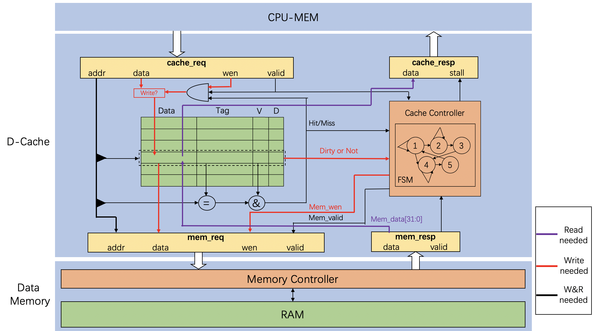

### Cache 存储

我们的 cache 存储实现在 lab2 文件夹的 CacheBank 模块中，定义的数据结构如下：

```Verilog
typedef logic [TAG_LEN-1:0] tag_t;  
// tag 数据类型，address 的最前端部分，为 address[TAG_END:TAG_BEGIN]
typedef logic [INDEX_LEN-1:0] index_t;    
// index 数据类型，address 中充当 cacheline 索引的部分，为 address[INDEX_END:INDEX_BEGIN]，大小等于 LINE_NUM
typedef logic [OFFSET_LEN-1:0] offset_t;
// offset 数据类型，address 中充当 cacheline 内部 quadword 索引的部分，为 address[OFFSET_END:OFFSET_BEGIN]，大小等于 BANK_NUM
typedef logic [BANK_NUM*DATA_WIDTH-1:0] data_t;

typedef struct {
    logic  valid;   // valid 位，当 cacheline 内容有效的时候等于 1，无效时等于 0
    logic  dirty;   // dirty 位，当 cacheline 数据有效且被写入的时候等于 1，未被写等于 0，数据无效则无所谓，配合 write back 策略
    logic  lru;     // lru 位，当 cacheline 这个 way 最近被访问时等于 1，另一个 way 最近被访问时等于 0，配合二路组关联策略
    tag_t  tag;     // tag 位，地址中的 tag 部分
    data_t data;    // data 位，存储的数据
} CacheLine; // 一路 cacheline

CacheLine set [1:0][LINE_NUM-1:0];
// 二路组相联策略，有两个 way 的 cache，每个 cache 有 LINE_NUM 个 cacheline
```

之后是这五个数据结构的有限状态机，大家编程之前最好自己仔细阅读，以免调试遇到问题。配合执行的策略是：

- **二路组相联：**一个 index 对应两个 cacheline，可以优先减少因为 index 地址冲突导致的 cache 失配

- **write alloc：**写失配时将数据从内存载入 cache，便于之后多次读写该数据的时候可以从内存得到数据

- **write back：**写命中时仅修改 cache，当 cacheline 被挤出 cache 时写回内存，避免每次写数据的时候都写内存

- **read 优先：**当发生 write alloc 需要将 cacheline 挤出 cache 并且将脏数据写回内存时，首先将数据载入 cache、同时将被挤出 cache 的数据暂存到 cache buffer，然后将被挤出 cache 的数据写回内存，这样 piepline 读 cache 的数据和 CMU 将数据写回内存可以并行，pipeline 无需等待 cache back 的时间，提高执行效率

该模块的各个输入输出作用如下：

```Verilog
module CacheBank #(
    parameter integer ADDR_WIDTH = 64,  // 地址线路的宽度
    parameter integer DATA_WIDTH = 64,  // 数据线路的宽度
    parameter integer BANK_NUM = 4,     // 一个 cacheline 的 word 个数
    parameter integer CAPACITY = 1024   // cache 可以存储的最大字节数
) (
    // 来自 core 的数据请求
    input clk,
    input rst,

    input   CorePack::addr_t  addr_cpu,     // 需要读写的地址信号
    input   CorePack::data_t  wdata_cpu,    // 需要写入的数据
    input                     wen_cpu,      // 写使能信号
    input   CorePack::mask_t  wmask_cpu,    // 写使能配套的字节使能信号
    input                     ren_cpu,      // 读使能信号
    output  CorePack::data_t  rdata_cpu,    // 读到的数据输出
    output                    hit_cpu,      // 是否命中

    // 如果有数据需要写回，这组信号将写回数据送入 write back buffer
    output  CorePack::addr_t          addr_wb,     // 写回数据的地址
    output  [BANK_NUM*DATA_WIDTH-1:0] data_wb,     // 写回数据的地址的内容，直接一个 cacheline
    input                             busy_wb,     // write back buffer 回应是否忙
    output                            need_wb,     // 向 write back buffer 发送将 write back buffer 内容写回内存请求

    // cache 将自己需要读入的数据信息和要被载入的 cacheline 信息给 CMU
    output  CorePack::addr_t  addr_cache,	// cache 告知 CMU 失配数据的地址
    output                    miss_cache,	// cache 告知 CMU 发生了失配
    output                    set_cache,	// cache 告知 CMU 需要写入的 way 的编号
    input                     busy_rd,		// CMU 告诉 cache 自己是否忙碌
    input   CorePack::addr_t  addr_rd,		// CMU 告诉 cache 自己从内存读入数据的地址
    input   CorePack::data_t  data_rd,		// CMU 告诉 cache 自己从内存读入数据的值
    input                     wen_rd,		// CMU 告诉 cache 自己要修改对应 cachline 的值
    input                     set_rd,		// CMU 告诉 cache 自己要修改的 cache way 的编号
    input                     finish_rd,	// CMU 告诉 cache 自己完成了所以的读操作，一个 cacheline 载入完毕
    input                     switch_mode	// 切换特权态 switch_mode 信号
);
```

### Write Back Buffer

如果没有 write back buffer，那么当某次失配发生，载入的数据需要将 cacheline 的脏数据挤占的时候，CMU 的操作一般如下：

1. 将需要被载入的 cacheline 中的脏数据写回 memory，这个过程需要多次写内存操作，每个操作需要多个周期
2. 将需要载入的数据从 memory 读入 cacheline，这个过程需要多次读内存操作，每个操作需要多个周期

步骤一和步骤二都需要 pipeline 进行等待。而如果有了 write back buffer，上述过程如下：

1. 将被挤占的脏数据写入 write back buffer，这个过程可以一个周期完成
2. 将需要载入的数据从 memory 读入 cacheline，这个过程需要多次读内存操作，每个操作需要多个周期
3. 将 write back buffer 中的脏数据写回 memory，这个过程需要多次写内存操作，每个操作需要多个周期

pipeline 仅需要等待步骤一和步骤二，然后就可以继续工作，无需等待步骤三，这个等待的开销比之前少了一半。

write back buffer 定义在 CacheWriteBuffer 模块中，接口定义如下：

```Verilog
module CacheWriteBuffer #(
    parameter integer ADDR_WIDTH = 64,
    parameter integer DATA_WIDTH = 64,
    parameter integer BANK_NUM   = 4
) (
    // 和来自 CacheBank 的数据交互，载入 cachebank 的脏数据
    input clk,
    input rstn,

    input  CorePack::addr_t addr_wb,          // cachebank 脏数据的地址
    input [BANK_NUM*DATA_WIDTH-1:0] data_wb, // cachebank 脏数据的内容
    output busy_wb,                          // 告诉 cachebank 自己是否被占用
    input need_wb,                           // cachebank 表示自己有脏数据需要写入
    input miss_cache,                        // cachebank 表示自己发生了失配，miss_cache=1 的时候 need_wb 才有意义

    // 和 CMU 交互，将数据发送给 CMU 写入内存
    input [$clog2(BANK_NUM)-2:0] bank_index, // CMU 写回数据时向 writebackbuffer 请求要写回第几个 subword
    output CorePack::addr_t addr_mem,        // 提供需要写回的地址，地址仅到 index 部分，不包括 offset
    output CorePack::data_t data_mem,        // 提供需要写回的数据
    input finish_wb                          // CMU 告知 writebackbuffer 写回完毕，write back buffer 再次空闲 
);
```

### Cache 控制逻辑

Cache 的基本结构、映射方式以及写策略等方面的内容在理论课程中已有详细的描述，但在实际实现中，cache 的复杂行为一般由专门的控制模块进行管理，被称作 CMU。CMU 实质上是把 cache 中的状态机部分与 CPU 和 Memory 的交互部分独立出来，作为一个控制单元，控制数据的处理，CMU 基本的架构与交互模式如下图所示：

<div style="text-align: center; margin-top: 0px;">

</div>

对于 CMU 的控制逻辑，一般可以采用状态机的模式来管理，下图给出了一种可行的状态机类型。该状态机针对 write back 策略进行实现，将 Cache 的行为归纳为 3 个状态。该部分 CMU 并没有专门提供模块封装，大家可以在 Cache 中直接实现，也可以选择单独封装出一个 CMU 模块。Cache 总体的模块关系如下：

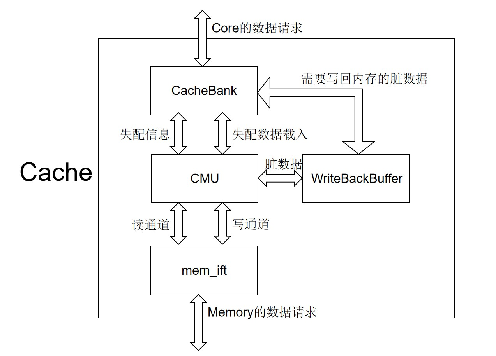

#### 初始化 IDLE 状态

该状态表示有限状态机处于空闲状态不工作。

1. 如果 cacheback 检查未失配，有限状态机保持 IDLE 状态，不发出任何控制信号。
2. 如果 cachebank 检查失配，cachebank 发送给 write back buffer 的脏数据信号载入 write back buffer，cachebank 发送给 CMU 的载入数据信号载入 CMU 的寄存器，进入 READ 状态，rd_busy 变为 1。

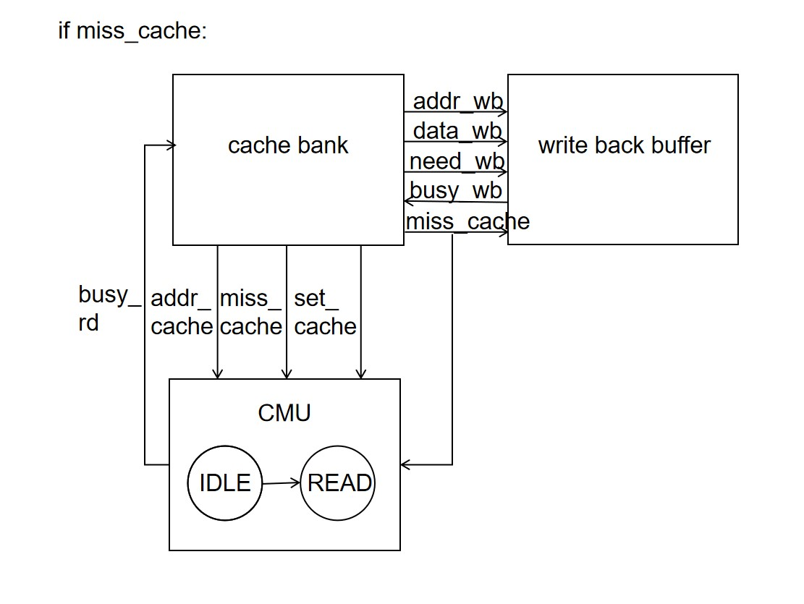

#### 读事务执行 READ 状态

该状态根据 IDLE->READ 载入 CMU 的地址，将数据写回 addr。这里我们的 cache 的 word 是 64 位，但是 cacheline 是 256 位，所以我们要分四次读取内存中的数据。然后开始如下操作流程：

1. 将变量 count 初始化为 0

2. 将 cacheline 要读的地址通过 dmem_ift 传递给总线，发送读请求

3. 等待 dmem_ift.r_reply_valid=1，得到需要的第一个 64 位数据
  
    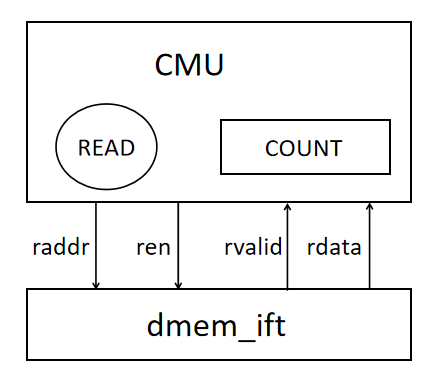
    
4. 根据 CMU 在 IDLE->READ 时候载入的写入 cacheline 的 set、addr，将读到的数据写入 cache（CacheBank中完成，只需要接对对应线即可）

5. count++，再重复执行上述操作四次，直到一个 cacheline 读完，发送 finish_rd

    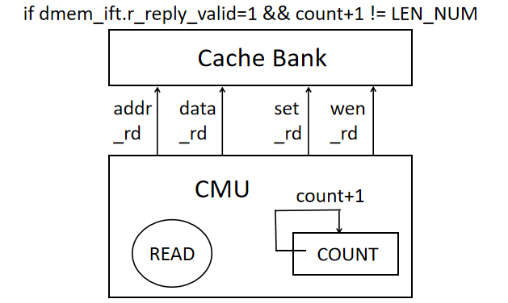

6. 看 write back buffer 是不是 busy，是的话进入 WRITE 状态开始将脏数据写回 memory，不是的话返回 IDLE 状态，完成一次 cache 失配处理，rd_busy 变为 0。

    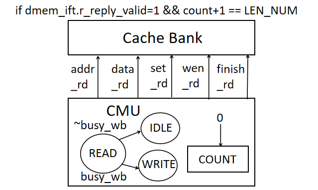

#### 写事务执行 WRITE 状态

该状态将 write back buffer 的数据写回 memory，然后开始如下流程：

1. 将变量 count 初始化为 0

2. 向 write back buffer 请求要写的地址通过 dmem_ift 传递给总线，发送写请求
  
    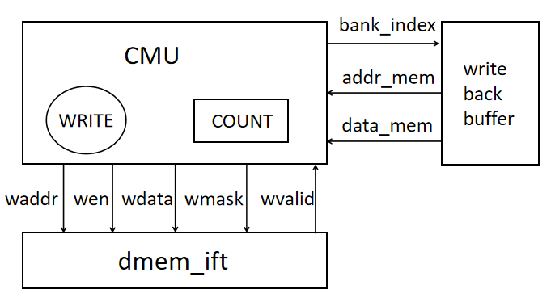
    
3. 等待 dmem_ift.w_reply_valid=1，第一个 64 位数据写入内存完毕

    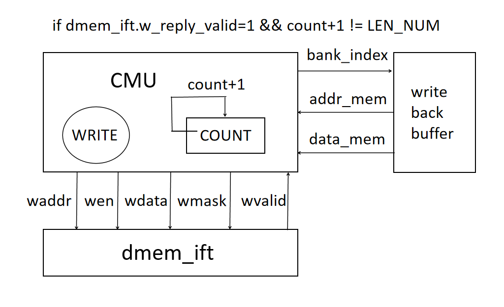

4. count++，再重复执行上述操作四次，直到一个 cacheline 写完，发送 finish_wb

5. 返回 IDLE 状态

    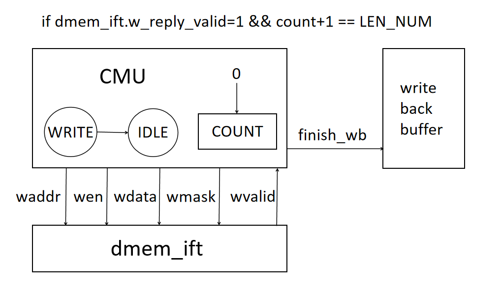

### cache 的完整结构

Cache 模块定义在 Cache.sv 中，需要同学们完善其中的 CMU

```verilog
module Cache #(
    parameter integer ADDR_WIDTH = 64,
    parameter integer DATA_WIDTH = 64,
    parameter integer BANK_NUM   = 4,
    parameter integer CAPACITY   = 1024
) (
    // 来自 core 的数据请求
    input                     clk,
    input                     rst,
    input   CorePack::addr_t  addr_cpu,     // 需要读写的地址信号
    input   CorePack::data_t  wdata_cpu,	// s型指令需要写入的数据
    input                     wen_cpu,		// 写使能信号
    input   CorePack::mask_t  wmask_cpu,	// 写使能配套的掩码信号
    input                     ren_cpu,		// 读使能信号
    output  CorePack::data_t  rdata_cpu,	// 读到的数据输出
    output                    hit_cpu,		// cache 是否命中
    output                    ren_mem,		// 发生写失配时从内存读取 miss 的 cacheline 的读使能信号
    output                    wen_mem,		// 需要将 write back buffer 中内容写回内存的写使能信号

    output    CorePack::addr_t   raddr_out,	// 发生写失配时从内存读取 miss 的 cacheline 的地址
    output    CorePack::addr_t   waddr_out,	// 需要将 write back buffer 中内容写回内存的地址
    output    CorePack::data_t   wdata_out, // 需要将 write back buffer 中内容写回内存的数据
    output    CorePack::mask_t   wmask_out, // 将 write back buffer 中内容写回内存的掩码信号
    input     CorePack::data_t   rdata_in,	// 总线传回的读取的内容
    input                        wvalid_in,	// 总线给出的写操作完成信号
    input                        rvalid_in, // 总线给出的读操作完成信号
    input                        switch_mode // 切换特权态的信号        
); 
```


* Core 的 IF、MEM 读写请求发送到 icache 和 dcache，icache、dcache 根据需要将读写请求转发给总线，进而发送给 memory
  
    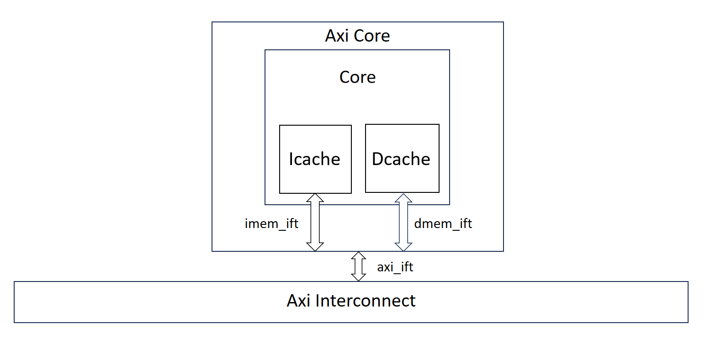
    
* 顶层为 Icache、Dcache 负责向上接受来自 core 的 IF、MEM 数据请求，向下向 memory 发送读写请求，作用是将来自 IF 和 MEM 的不同的数据请求格式和 cache 可以处理的数据请求格式做转换
  
    其中 Icache 结构如下，传入需要读取指令的 pc 及相关信息，并从中返回 inst
    
    ```verilog
    module Icache #(
        parameter integer ADDR_WIDTH = 64,
        parameter integer DATA_WIDTH = 64,
        parameter integer BANK_NUM   = 4,
        parameter integer CAPACITY   = 1024
    ) (
        input                   clk,
        input                   rst,
        input  CorePack::addr_t pc,
        input  CorePack::data_t imem_data,        // 总线中取出的指令
        input                   switch_mode,
        input                   rvalid_in,		  // 总线完成 read 的 valid 信号
    
        output CorePack::inst_t inst,			      // 输出 pc 对应的 inst
        output CorePack::addr_t icache_request_addr,  // icache miss后需要去内存取指令的地址，由内部 cache 给出
        output                  hit_icache            // icache 是否命中
    );
    ```
    
    
    
    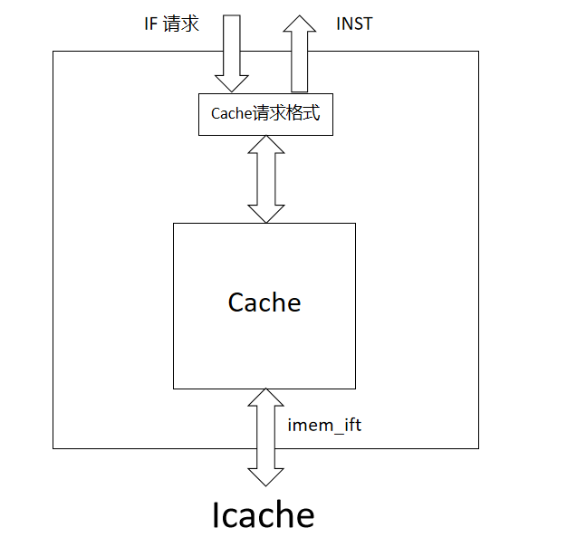
    
    Dcache 结构如下，实现在 Dcache.sv 中，其输入与 Cache 模块输入相同，但是增加了一个旁路，用于判断访存地址是否为 mmio 的映射地址，即在系统二综合实验提及的 mtime、mtimecmp、uart 等地址，访问这些特定地址的内存即可实现读取时钟以实现时钟中断、以及输入、输出等功能。而对于这些地址的访问，不能由 cache 存储，需要直接通过总线访问，所以我们需要在 dcache 中先进行地址判断，若为特殊地址，则直接输出给总线访问，否则正常访问 cache
    
    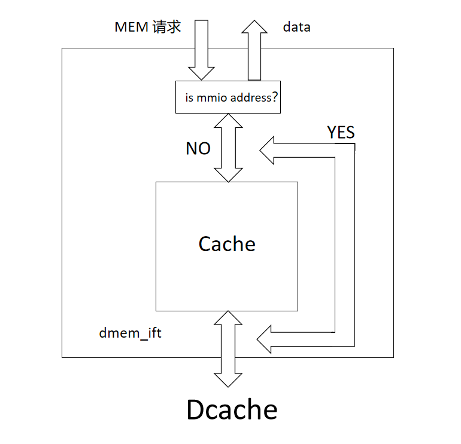
    
* Cache 处理 cache 请求
    
    
* Icache 和 Dcache 是完全参数可配置的，可以根据自己的需要配置参数

## 实验要求

在 lab2 文件中添加了新增的 cache 相关模块的文件，其中已经实现了大部分 cache 相关的模块。因为在以往的框架中有关内存读写与总线交互的状态机是由同学们自己实现的，所以本次实验添加的 cache 和大家自己的 Core 模块（尤其是总线交互的模块）关系较大，同学们需要注意各个模块的耦合性，同时同学们为了匹配自己的 Core 模块，可以修改提供的相关模块，只需能够通过仿真测试即可。

!!! note
    当然，对于追求挑战或者对于给定框架不满意的同学，也可以在之前实验的基础上完全自行设计 Cache 相关部分，但最终目标肯定是要体现出带有缓存的优越性。

### Cache模块的完善

提供的 Cache.sv 文件中包含了 CacheBank 和 WriteBackBuffer 两个模块，你需要通过前面介绍的状态机，实现 Cache 的 CMU 模块，CMU 并没有专门提供模块封装，大家可以在 Cache 中直接实现，也可以选择单独封装出一个 CMU 模块

### Core模块接入Cache

本次实验添加的 cache 和大家自己的 Core 模块（尤其是总线交互的模块）关系较大，我们需要修改 Core 中的一些接线以正常运行 Cache，为了方便大家修改代码，下面列出一些可能相关的需要改动的地方**（并不一定覆盖所有的情况，请根据自己的 Core 修改，仅供参考！！）**

**Core 与总线交互的状态机：**由于 Cache 的接入，根据 pc 取 inst 不再需要直接接入总线，取而代之的是将 pc 接入 Icache 中，当未命中时再通过总线读取指令相关内存，访存也是类似的状况。所以之前控制访问内存的状态机的 input 应该由 core 中的 pc，alu_res 等信号变为 cache 的 output，即 cache 给出访问哪个地址 miss 了，以及读取和写回的使能信号（具体信号见前面Cache的介绍）。

同时与总线交互的状态机可以不需要大改，但是由于加入了cache，流水线不再像之前一样需要几个周期才能取出一个指令执行，也不需要一直访存和取指令，所以IDLE状态时有可能发生 icache miss 或者 dcache miss ，不再是直接进入 IF1 状态，更多的改变则要根据同学们自己的状态机修改~

**Forwarding模块：**由于流水线不再像之前一样需要几个周期才能取出一个指令执行，而是一个周期执行一个指令，之前的 forwarding 模块由于测试样例过于简单，以及总线的特殊性，其实并不能有效的处理指令冲突。下面列出了运行 kernel 需要考虑到的更多情况（并不完整，仅供参考）
csr指令的forwarding，load-use情形的forwarding，exe阶段是j型指令的前递（需要前递 pc+4，而不是 alu_res）……

……


!!! tip
    同样，如果无法完全完成本次实验，只完成 Cache 模块但没有正确通过仿真测试，或者只上交实验报告写出了自己的理解也是可以拿到部分分数的。请同学们不要完全放弃本次实验。

### 关于测试

本次实验我们仍然可以使用 lab1 中的排序测试，但是该测试只能测试到 icache 和一部分dcache（测试不到需要写回内存的情况），所以除了通过 verilate_sort 外，本次实验要求成功运行 kernel，考虑到 lab1 可能一部分人没跑过kernel，本次实验可以用未添加分支预测的 cpu 完成，即系统二综合实验时完成的代码。

执行

``` 
make kernel
```

运行 kernel ，运行 `make kernel 2>/dev/null` 查看具体现象，要求看到进程切换

!!! tip
    make kernel 是正常编译，并将程序的执行流（指令）输出出来，这些指令的输出方式是以错误流输出，而 make kernel 2>/dev/null 或者 make kernel 2>log 将标准错误流重定向到空或者文件里，就可以看到之前软件实验中编写的操作系统的输出

!!! abstract "本实验中你需要完成"

    1. 同步框架代码，理解其中 CacheBank 模块的设计
    2. 完成 Cache.sv 模块的设计
    3. 成功**仿真通过排序测试**（`make verilate_sort`）和**运行 kernel**
        - 只通过排序测试只能获得一半分

## 思考题

1. 画图（推荐）或通过文字描述展示出你对于 CacheBank 模块的理解
2. 展示测试中遇到的 cache hit、miss、write back 的波形图，并分析消耗的周期数
3. 计算自己的 CPU 在启用 cache 前后（利用 lab1 代码）运行排序测试的整体 CPI 并进行比较
    - 本次实验中应该无法通过 GTKWave 对 cosim_valid 高电平进行搜索来对指令进行计数，需要你自行修改代码来计数

        !!! tip "Hint"
            lab1 中方法失效的原因是带有缓存后执行效率提高巨大，可能连着两个及以上周期 cosim_valid 都是高电平，所以无法直接通过搜索计数。

            可以修改 sys-project/sim/testbench.sv 仿真顶层文件，仿照 cnt（周期记数）进行 cosim_valid 的计数，并通过 display 输出到终端，也可以在此时同时计算出 CPI。

## 实验提交

请在学在浙大上提交以下两份文件：

- 实验报告（pdf）
- project 文件夹压缩包（打包前 `make clean` 清除编译产物）
