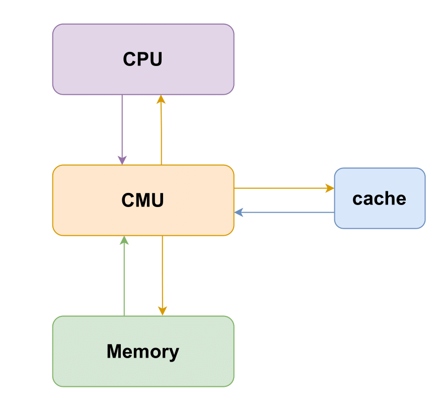
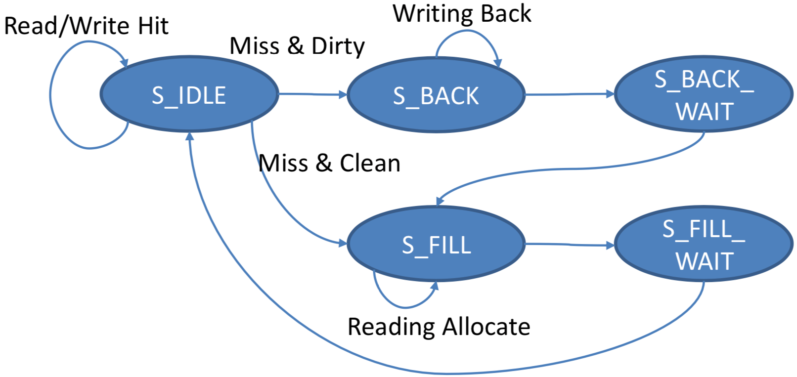
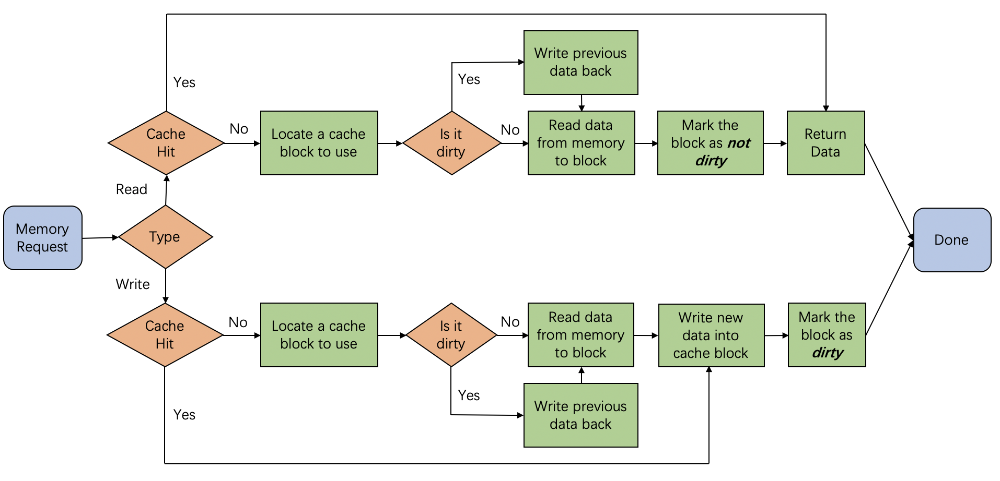
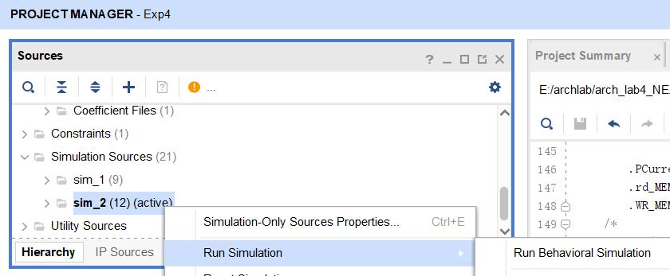
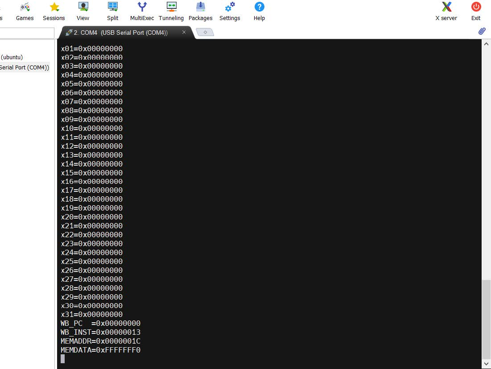

# 实验 2：Cache

## 1. 实验目的

- 理解cache在CPU中的作用。
- 了解cache与流水线和内存的交互机制。
- 理解存储层次（Memory Hierarchy）。

## 2. 实验环境

- **HDL：** Verilog。
- **IDE：** Vivado。
- **开发板：** Nexys A7。

## 3. 实验原理

### 3.1 Cache模块

Cache作为CPU和内存之间的存储结构，能够利用其速度快、容量小的特点，在速度相差较大的两种硬件之间，起到协调两者数据传输速度差异的作用，是CPU存储层次中的重要组件。

对于整个Cache模块的结构和功能，下图以D-Cache为例给出一种参考设计，总体来说Cache内部可以再细分至控制模块（橙色）和存储模块（绿色）两个子模块。控制模块负责维护用于管理Cache状态的有限状态机，同时对Cache同上层CPU与下层Memory的交互起到调控作用。存储模块中则是Cache中存储的实际内容，一般为了保证Cache功能的正确实现，每个Block还需要辅助Tag（地址高位）、V（有效位）、D（脏数据）等信息进行管理。

附表中给出了一个cache模块接口的列表，对各信号的功能和位宽进行了说明，在实现中可参考此表根据流水线的功能和需求进行设计和调整。对于I-Cache，本次实验中不考虑写指令的情况，因此只选取D-Cache中的"读通路"部分即可完成相应实现。

### 3.2 Cache控制逻辑

Cache的基本结构、映射方式以及写策略等方面的内容在理论课程中已有详细的描述，但在实际实现中，cache的复杂行为一般由专门的控制模块进行管理，被称作CMU。CMU实质上是把cache中的状态机部分与CPU和Memory的交互部分独立出来，作为一个控制单元，控制数据的处理，CMU基本的架构与交互模式如下图所示。

对于CMU的控制逻辑，一般可以采用状态机的模式来管理，下图给出了一种可行的状态机类型。该状态机针对Write-Back策略进行实现，将Cache的行为归纳为5个状态，各个状态的功能为描述如下：

1. S\_IDLE：cache正常读写，即Load/Store命中或者未使用Cache。
2. S\_BACK：发生cache Miss，且被替换块中存在脏数，此时需要对脏数据先进行写回。
3. S\_BACK\_WAIT：写回等待阶段，完成后自动跳转至S\_FILL状态。
4. S\_FILL：发生Cache Miss或者写回已经完成，目标位置上不存在脏数据，可以直接从Memory中取回数据进行替换。
5. S\_FILL\_WAIT：填充等待阶段，完成后表示目标数据已经加载到Cache中，自动跳转至S\_IDLE状态。

上述状态要遵循的基本逻辑流程与下图相同。总体来说，Cache处理的事务主要包括：读、写、替换。

## 4. 实验要求和步骤

### 4.1 实验要求

关于cache读/写策略可以参考这里：

- [Cache (computing) - Wikipedia](https://en.wikipedia.org/wiki/Cache_(computing)#Writing_policies)

关于cache替换策略可以参考这里：

- [Cache replacement policies - Wikipedia](https://en.wikipedia.org/wiki/Cache_replacement_policies)

#### 4.1.1 使用原创架构

1. 功能要求：在Lab 1的工程基础上，创建新的模块完成本次实验，本次实验要求实现I-Cache和D-Cache两个模块，每个Cache的基本要求为：**直接映射，write-back策略，write-allocate策略。Block中数据块大小为1 word（4B），单个Cache总大小512B**；内存基本要求：**两个8KB的BRAM，采用哈佛架构，指令内存和数据内存相互独立，均从0x0开始编址**。
2. 实现要求：在实现中cache存储单元可以使用寄存器堆或者生成IP核Block RAM进行构建，内存模块请修改传入的`mem_clk`的值调整为CPU周期的八倍，以达到分频延时的目的，也可使用所提供的增加了分频时钟的内存模块LatencyMemory。

#### 4.1.2 使用给定架构

1. cache要求使用write-back和write-allocate策略
2. CMU要求使用LRU策略

### 4.2 实验步骤

#### 4.2.1 使用原创架构

1. 基于lab1的实现，添加相应的cache模块。
2. 进行cache内部交互逻辑的实现。
   - 该部分逻辑可分为与流水线的交互和与内存的交互两个方面，需要考虑各自的交互关系。Cache的访存可能会对流水线的时序正确性产生影响，需要利用Stall机制保证流水线功能的正确性。较为简单的处理方法为：约定在访存完成前 MEM 段之前的流水段必须被 stall，如果遇到访存延迟与数据冒险在流水线内同时发生的情况，还需根据设计的流水线对处理优先级进行规定，相关设计请在报告中详细描述。
   - 如果感觉一步完成实现较困难的话，可以分步进行实现。例如，在cache模块中，可以先实现一个仅包含一个寄存器的存储模块，在此基础上实现cache的控制与交互逻辑；在上一步的基础上，再实现更大的缓存模块。另外，在实验过程中可以先实现一个较为简单的I-Cache，然后在此基础上添加功能以实现D-Cache。
   - 在缓存模块以及访问内存时，需要注意Block RAM的访问时一般会有一个周期的延迟。
3. 进行仿真与上板测试。

#### 4.2.2 使用给定机构

1. 理解所给代码框架的cache和CMU模块
2. 补全cache和CMU模块的代码
3. 在给定的SoC中，加入自己的CPU，通过仿真测试和上板验证

### 4.3 验收要求

#### 4.3.1 使用原创架构

CPU应能够正确运行所提供的汇编文件[`lab2.asm`](https://gitee.com/computer_architecture_cr_zju/sys3lab-2022-stu/blob/master/src/lab2/lab2.asm)，该汇编文件包含三个测试点，验收时会查看每个测试点所对应的关键现象，根据数码管上的寄存器值和cache line的内容进行验证，并按测试点进行打分。验收时具体评分标准为：

|  通过测试点数目  |  1   |  2   |  3   |
| :--------------: | :--: | :--: | :--: |
| 所获验收成绩比例 | 60%  | 80%  | 100% |

对数码管显示要求具体如下表：

|     变量名      | switch[14:12] |                           内容描述                           |
| :-------------: | :-----------: | :----------------------------------------------------------: |
| chip_debug_out0 |    2'b100     |                           输出PC值                           |
| chip_debug_out1 |    2'b101     | 输出某个寄存器（32个寄存器之一）的值 地址由 switch[11:7] 控制 |
| chip_debug_out2 |    2'b110     | 输出某条cache line的数据内容 cache line地址（即index）由开关低位控制 |
| chip_debug_out3 |    2'b111     | 输出某条cache line的非数据内容，包括D、V、Tag、Index cache line地址（即index）由开关低位控制 |

#### 4.3.2 使用给定的架构

##### 4.3.2.1 仿真验证

1. 本次实验有两个仿真，一个仅用于仿真CMU 和Cache 模块，对应于`code/cache/sim/sim_top.v`；另一个用于仿真完整的CPU，对应于`code/sim/core_sim.v`

2. 前者会仿真一些访存操作，后者则和以往一样，运行简单的测试程序。

3. 推荐先对模块仿真，然后再对整体仿真。

4. 若想要仿真CMU和Cache模块，在Sources 中的Simulation Sources目录中右键sim_1选择运行仿真；若仿真完整CPU，则在sim_2上右键运行仿真

5. 如果想先熟悉下正确的测试结果，可以先把Cache 去掉，使用旧版内存，具体操作为：将RV32Core 的CMU 和RAM 注释掉，同时把下方“RAM_B data_ram ...”的注释打开，最后把cmu_stall 置为0（重新使用Cache 时记得恢复）。

	

	

##### 4.3.2.2 上板验证

NEXYS A7 支持打印调试信息，以下为使用说明：

- 串口的连接和通信，以及在电脑显示输出的方法上次实验已经介绍，不再赘述
- 使用时需要把**SW8**拉高并开启**单步调试模式（SW0）**
- 每执行一步会输出一次调试信息，包括寄存器值、WB 阶段的PC 和指令，以及访存的地址和结果，如下图所示
- 如果想用以前的方法，即通过数码管查看其他信号值，将**SW8**拉低即可
- 如果想添加别的信号，可查看**code/auxillary/debug_ctrl.v**并根据注释添加

## 5. 思考题

1. 给出本实验给定要求下地址分割情况简图，要求有简要的计算过程，简图如下图所示。

2. 请分析本实验的测试代码中每条访存指令的命中/缺失情况，如果发生缺失，请判断其缓存缺失的类别。

3. 在实验报告分别展示缓存命中、不命中的波形，分析时延差异。

	
	
	（第一题图）

## 6. 附表

### 原创架构Cache接口参考

| 接口名             | 对接模块 | 输入/输出 | 位宽 | 意义                         |
|--------------------|----------|-----------|------|------------------------------|
| `clk`              | Pipeline | Input     | 1    | 时钟信号                     |
| `rst`              | Pipeline | Input     | 1    | 复位信号                     |
| `cache_req_addr`   | Pipeline | Input     | 32   | 流水线发出的读/写地址        |
| `cache_req_data`   | Pipeline | Input     | 32   | 写入数据                     |
| `cache_req_wen`    | Pipeline | Input     | 1    | cache写使能                  |
| `cache_req_valid`  | Pipeline | Input     | 1    | 发往cache的读写请求的有效性  |
| `cache_resp_data`  | Pipeline | Output    | 32   | 向流水线提交的数据内容       |
| `cache_resp_stall` | Pipeline | Output    | 1    | 流水线是否需要继续Stall      |
| `mem_req_addr`     | Memory   | Output    | 32   | 发往Memory的读/写地址        |
| `mem_req_data`     | Memory   | Output    | 32   | 发往Memory写入数据           |
| `mem_req_wen`      | Memory   | Output    | 1    | Memory写使能                 |
| `mem_req_valid`    | Memory   | Output    | 1    | 发往Memory的读写请求的有效性 |
| `mem_resp_data`    | Memory   | Input     | 32   | 内存返回数据                 |
| `mem_resp_valid`   | Memory   | Input     | 1    | Memory数据查询完成           |
