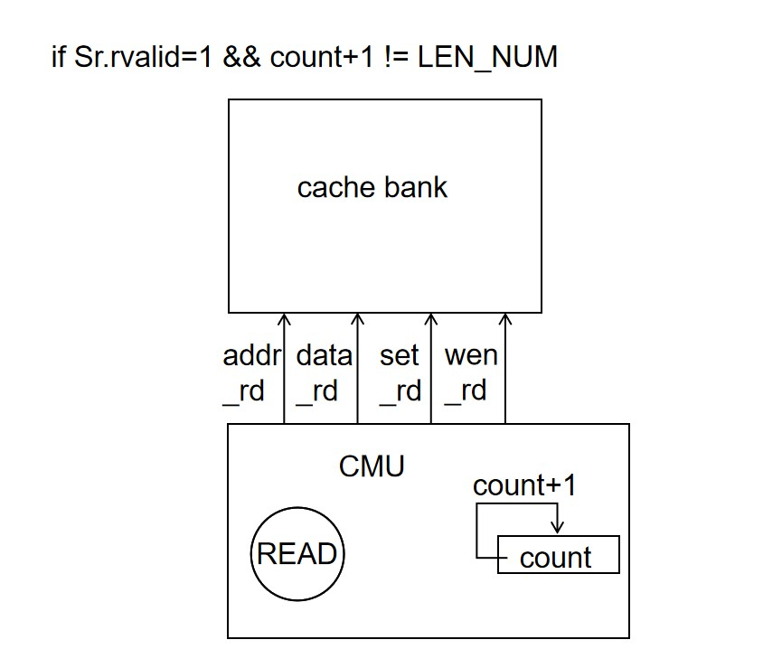
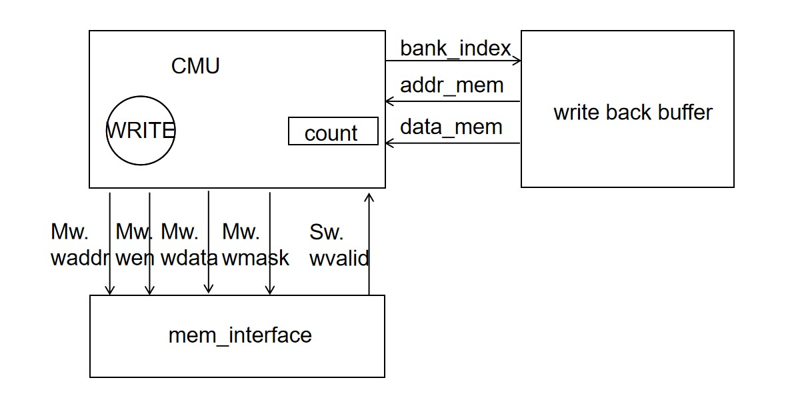
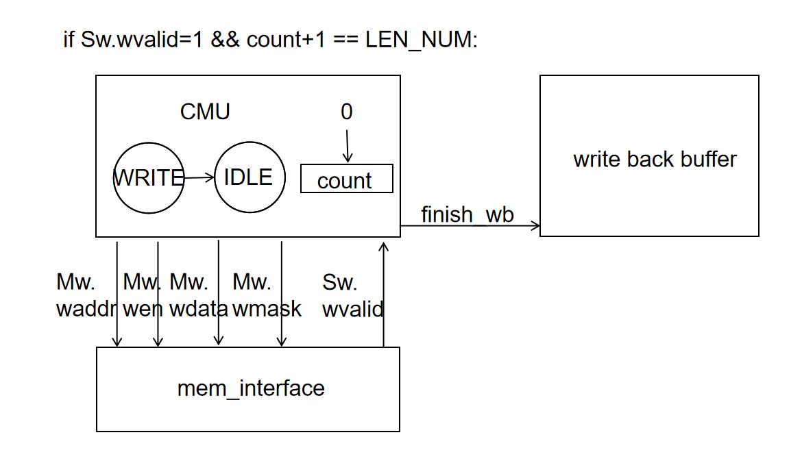
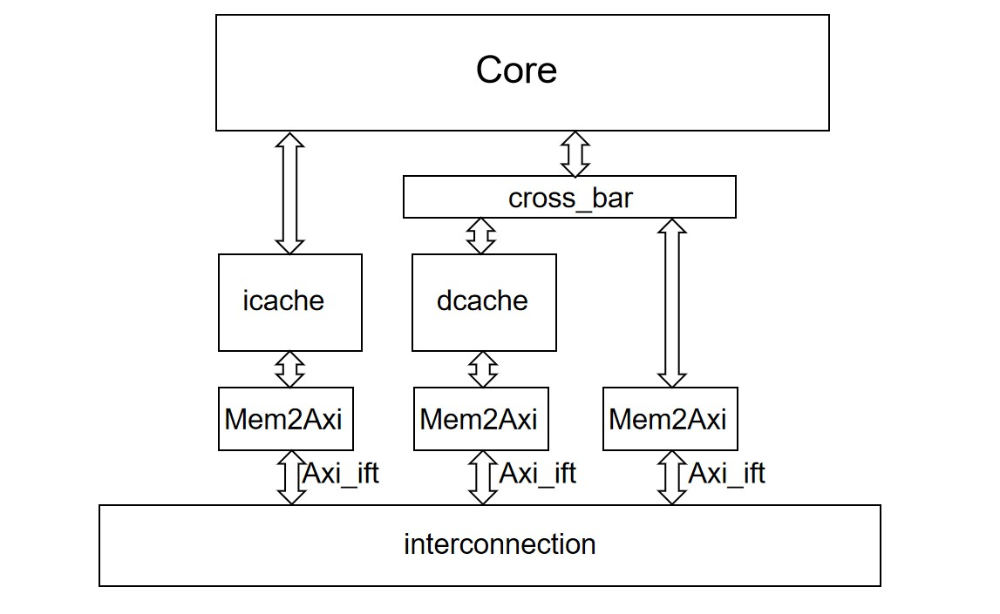

# 实验 2：Cache

!!! info "24.04.02 发布、24.04.25 截止验收与提交（三周半）"

## 实验目的

- 理解 cache 在 CPU 中的作用
- 了解 cache 与流水线和内存的交互机制
- 理解存储层次（Memory Hierarchy）

## 实验环境

- **HDL**：Verilog、SystemVerilog
- **IDE**：Vivado
- **开发板**：Nexys A7

## 实验原理

### Cache 模块

Cache 作为 CPU 和内存之间的存储结构，能够利用其速度快、容量小的特点，在速度相差较大的两种硬件之间，起到协调两者数据传输速度差异的作用，是 CPU 存储层次中的重要组件。

对于整个 Cache 模块的结构和功能，下图以 D-Cache 为例给出一种参考设计，总体来说 Cache 内部可以再细分至控制模块（橙色）和存储模块（绿色）两个子模块。

- 控制模块负责维护用于管理 Cache 状态的有限状态机，同时对 Cache 同上层 CPU 与下层 Memory 的交互起到调控作用
- 存储模块中则是 Cache 中存储的实际内容，一般为了保证 Cache 功能的正确实现，每个 Block 还需要辅助 Tag（地址高位）、V（有效位）、D（脏数据）等信息进行管理


### Cache 存储

我们的 cache 存储是现在 sys-3-project 的 lab2 分支的 general/CacheBank 模块中，定义的数据结构如下：

```Verilog
typedef logic [TAG_LEN-1:0] tag_t;  
// tag 数据类型，address 的最前端部分，为 address[TAG_END:TAG_BEGIN]
typedef logic [INDEX_LEN-1:0] index_t;    
// index 数据类型，address 中充当 cacheline 索引的部分，为 address[INDEX_END:INDEX_BEGIN]，大小等于 LINE_NUM
typedef logic [OFFSET_LEN-1:0] offset_t;
// offset 数据类型，address 中充当 cacheline 内部 quadword 索引的部分，为 address[OFFSET_END:OFFSET_BEGIN]，大小等于 BANK_NUM
typedef logic [BANK_NUM*DATA_WIDTH-1:0] data_t;

typedef struct {
    logic  valid;   // valid 位，当 cacheline 内容有效的时候等于 1，无效时等于 0
    logic  dirty;   // dirty 位，当 cacheline 数据有效且被写入的时候等于 1，未被写等于 0，数据无效则无所谓，配合 write back 策略
    logic  lru;     // lru 位，当 cacheline 这个 way 最近被访问时等于 1，另一个 way 最近被访问时等于 0，配合二路组关联策略
    tag_t  tag;     // tag 位，地址中的 tag 部分
    data_t data;    // data 位，存储的数据
} CacheLine; // 一路 cacheline

CacheLine set [1:0][LINE_NUM-1:0];
// 二路组相联策略，有两个 way 的 cache，每个 cache 有 LINE_NUM 个 cacheline
```

之后是这五个数据结构的有限状态机，大家编程之前最好自己仔细阅读，以免调试遇到问题。配合执行的策略是：

1. 二路组相联：一个 index 对应两个 cacheline，可以优先减少因为 index 地址冲突导致的 cache 失配
2. write alloc：写失配时将数据从内存载入 cache，便于之后多次读写该数据的时候可以从内存得到数据
3. write back：写命中时仅修改 cache，当 cacheline 被挤出 cache 时写回内存，避免每次写数据的时候都写内存
4. read 优先：当发生 write alloc 需要将 cacheline 挤出 cache 并且将脏数据写回内存时，首先将数据载入 cache、同时将被挤出 cache 的数据暂存到 cache buffer，然后将被挤出 cache 的数据写回内存，这样 piepline 读 cache 的数据和 CMU 将数据写回内存可以并行，pipeline 无需等待 cache back 的时间，提高执行效率

该模块的各个输入输出作用如下：

```Verilog
module CacheBank #(
    parameter integer ADDR_WIDTH = 64,  // 地址线路的宽度
    parameter integer DATA_WIDTH = 64,  // 数据线路的宽度
    parameter integer BANK_NUM = 4,     // 一个 cacheline 的 word 个数
    parameter integer CAPACITY = 1024   // cache 可以存储的最大字节数
) (
    // 来自 core 的数据请求
    input clk,
    input rstn,

    input [ADDR_WIDTH-1:0] addr_cpu,     // 需要读写的地址信号
    input [DATA_WIDTH-1:0] wdata_cpu,    // 需要写入的数据
    input wen_cpu,                       // 写使能信号
    input [DATA_WIDTH/8-1:0] wmask_cpu,  // 写使能配套的字节使能信号
    input ren_cpu,                       // 读使能信号
    output [DATA_WIDTH-1:0] rdata_cpu,   // 读到的数据输出
    output hit_cpu,                      // 是否命中

    // 如果有数据需要写回，这组信号将写回数据送入 write back buffer
    output [ADDR_WIDTH-1:0] addr_wb,             // 写回数据的地址
    output [BANK_NUM*DATA_WIDTH-1:0] data_wb,    // 写回数据的地址的内容，直接一个 cacheline
    input busy_wb,                               // write back buffer 回应是否忙
    output need_wb,                              // 向 write back buffer 发送写回暂存请求

    // cache 将自己需要读入的数据信息和要被载入的 cacheline 信息给 CMU
    output [ADDR_WIDTH-1:0] addr_cache,  // cache 告知 CMU 失配数据的地址
    output miss_cache,                   // cache 告知 CMU 发生了失配
    output set_cache,                    // cache 告知 CMU 需要写入的 way 的编号
    input busy_rd,                       // CMU 告诉 cache 自己是否忙碌
   
    // CMU 将读到的数据写入 cache 的信号
    input [ADDR_WIDTH-1:0] addr_rd,      // CMU 告诉 cache 自己从内存读入数据的地址
    input [DATA_WIDTH*2-1:0] data_rd,    // CMU 告诉 cache 自己从内存读入数据的值
    input wen_rd,                        // CMU 告诉 cache 自己要修改对应 cachline 的值
    input set_rd,                        // CMU 告诉 cache 自己要修改的 cache way 的编号
    input finish_rd                      // CMU 告诉 cache 自己完成了所以的读操作，一个 cacheline 载入完毕
);
```

### Write Back Buffer

如果没有 write back buffer，那么当某次失配发生，载入的数据需要将 cacheline 的脏数据挤占的时候，CMU 的操作一般如下：

1. 将需要被载入的 cacheline 中的脏数据写回 memory，这个过程需要多次写内存操作，每个操作需要多个周期
2. 将需要载入的数据从 memory 读入 cacheline，这个过程需要多次读内存操作，每个操作需要多个周期

步骤一和步骤二都需要 pipeline 进行等待。而如果有了 write back buffer，上述过程如下：

1. 将被挤占的脏数据写入 write back buffer，这个过程可以一个周期完成
2. 将需要载入的数据从 memory 读入 cacheline，这个过程需要多次读内存操作，每个操作需要多个周期
3. 将 write back buffer 中的脏数据写回 memory，这个过程需要多次写内存操作，每个操作需要多个周期

pipeline 仅需要等待步骤一和步骤二，然后就可以继续工作，无需等待步骤三，这个等待的开销比之前少了一半。

write back buffer 定义在 general/WriteBackBuffer 模块中，接口定义如下：

```Verilog
module CacheWriteBuffer #(
    parameter integer ADDR_WIDTH = 64,
    parameter integer DATA_WIDTH = 64,
    parameter integer BANK_NUM   = 4
) (
    // 和来自 CacheBank 的数据交互，载入 cachebank 的脏数据
    input clk,
    input rstn,

    input [ADDR_WIDTH-1:0] addr_wb,          // cachebank 脏数据的地址
    input [BANK_NUM*DATA_WIDTH-1:0] data_wb, // cachebank 脏数据的内容
    output busy_wb,                          // 告诉 cachebank 自己是否被占用
    input need_wb,                           // cachebank 表示自己有脏数据需要写入
    input miss_cache,                        // cachebank 表示自己发生了失配，miss_cache=1 的时候 need_wb 才有意义

    // 和 CMU 交互，将数据发送给 CMU 写入内存
    input [$clog2(BANK_NUM)-2:0] bank_index, // CMU 写回数据时向 writebackbuffer 请求要写回第几个 subword
    output [ADDR_WIDTH-1:0] addr_mem,        // 提供需要写回的地址，地址仅到 index 部分，不包括 offset
    output [DATA_WIDTH*2-1:0] data_mem,      // 提供需要写回的数据
    input finish_wb                          // CMU 告知 writebackbuffer 写回完毕，write back buffer 再次空闲 
);
```

### Cache 和 memory 的数据传输

cache 和 memory 之间用 mem_ift 接口做数据传输，这里将读写常用的信号包裹起来，方便编程和管理。接口定义在 general/Mem_interface 模块当中，我们顺便介绍一下 interface 的语法。

```Verilog
// Master 发送给 Slave 的写通道的信号
typedef struct {
    addr_t waddr;   // 写入的地址
    ctrl_t wen;     // 写使能
    data_t wdata;   // 写入的数据
    mask_t wmask;   // 字节使能信号
} Mw_struct;

// Slave 发送给 Master 的写通道信号
typedef struct {
    ctrl_t wvalid;  // 写入数据完成，该信号仅持续一周期
} Sw_struct;

// Master 发送给 Slave 的读通道信号
typedef struct {
    addr_t raddr;   // 读数据的地址
    ctrl_t ren;     // 读使能信号
} Mr_struct;

// Slave 发送给 Master 的读通道信号
typedef struct {
    ctrl_t rvalid;  // 读到的数据有效，仅持续一个周期，这个时候需要立刻接收数据
    data_t rdata;   // 读到的数据，rvalid=1 时有效
} Sr_struct;

// 接口涉及到的数据线，可以接口是一个大号的 struct，这些是接口的成员变量
Mw_struct Mw;   // 读通道的交互数据
Sw_struct Sw;   // 读通道的交互数据
Mr_struct Mr;   // 写通道的交互数据
Sr_struct Sr;   // 写通道的交互数据

// 定义接口
modport Master (    // 面向 Master 设备的接口
    output Mw,  // Master 到 interface 的输出
    input Sw,   // interface 到 Master 的输入
    output Mr,  // Master 到 interface 的输出
    input Sr    // interface 到 Master 的输入
);

modport Slave (     // 面向 Slave 设备的接口
    input Mw,   // interface 到 Slave 的输入
    output Sw,  // Slave 到 interface 得输出
    input Mr,   // interface 到 Slave 的输入
    output Sr   // Slave 到 interface 得输出
);
```

这里我们的 Cache 模块是向 Memory 发送读写信号，所以 Cache 模块是 Master 模块，所以它的 mem_ift 是 Master 接口，因此声明为：

```Verilog
module Cache #(
    parameter integer ADDR_WIDTH = 64,
    parameter integer DATA_WIDTH = 64,
    parameter integer BANK_NUM   = 4,
    parameter integer CAPACITY   = 1024
) (
    ...
    Mem_ift.Master mem_ift
);
```

如果将 mem_ift 展开其实就是：

```Verilog
module Cache #(
    parameter integer ADDR_WIDTH = 64,
    parameter integer DATA_WIDTH = 64,
    parameter integer BANK_NUM = 4,
    parameter integer CAPACITY = 1024
) (
    ...
    input  Mem_ift.Sw_struct mem_ift.Sw,
    input  Mem_ift.Sr_struct mem_ift.Sr,
    output Mem_ift.Mw_struct mem_ift.Mw,
    output Mem_ift.Mr_struct mem_ift.Mr
);
```

所以我们的 cache 在和 memory 交互的时候的输入输出就是这里的 mem_ift.Sw、mem_ift.Sr、mem_ift.Mw、mem_ift.Mr 四个结构，然后做对应的输入输出操作。

### Cache 控制逻辑

Cache 的基本结构、映射方式以及写策略等方面的内容在理论课程中已有详细的描述，但在实际实现中，cache 的复杂行为一般由专门的控制模块进行管理，被称作 CMU。CMU 实质上是把 cache 中的状态机部分与 CPU 和 Memory 的交互部分独立出来，作为一个控制单元，控制数据的处理，CMU 基本的架构与交互模式如下图所示：

<div style="text-align: center; margin-top: 0px;">

</div>

对于 CMU 的控制逻辑，一般可以采用状态机的模式来管理，下图给出了一种可行的状态机类型。该状态机针对 write back 策略进行实现，将 Cache 的行为归纳为 3 个状态。该部分 CMU 并没有专门提供模块封装，大家可以在 Cache 中直接实现，也可以选择单独封装出一个 CMU 模块。Cache 总体的模块关系如下：


#### 初始化 IDLE 状态

该状态表示有限状态机处于空闲状态不工作。

1. 如果 cacheback 检查未失配，有限状态机保持 IDLE 状态，不发出任何控制信号。
2. 如果 cachebank 检查失配，cachebank 发送给 write back buffer 的脏数据信号载入 write back buffer，cachebank 发送给 CMU 的载入数据信号载入 CMU 的寄存器，进入 READ 状态，rd_busy 变为 1。


#### 读事务执行 READ 状态

该状态根据 IDLE->READ 载入 CMU 的地址，将数据写回 addr。这里我们的 cache 的 word 是 64 位，但是 memory 的总线是 128 位（因为 DDR2 的 MIG 支持 128 位读写，可以将 cache-memory 的传输效率提高一倍），所以我们每次可以读入两个 word，而不是一个。然后开始如下操作流程：

1. 将变量 count 初始化为 0
2. 将 cachline 要读的前 2 个 word 的地址写入 mem_ift.Mr，发送读请求
3. 等待 mem_ift.Sr.rvalid=1，得到需要的 2 个 word 数据
    
4. 根据 CMU 在 IDLE->READ 时候载入的写入 cacheline 的 set、addr，将读到的数据写入 cache
5. count++，再次执行第二步读后续的 2 个 word，直到一个 cacheline 读完，发送 finish_rd
    
6. 看 write back buffer 是不是 busy，是的话进入 WRITE 状态开始将脏数据写回 memory，不是的话返回 IDLE 状态，完成一次 cache 失配处理，rd_busy 变为 0。
    

#### 写事务执行 WRITE 状态

该状态将 write back buffer 的数据写回 memory，然后开始如下流程：

1. 将变量 count 初始化为 0
2. 向 write back buffer 请求要写的前 2 个 word 的地址写入 mem_ift.Mw，发送写请求
    
3. 等待 mem_ift.Sw.wvalid=1，2 个 word 写入完毕
    
4. count++，再次执行第二步读后续的 2 个 word，直到一个 cacheline 读完，发送 finish_wb
5. 返回 IDLE 状态
    

### cache 的完整结构

* Core 的 IF、MEM 读写请求发送到 icache 和 dcache，icache、dcache 根据需要将读写请求转发给总线，进而发送给 memory
    
* 顶层为 Icache、Dcache 负责向上接受来自 core 的 IF、MEM 数据请求，向下向 memory 发送读写请求，作用是将来自 IF 和 MEM 的不同的数据请求格式和 cache 可以处理的数据请求格式做转换
    
* 再内部为 CacheWrap 负责处理 cache 旁路问题，如果启用了 cache_enable 则将数据请求发送给 cache，如果没有开启 cache_enable，则将数据请求直接发送给 memory
    
* Cache 处理 cache 请求
    
* Axi_lite_MMUer 负责管理 cache_enable，地址 0x5000000 的第一位管理 icache 的 cache_enable，地址 0x5000008 的第一位管理 dcache 的 cache_enable，如果要使用 cache，请先使能这两个 bit
    
* Icache 和 Dcache 是完全参数可配置的，可以根据自己的需要配置参数

## 实验要求

在 sys-3-project 中执行 `git checkout lab2` 和 `git pull` 切换到本次试验的框架，其中已经实现了大部分 cache 相关的模块。因为在以往的框架中有关内存读写的部分都由框架来进行实现，所以本次实验修改的这一部分其实和大家自己的 Core 模块应该完全没有交集。所以只需要同学们添加 src/lab2 文件夹中的 Cache.sv 并完善改模块的设计，然后通过仿真测试和上板验证即可。

!!! note
    当然，对于追求挑战或者对于给定框架不满意的同学，也可以在之前实验的基础上完全自行设计 Cache 相关部分，但最终目标肯定是要体现出带有缓存的优越性。

!!! tip
    整理一下需求，其实本次实验中需要完成的 Cache.sv 模块的内容就是连接起 CacheBank 和 WriteBackBuffer 两个模块以及通过 mem_ift 进行和 memory 的交互。你需要通过状态机来完成这几个部分间的交互控制（每个状态要做的事以及状态转移的条件都整理在了上面的实验原理中）。

> 同样，如果无法完全完成本次实验，只完成 Cache 模块但没有正确通过仿真测试，或者只上交实验报告写出了自己的理解也是可以拿到部分分数的。请同学们不要完全放弃本次实验。

### 关于测试

本次实验我们仍然可以使用 lab1 中的排序测试。不过为了开启 cache 功能，我们在 sort/loader.S 中需要向 0x5000000 和 0x5000008 两个地址写入 1，分别开启 icache 和 dcache：

```asm
...
_start:
    la sp, boot_stack_top
    li t0, 0x5000000
    li t1, 1
    sb t1, 0(t0) # enable icache
    sb t1, 8(t0) # enable dcache
    # nop
    # nop
...
```

为了更好地对比 CPI，在不开启 cache 的情况下，可以将两条 sb 指令替换为 nop 指令来对齐指令条数。

同时我们也鼓励自己编写更全面更简单的测试样例，测试 hit、miss、write back 等情况。具体操作为在 testcode/testcase 中创建 cache/cache.S 文件：

```asm
.section .text
.globl _start

_start:
    li t0, 0x5000000
    li t1, 1
    sb t1, 0(t0) # enable icache
    sb t1, 8(t0) # enable dcache
    ... # 你的测试代码
```

然后在 src/project 中执行 `make verilate_testcase TESTCASE=cache` 来进行测试。注意你需要提前修改 Makefile 使其中将 testcase 的 hex 文件复制到 build 下的 rom.hex 而不是 testcase.hex：

```makefile
verilate_testcase:$(VERILATOR_TOP)
	make -C $(DIR_TESTCASE) gen
	cp $(DIR_TESTCASE)/$(TESTCASE)/*.elf $(SIM_BUILD)/testcase.elf
	cp $(DIR_TESTCASE)/$(TESTCASE)/*.hex $(SIM_BUILD)/rom.hex
	cd $(SIM_BUILD); ./$(VERILATOR_TOP)
```

!!! abstract "本实验中你需要完成"

    1. 同步框架代码，理解其中 CacheBank 模块的设计
    2. 完成 Cache.sv 模块的设计
    3. 仿真通过所有的 testcase（自行测试，无硬性要求）
    4. **编写自己的简单测试样例，测试几种可能出现的情况**（强烈建议）
    5. **仿真通过排序测试**（`make verilate_sort`）
        - 在实验报告中分析对比该测试在开启和关闭 cache 的情况下的 CPI
    6. 成功运行 kernel（自行测试，无硬性要求）
    7. （bonus）上板运行 kernel 进行验证以及验收

### 注意事项

* 自己设计测试样例的时候记得首先开启 MMUer 的 cache_enable
* 如果下板出现时序约束问题，可以考虑将 Cache 的参数变小

## 思考题

1. 画图（推荐）或通过文字描述展示出你对于 CacheBank 模块的理解
2. 展示测试中遇到的 cache hit、miss、write back 的波形图，并分析消耗的周期数
3. 计算自己的 CPU 在启用 cache 前后运行排序测试的整体 CPI 并进行比较
    - 由于本次实验框架的访存部分有较大更改，所以不要将本实验运行排序测试的 CPI 和 lab1/lab0 进行比较
    - 本次实验中应该无法再通过 GTKWave 对 cosim_valid 高电平进行搜索来对指令进行计数，需要你自行修改代码来计数

        !!! tip "Hint"
            lab1 中方法失效的原因是带有缓存后执行效率提高巨大，可能连着两个及以上周期 cosim_valid 都是高电平，所以无法直接通过搜索计数。

            可以修改 sys-3-project/sim/testbench.sv 仿真顶层文件，仿照 cnt（周期记数）进行 cosim_valid 的计数，并通过 display 输出到终端，也可以在此时同时计算出 CPI。

## 实验提交

请在学在浙大上提交以下两份文件：

- 实验报告（pdf）
- project 文件夹压缩包（打包前 `make clean` 清除编译产物）
