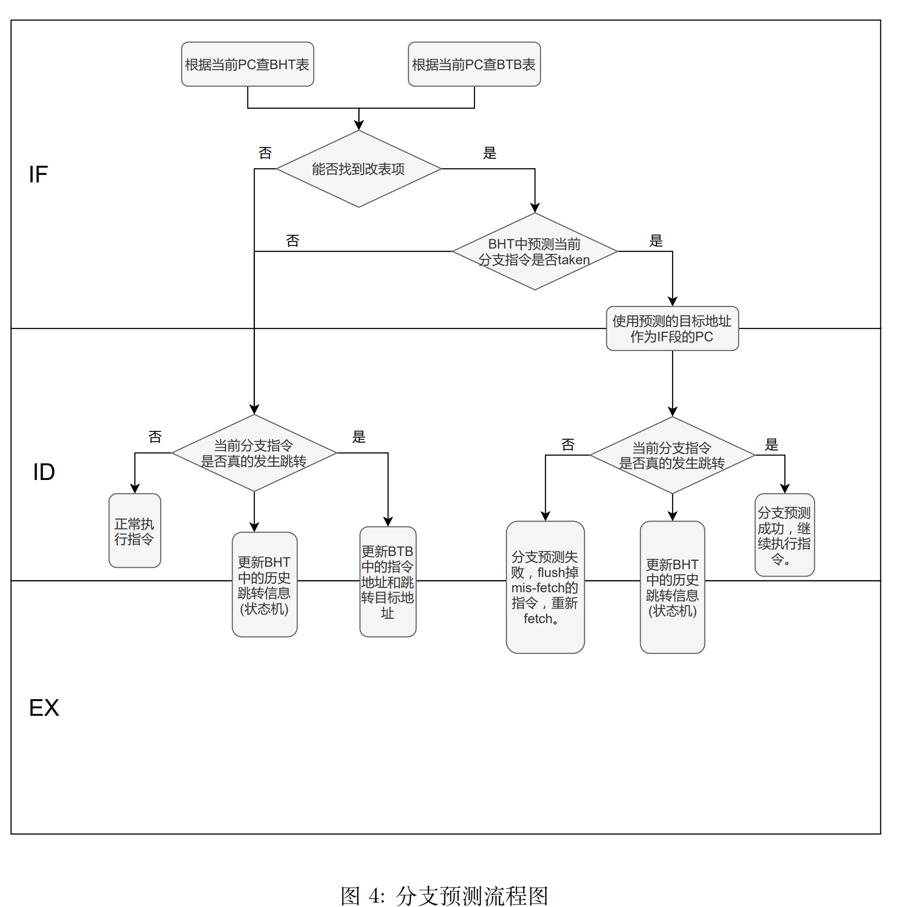

# 实验2 - 动态分支预测

##  实验目的

- 了解分支预测原理 

- 实现以 BHT 和 BTB 为基础的动态分支预测 

## 实验环境 

- HDL：Verilog SystemVerilog
- IDE：Vivado 
- 开发板：NEXYS A7 (XC7A100T-1CSG324C)

## 实验原理

#### 动态分支预测

动态分支预测利用了运行时以往是否发生跳转的信息对未来的分支跳转进行预测。它会比 predict not taken 这样简单的静态分支预测要更加高效，准确率更高。本次实验需要大家实现 BHT 和 BTB 相结合的动态分支预测技术。

#### BHT

branch-history table(BHT)，又名 branch-prediction buffer，它是一小块包含了跳转地址和历史跳转信息的 buffer。我们在遇到跳转指令的时候，通过对比之前保存在 buffer 中的跳转地址和相应的跳转信息来决定当前这条跳转指令是否应该发生跳转。buffer 基本信息如图1所示。


BHT 的跳转地址可以是完整的指令地址，也可以是 PC 的低地址部分 (也就是相当于做了一个 hash)。历史信息最简单的形式是用 1-bit 来表示当前分支跳转指令之前有没有发生跳转，如果历史分支跳转是 taken 的话，那么当前的分支跳转指令也选择跳转。反之，亦然。当然，我们没有办法保证每次的分支预测都是正确的，如果遇到分支预测错误，需要重新 fetch 后面的指令，并修改 BHT 中的历史跳转信息。 

本次实验我们会使用 2-bit 来表示历史跳转信息，从而提高预测的准确性。2-bit 的预测策略可以用一个状态机来表示，不过需要注意的是，这个状态机是保存在 BHT 中的每个表项中的，也就是说每一条分支跳转指令都会有一个 2-bit 的状态机来表示历史跳转信息。状态机如图2所示。


BHT 的数据结构有多种实现方式，包括链表，队列，哈希表等，大家选择自己喜欢的方式实现即可。


#### BTB

看了 BHT 的基本介绍，大家可能会疑惑 BHT 中预测分支跳转是 taken 的情况下如何拿到跳转的目标 PC，BTB 就是来解决这一问题的。 


branch-target buffer(BTB)，也叫 branch-target cache，用来保存预测的分支跳转目标地址。与 BHT 相结合，如果预测当前分支发生跳转，就根据当前的分支跳转指令的 PC，从 BTB 里拿到对应的目标跳转地址作为下一条指令地址。其基本结构就是一张 look-up table， 如图3所示。可以看到，表的左边记录的是访问过的分支指令的 PC，表的右边记录的是分支指令的目标地址。每次 BHT 预测当前分支是 taken 的情况下，通过查 BTB 来获取分支指令跳转的目标地址，从而不会形成任何的 stall 或者 flush。在更新 BTB 所维护的表的时候，要 注意每次记录的是 taken 的分支指令及对应的跳转目标地址，如果分支指令不 taken，也不需要记录，指令按顺序 fetch 下一条指令即可。 

在 5 段流水线中使用 BHT 和 BTB 进行分支预测的流程如图4所示。（本流程适用于跳转指令在ID阶段即发生跳转的情况，即在ID阶段可以修正预测错误，请同学们根据自己的cpu自行设计，不必完全按照此流程图）




#### BTB 模块介绍

BTB 和 BHT 都已经在 BTB.sv 模块当中继承好了，现在还需要同学们补全 BTB 和 BHT 管理的状态机，以及将 BTB.sv 模块连接到流水线中，BTB.sv 的接口和内部的数据结构介绍如下：
```SystemVerilog
module BTB #(
    parameter DEPTH = 16,
	//BTB 和 BHT 表项的个数
    parameter ADDR_WIDTH = 64,
	//地址宽度
    parameter STATE_NUM = 2
	//BHT 的分支预测器的位数
) (
    input clk,
    input rst,
	//IF 阶段进行预测的部分
    input [ADDR_WIDTH-1:0] pc_if,
	//当前的 PC，用于索引对应的表项
    output jump_if,
	//BHT 判断是否要跳转
    output [ADDR_WIDTH-1:0] pc_target_if,
	//BTB 给出跳转的目标地址
    
	//EXE 阶段进行跳转的确认和修正，BHT、BTB 的更新
    input [ADDR_WIDTH-1:0] pc_exe,
	//跳转指令的地址，用于索引 BTB 和 BHT
    input [ADDR_WIDTH-1:0] pc_target_exe,
	//跳转的目标，更新 BTB
    input jump_exe,
	//是否发生跳转，跳转与否更新 BHT
    input is_jump_exe
	//是否是跳转指令，是跳转指令 BTB、BHT 才做对应处理
);

    localparam INDEX_BEGIN = 1;
    localparam INDEX_LEN = $clog2(DEPTH);
    localparam INDEX_END = INDEX_BEGIN+INDEX_LEN-1;
    localparam TAG_BEGIN = INDEX_END+1;
    localparam TAG_END = ADDR_WIDTH-1;
    localparam TAG_LEN = TAG_END-TAG_BEGIN+1;

    typedef logic [TAG_LEN-1:0] tag_t;
    typedef logic [INDEX_LEN-1:0] index_t;
    typedef logic [STATE_NUM-1:0] state_t;
    typedef logic [ADDR_WIDTH-1:0] addr_t;

    typedef struct{
        tag_t tag;
        addr_t target;
		// BTB 部分
        state_t state;
		// BHT 部分
        logic valid;
    } BTBLine;
	// BTB、BHT 一行表项

    BTBLine btb [DEPTH-1:0];
	// 完整的 BTB、BHT 

    tag_t tag_exe;
    index_t index_exe; 
    BTBLine btb_exe; 
    assign tag_exe = pc_exe[TAG_END:TAG_BEGIN];
    assign index_exe = pc_exe[INDEX_END:INDEX_BEGIN];
    assign btb_exe = btb[index_exe];
	// EXE 阶段的索引和对应表象的结果

    
    tag_t tag_if;
    index_t index_if;
    BTBLine btb_if;
    assign tag_if = pc_if[TAG_END:TAG_BEGIN];
    assign index_if = pc_if[INDEX_END:INDEX_BEGIN];
    assign btb_if = btb[index_if];
	// IF 阶段的索引和对应表象的结果
    
	...
endmodule
```

* IF 阶段: PC 将当前 PC 地址发送给 BTB，BTB 默认这是一条跳转指令，检查对应的表项的 tag 和 valid，如果表项命中发送分支预测的跳转结果 jump_if 和跳转地址 pc_target_if，如果预测不命中则默认不跳转，返回 jump_if=0 和 pc_target_if=pc_if+4。跳转结果和跳转地址传递到 EXE 阶段进行验证。

* EXE 阶段: 检查 jump_if 和 pc_target_if 的值是否正确。如果正确的目标地址和预测的目标地址不一致，发送修正的信号，然后 PC 修改为正确的值，IF、ID 的指令进行 flush。此外如果是跳转指令，将跳转的结果和目标地址送入 BTB 模块，BTB 模块根据目标地址更新 BTB 部分的值，根据跳转与否更新 BHT 的值。

#### 实验要求

1. 在[给定框架](https://gitee.com/Parfaity/sys3lab-2023-stu/tree/master/src/lab2)或 lab0 的基础上实现用 BTB 和 BHT 做动态分支预测
2. 通过仿真测试和上板验证
3. 验收要求指出使用了 BTB 和 BHT 的跳转指令位置，展示 PC 的变化和BHT状态变化


#### 实验步骤

1. 在给定框架或 lab0 的基础上，在 5 段流水线内增加 BTB 和 BHT。

2. 通过仿真测试和上板验证

#### 思考题

1. 在报告里分析分支预测成功和预测失败时的相关波形。
2. 在正确实现 BTB 和 BHT 的情况下，有没有可能会出现 BHT 预测分支发生跳转，也就是 branch taken，但是 BTB 中查不到目标跳转地址，为什么？
3. 前面介绍的 BHT 和 BTB 都是基于内容检索，即通过将当前 PC 和表中存储的 PC 比较来确定分支信息存储于哪一表项。这种设计很像一个全相联的 cache，硬件逻辑实际上会比较复杂，那么能否参考直接映射或组相联的 cache 来简化 BHT/BTB 的存储和检索逻辑？请简述你的思路。