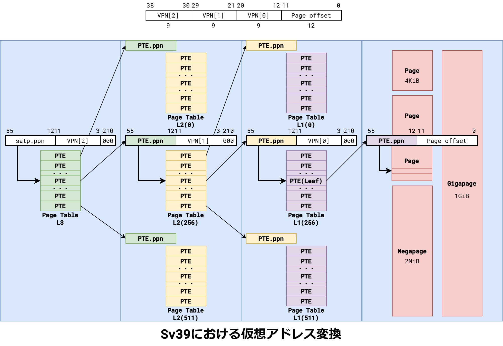

<style>
code {
    font-family: ui-monospace, Cascadia, SFMono-Regular, Consolas, Menlo, monospace;
}
</style>

# 实验 3：RV64 虚拟内存管理

!!! info "26.04.15 发布、26.05.06 截止提交（三周）"

## 实验目的

- 理解虚拟内存的工作原理
- 实现物理地址到虚拟地址的切换
- 了解 RISC-V 的分页模式
- 实现虚拟地址到物理地址的映射，并对不同的段进行相应的权限设置

## 实验环境

- Debian 12 / Ubuntu 24.04
- Your kernel in Sys2 Lab 6

## 背景知识

!!! danger "一切均以 spec 为准，不可跳过阅读 spec 这一步骤；中文版 RISC-V 手册质量良莠不齐，请谨慎参考并以英文版内容为准。"

    相比于 Sys2 Lab 4，本次实验更加依赖于阅读 spec，特别是关于虚拟内存及 Sv39 模式的相关内容。

    在后续实验中，除另有说明，所有节符号 § 均表示 [The RISC-V Instruction Set Manual: Volume II - Privileged Architecture 20240411](https://docs.riscv.org/reference/isa/v20240411/priv/supervisor.html) 中的章节。这些章节是需要你仔细阅读的。

    目前 RISC-V 标准的稳定版本是 20260120，也可以参考[最新版标准](https://docs.riscv.org/reference/isa/priv/priv-index.html)中的相关章节，如果二者某些内容有较大出入，请及时联系助教。

在 [Sys2 Lab 6](https://zju-sys.pages.zjusct.io/sys2/sys2-fa24/lab6/) 中，我们赋予了 OS 调度多个线程以及并发执行的能力，由于目前这些线程都是内核线程，因此它们可以共享运行空间，不同线程对内存的修改对其他线程都是可见的。但是如果需要线程相互**隔离**，或需要限制线程对内存的**操作能力**，就必须引入**虚拟内存**这个概念。

虚拟内存可以为正在运行的进程提供独立的地址空间，制造一种每个进程的内存都是独立的假象。同时虚拟内存到物理内存的映射也包含了对内存的访问权限，方便 kernel 完成权限检查。

在本次实验中，我们需要关注 OS 如何**开启虚拟地址**以及通过设置页表来实现**地址映射**和**权限控制**。

### Kernel 的虚拟内存布局

```text linenums="0"
start_address             end_address
    0x0                  0x3fffffffff
     │                        │
┌────┘                  ┌─────┘
↓        256G           ↓
┌───────────────────────┬──────────┬────────────────┐
│      User Space       │    ...   │  Kernel Space  │
└───────────────────────┴──────────┴────────────────┘
                                   ↑      256G      ↑
                      ┌────────────┘                │
                      │                             │
              0xffffffc000000000           0xffffffffffffffff
                start_address                  end_address
```

通过上图我们可以看到 RV64 将 `0x4000000000` 以下的虚拟空间作为 user space，将 `0xffffffc000000000` 及以上的虚拟空间作为 kernel space。由于还未引入用户态程序，本实验只需关注 kernel space。

本次实验使用的虚拟内存布局为 RISC-V Linux Kernel v5.16 前 Sv39 的内存布局，具体内容可以参考 [Virtual Memory Layout on RISC-V Linux](https://elixir.bootlin.com/linux/v5.15/source/Documentation/riscv/vm-layout.rst)。

在 kernel space 中有一段区域被称为 Direct Mapping Area，为了方便 kernel 可以高效访问 RAM，kernel 会预先把所有物理内存都映射至这一块区域（`PA + OFFSET == VA`），这种映射也被称为 linear mapping。在 RISC-V Linux Kernel 中这一段区域为 `0xffffffe000000000 ~ 0xffffffff00000000`，共 124 GiB。

### RISC-V 虚拟内存系统（Sv39 模式）

#### `satp` CSR

`satp`（Supervisor Address Translation and Protection Register）是 RISC-V 中控制虚拟内存分页模式的寄存器。在 RV64 上，其结构如下：

!!! quote "§10.1.11. Supervisor Address Translation and Protection (`satp`) Register"

    ```text linenums="0"
     63      60 59                  44 43                                0
    ┌──────────┬──────────────────────┬───────────────────────────────────┐
    │   MODE   │         ASID         │                PPN                │
    └──────────┴──────────────────────┴───────────────────────────────────┘
    ```

- MODE 字段的取值如下：

    !!! quote "§10.1.11. Supervisor Address Translation and Protection (`satp`) Register"

        |Value|Name|Description|
        |:--:|:--:|:--:|
        | 0 | Bare | No translation or protection. |
        | 1 \~ 7 | | *Reserved for standard use* |
        | 8 | Sv39 | Page-based 39 bit virtual addressing (see §10.4). |
        | 9 | Sv48 | Page-based 48 bit virtual addressing (see §10.5). |
        | 10 | Sv57 | Page-based 57 bit virtual addressing (see §10.6). |
        | 11 | Sv64 | *Reserved for page-based 64 bit virtual addressing* |
        | 12 \~ 13 | | *Reserved for standard use* |
        | 14 \~ 15 | | *Designed for custom use* |

- ASID（Address Space Identifier）：在我们的实验中未用到，置 0。
- PPN（Physical Page Number）：顶级页表的物理页号。RISC-V 定义物理页的大小为 4 KiB，因此有 `#!c PA >> 12 == PPN`。

#### RISC-V Sv39 模式下的虚拟地址和物理地址

!!! quote "§10.4.1. Addressing and Memory Protection (Sv39)"

    ```text linenums="0"
     38        30 29        21 20        12 11                           0
    ┌────────────┬────────────┬────────────┬──────────────────────────────┐
    │   VPN[2]   │   VPN[1]   │   VPN[0]   │          page offset         │
    └────────────┴────────────┴────────────┴──────────────────────────────┘
                        Sv39 virtual address
    ```

    ```text linenums="0"
     55                30 29        21 20        12 11                           0
    ┌────────────────────┬────────────┬────────────┬──────────────────────────────┐
    │       PPN[2]       │   PPN[1]   │   PPN[0]   │          page offset         │
    └────────────────────┴────────────┴────────────┴──────────────────────────────┘
                                Sv39 physical address
    ```

Sv39 模式定义了 39 位虚拟地址和 56 位物理地址。虚拟地址的 63 \~ 39 位必须与 38 位相同，否则会产生 page fault 异常。参考 [Kernel 的虚拟内存布局](#kernel)一节，63 \~ 38 位为 0 时代表 user space address，为 1 时代表 kernel space address。

Sv39 翻译过程见 [RISC-V 地址转换](#risc-v)一节。请阅读 RISC-V 标准 §10.3.2 章节的翻译过程，自行理解 `va.vpn[i]`、`pa.ppn[i]`、`pte.ppn[i]` 各个字段的含义。

#### RISC-V Sv39 模式页表项

!!! quote "§10.3.1. Addressing and Memory Protection (Sv32)"

    The V bit indicates whether the PTE is valid; if it is 0, all other bits in the PTE are don't-cares and may be used freely by software. The permission bits, R, W, and X, indicate whether the page is readable, writable, and executable, respectively. **When all three are zero, the PTE is a pointer to the next level of the page table; otherwise, it is a leaf PTE.** Writable pages must also be marked readable; the contrary combinations are reserved for future use.

!!! quote "§10.4.1. Addressing and Memory Protection (Sv39)"

    ```text linenums="0"
    63 62  61 60      54 53       28 27        19 18        10 9   8 7 6 5 4 3 2 1 0
    ┌─┬──────┬──────────┬───────────┬────────────┬────────────┬─────┬─┬─┬─┬─┬─┬─┬─┬─┐
    │N| PBMT | Reserved |  PPN[2]   │   PPN[1]   │   PPN[0]   │ RSW │D│A│G│U│X│W│R│V│
    └─┴──────┴──────────┴───────────┴────────────┴────────────┴─────┴─┴─┴─┴─┴─┴─┴─┴─┘
                         Reserved for use by supervisor software ┘   │ │ │ │ │ │ │ │
                                                       (*) Dirty ────┘ │ │ │ │ │ │ │
                                                    (*) Accessed ──────┘ │ │ │ │ │ │
                                                          Global ────────┘ │ │ │ │ │
                                                            User ──────────┘ │ │ │ │
                                                      Executable ────────────┘ │ │ │
                                                        Writable ──────────────┘ │ │
                                                        Readable ────────────────┘ │
                                                           Valid ──────────────────┘
    ```

常用位的含义如下：

- V：为 1 表示该页是有效的
- R：为 1 表示该页可读
- W：为 1 表示该页可写
- X：为 1 表示该页可执行
- 其他位在本次实验中不使用。**A / D 位的设置见 [`setup_vm_final` 的实现](#setup_vm_final)一节，请将其他位置 0。**

#### RISC-V 地址转换

Sv39 模式虚拟地址转化为物理地址流程图如下：

<figure markdown="span">
    <center>
    
    </center>
    <figcaption>
    <small>
    图片来源：[RISC-V Sv32,Sv39 を理解する](https://vlsi.jp/UnderstandMMU.html)
    </small>
    </figcaption>
</figure>

虚拟地址翻译的过程由 §10.3.2 严格定义，其中描述的翻译过程对 Sv32、Sv39、Sv48 及 Sv57 模式均适用。

## 实验步骤

本实验基于 Sys2 Lab 6 中同学所实现的代码进行。

### 准备工程

```text linenums="0" hl_lines="11"
├── Makefile
├── arch
│   └── riscv
│       ├── include
│       │   ├── mm.h
│       │   └── vm.h
│       └── kernel
│           ├── Makefile
│           ├── mm.c
│           ├── vm.c
│           └── vmlinux.lds
└── lib
    └── Makefile
```

`src/lab3` 的目录结构如上。请同学们将以上文件同步到 `project/kernel` 对应目录下，**覆盖任何已有的文件**。

链接脚本 `vmlinux.lds` 中的 `ramv` 代表 VMA（Virtual Memory Address，虚拟地址）；`ram` 代表 LMA（Load Memory Address），即我们的 OS image 被 load 的地址，可以理解为物理地址。使用以上的 `vmlinux.lds` 进行编译之后，得到的 `System.map` 以及 `vmlinux` 采用的都是虚拟地址，方便后续 debug。

!!! info "VMA、LMA 与 PC 相对寻址"

    在新的链接脚本中，你会发现 `BASE_ADDR` 被设置为了高位虚拟地址。
    
    * **VMA 与 LMA 的分离**：链接器在执行符号解析时，使用的是 **VMA**，你可以打开编译生成的 `System.map` 观察，所有函数和变量的符号地址现在都是以 `0xffffffe0` 开头的。但在链接脚本中我们通过 `AT>ram` 语法，指定了 **LMA** 仍然为 `0x80000000`。这意味着内核镜像依然会被 OpenSBI 原封不动地加载到物理内存 `0x80000000` 处运行。
    * **为什么没有开启 MMU 前内核不会崩溃？**既然所有符号都是虚拟地址，为什么在 `head.S` 开启虚拟内存前，内核仍在物理地址运行却不会发生取指或访存异常？
        - 关键在于 RISC-V 的 **PC 相对寻址**机制。在内核初期，大部分跳转（如 `jal`、`bnez`）和地址计算（如 `la` 伪指令一般会被展开为 `auipc + addi`）基本都是基于当前 PC 加上一个相对偏移量来执行的。因此只要指令所在的物理位置与其目标的相对距离与链接时一致，机器码就能正确执行，而**不依赖绝对地址**。
    * **为什么需要重定位（Relocate）？**虽然相对寻址能让我们运行在物理空间，但一旦我们需要使用绝对地址（比如从函数指针表读取地址，或者通过 `jalr` 结合绝对地址进行长跳转），程序就会尝试访问 `0xffffffe0...`，此时如果还没有开启页表映射，内核就会当场崩溃。因此，在建立好初期页表后，我们必须在 `head.S` 中手动修改 PC 和相关寄存器，完成从物理地址到虚拟地址的重定位。

本实验中我们需要使用刷新 TLB 和 icache 的指令扩展，需要用到 Zifencei 扩展。更新过后的 Makefile 已经设置好了相关参数，请确保使用更新后的 Makefile 进行编译。

同学们需要完成以下工作：

- **重要**：Sys2 Lab 7 中同学们可能修改了时钟中断的设置（`clock_set_next_event`）以适配硬件，在做软件实验时一定需要改回使用 `#!asm rdtime` 读取 `time` CSR 并计算下次中断时间的方式！
- 修改 `private_kdefs.h`，增大 `PHY_SIZE` 并在适当的位置加入虚拟地址的相关定义：

    ```diff title="(diff) arch/riscv/include/private_kdefs.h" linenums="0"
    -#define PHY_SIZE 0x400000 // 4 MiB
    +#define PHY_SIZE 0x8000000 // 128 MiB

    +#define OPENSBI_SIZE 0x200000
    +
    +#define VM_START 0xffffffe000000000
    +#define VM_END 0xffffffff00000000
    +#define VM_SIZE (VM_END - VM_START)
    +
    +#define PA2VA_OFFSET (VM_START - PHY_START)
    ```

- **重要**：由于 S-mode 开启了虚拟地址，而 **M-mode 的 OpenSBI 运行在物理地址**，因此可能需要修改 `printk_sbi_write` 的实现，确保传递给对应 SBI 接口的地址是物理地址。

    !!! example "修改示例"

        例如，你将 `printk_sbi_write` 实现为：

        ```c
        sbi_debug_console_write(len, buf, 0);
        ```

        那么你需要将其修改为：

        ```c
        sbi_debug_console_write(len, VA2PA(buf), 0);
        ```

    !!! warning "注意"

        请理解此处修改的原因，并确认自己的实现是否已完成/不需要此修改。修改错误会导致 `printk` 不正常工作！

### 开启虚拟内存映射

在 RISC-V 中开启虚拟地址被分为了两步：`setup_vm` 以及 `setup_vm_final`。第一步通过调用 `setup_vm` 建立临时页表，第二步通过调用 `setup_vm_final` 建立正式页表。下面介绍相关的具体实现。

#### `setup_vm` 的实现

`setup_vm` 只使用一级页表（gigapage），将 `0x80000000` 开始的 1 GiB 区域进行两次映射，其中一次是等值映射（`#!c PA == VA`），另一次是将其映射至高地址（`#!c PA + PV2VA_OFFSET == VA`）。如下图所示：

```text linenums="0"
Physical Address
┌────────────────────┬─────────┬────────┬─┐
│                    │ OpenSBI │ Kernel │ │
└────────────────────┴─────────┴────────┴─┘
                     ↑
                0x80000000
                     ├─────────────────────────────────────────────┐
                     │                                             │
Virtual Address      ↓                                             ↓
┌────────────────────┬─────────┬────────┬──────────────────────────┬─────────┬────────┬───┐
│                    │ OpenSBI │ Kernel │                          │ OpenSBI │ Kernel │   │
└────────────────────┴─────────┴────────┴──────────────────────────┴─────────┴────────┴───┘
                     ↑                                             ↑
                0x80000000                                 0xffffffe000000000
```

在 `setup_vm` 中，你需要设置页表 `early_pgtbl` 中的对应项，确保虚拟地址 `0x80000000` 和 `0xffffffe000000000` 能够成功地映射到物理地址 `0x80000000` 上。

```c title="arch/riscv/kernel/vm.c" linenums="4"
// 用于 setup_vm 进行 1 GiB 的映射
uint64_t early_pgtbl[PGSIZE / 8] __attribute__((__aligned__(PGSIZE)));
// kernel page table 根目录，在 setup_vm_final 进行映射
uint64_t swapper_pg_dir[PGSIZE / 8] __attribute__((__aligned__(PGSIZE)));

void setup_vm(void) {
  memset(early_pgtbl, 0, PGSIZE);

  // 1. 初始化阶段，页大小为 1 GiB，不需使用多级页表
  // 2. 将 va 的 64 bit 作如下划分：| 63...39 | 38...30 | 29...0 |
  //    - 63...39 bit 忽略
  //    - 38...30 bit 作为 early_pgtbl 的索引
  //    - 29...0 bit 作为页内偏移，注意到 30 = 9 + 9 + 12，即我们只使用根页表，根页表的每个 entry 对应 1 GiB 的页
  // 3. Page Table Entry 的权限为 X W R V

#error Not yet implemented
}
```

#### 修改 `head.S`

完成 [`setup_vm` 的实现](#setup_vm)中的映射之后，调用 `setup_vm`，并通过 `relocate` 函数，完成对 `satp` 的设置，并通过 `#!asm ret` 跳转到对应的虚拟地址。

```asm title="arch/riscv/kernel/head.S" linenums="0"
_start:
    # load stack ...

    call setup_vm
    call relocate

    # other calls ...

    call setup_vm_final

    # other calls ...


relocate:
    # 1. set general purpose registers to appropriate values
    #    - set ra = ra + PA2VA_OFFSET
    #    - set sp = sp + PA2VA_OFFSET, if needed

#error Not yet implemented

    # flush TLB
    sfence.vma zero, zero

    # 2. set satp to use early_pgtbl
    #    - set satp to use Sv39 mode

#error Not yet implemented

    ret

    .section .bss.stack
    .space PGSIZE
```

经过 `setup_vm` 设置了一级页表之后，我们的 kernel 将能够成功运行在虚拟地址上。

??? note "对 `#!asm sfence.vma` 和 `#!asm fence.i` 语义的详细说明"

    为与 OS 课程 lab 同步，我们去除了 `#!asm fence.i`，并调整了 `#!asm sfence.vma` 的顺序，与 Linux 内核源码保持一致，以避免同学们阅读内核源码时产生困惑。同学们可能会好奇其中的具体原理，下面简单说明。首先，根据 spec：

    !!! quote "§10.2.1. Supervisor Memory-Management Fence Instruction"

        It is specified as **a fence rather than a TLB flush** to provide cleaner semantics with respect to which instructions are affected by the flush operation and to support a wider variety of dynamic caching structures and memory-management schemes.

    接下来看 [Linux v5.2.21 内核源码](https://elixir.bootlin.com/linux/v5.2.21/source/arch/riscv/kernel/head.S#L89)：

    ```asm title="arch/riscv/kernel/head.S" linenums="89" hl_lines="10-11"
    /*
     * Load trampoline page directory, which will cause us to trap to
     * stvec if VA != PA, or simply fall through if VA == PA.  We need a
     * full fence here because setup_vm() just wrote these PTEs and we need
     * to ensure the new translations are in use.
     */
    la a0, trampoline_pg_dir
    srl a0, a0, PAGE_SHIFT
    or a0, a0, a1
    sfence.vma
    csrw CSR_SATP, a0
    ```

    与实验指导的初版代码相比，这里有三个问题：为什么要在 `#!asm csrw satp` 之前加一个 `#!asm sfence.vma`？为什么后面不需要加 `#!asm sfence.vma`？为什么不需要 `#!asm fence.i`？

    1. 第一个问题由上面代码段的注释解答：`#!asm csrw satp` **前**的 `#!asm sfence.vma` 主要是**为了保证新的页表项生效**而设置的一个 fence，而没有用到其刷新 TLB 的功能，毕竟这里才刚刚启用 MMU。那么为什么要保证页表项生效呢？这涉及思考题 2 的答案，在此按下不表。
    2. 第二个问题由 §10.2.1 中的一段话解答：

        !!! quote "§10.2.1. Supervisor Memory-Management Fence Instruction"

            Changing `satp.MODE` **from *Bare* to other modes and vice versa also takes effect immediately**, without the need to execute an `#!asm sfence.vma` instruction.

        也就是说，启用或关闭分页模式时的操作立即生效，不需要额外的 `#!asm sfence.vma`。

    3. 第三个问题由 [Linux 内核源码 `local_flush_tlb_all`](https://elixir.bootlin.com/linux/v5.2.21/source/arch/riscv/include/asm/tlbflush.h#L14) 中的注释解答：

        ```c title="arch/riscv/include/asm/tlbflush.h" linenums="14"
        /*
        * Flush entire local TLB.  'sfence.vma' implicitly fences with the instruction
        * cache as well, so a 'fence.i' is not necessary.
        */
        static inline void local_flush_tlb_all(void)
        {
            __asm__ __volatile__ ("sfence.vma" : : : "memory");
        }
        ```

        也就是说，`#!asm sfence.vma` 会**隐式地刷新指令缓存**，因此不需要额外的 `#!asm fence.i`。

        你可能会好奇什么时候才会使用 `#!asm fence.i`。在 Linux 源码中搜索，可以发现主要用在进程调度。因为需要让新进程的指令替换掉旧进程的缓存，此时会显式使用 `#!asm fence.i`。

    [SFENCE.VMA Before or After SATP Write · Issue #226 · riscv/riscv-isa-manual](https://github.com/riscv/riscv-isa-manual/issues/226) 中 RISC-V 开发者对 `sfence.vma` 和 `csrw satp` 顺序做了一些讨论：

    > - **`#!asm sfence.vma` before `#!asm csrw satp` may be necessary**: The concern is, what if the mapping for the instruction immediately after SFENCE.VMA has been modified? In the Linux kernel, this mapping is fixed (regardless of address space) so the concern does not apply.
    > - **`#!asm sfence.vma` after `#!asm csrw satp` is definitely necessary**: In general, you need to SFENCE after you've recycled an ASID. Since we don't use ASIDs in the Linux kernel yet, every context switch is effectively an ASID reuse, **hence the full TLB flush**.

    根据上述解释，在 `setup_vm_final` 中第二次切换 `satp` 时，其后必须要设置 `#!asm sfence.vma`，否则可能命中旧页表。但是你可能会发现，即使去掉 `#!asm sfence.vma`，实验依然可以正常运行。更进一步地，我们可以设计下面的代码：

    ```c linenums="0"
    void setup_vm_final(void) {
        ...
        // create old TLB entry
        asm volatile("li t0, 0x80200000");
        asm volatile("ld t1, 0(t0)");
        // set satp with swapper_pg_dir
        csr_write(satp, ...); // your code
        // try to hit old TLB entry
        asm volatile("li t0, 0x80200000");
        asm volatile("ld t1, 0(t0)");
        ...
    }
    ```

    第二个 `#!asm ld` 将失败，说明 TLB 已经被刷新了，并不符合预期。原因是 QEMU、spike 这类模拟器会在写 `satp` 时立即刷新 TLB 来避免泄漏无效的缓存映射。不过 RISC-V 的标准中并未强制规定这一点，所以为了兼容性考虑，我们还是需要在写 `satp` 后使用 `#!asm sfence.vma` 来保证在任何平台上都可以正确运行。

!!! tip "调试小技巧"

    在设置好 `satp` 之前，我们只可以使用**物理地址**来打断点。因为符号表、`vmlinux.lds` 里面记录的函数名的地址都是虚拟地址，而在设置好 `satp` 之前程序运行在物理地址上，两者相差 `PA2VA_OFFSET`。你可以在目录下编译生成的 `vmlinux.asm` 中找到所有代码的虚拟地址，将其转换成物理地址，然后使用 `b *<addr>` 命令设置断点。

    设置 `satp` 之后，才可以使用虚拟地址打断点，同时之前设置的物理地址断点也会失效，需要删除。

    另外你或许还需要注意，若你使用 `#!asm la` 指令来加载地址，可能需要对其做必要的转换，详见思考题 4。

#### `setup_vm_final` 的实现

由于 `setup_vm_final` 中需要申请物理页的接口，所以应当在调用 `setup_vm_final` 之前调用 `mm_init` 对内存进行初始化。

`setup_vm_final` 需要完成对所有物理内存（128 MiB）的映射，并设置正确的权限。具体的映射关系可参考下图：

```text linenums="0"
Physical Address
 PHY_START _skernel                  PHY_END
     ↓         ↓                        ↓
┌────┬─────────┬────────┬───────────────┐
│    │ OpenSBI │ Kernel │               │
└────┴─────────┴────────┴───────────────┘
                    ↑                   ↑
               0x80200000               └──────────────────────────────┐
                    └─────────────────────────────┐                    │
                                                  │                    │
                                          VM_START+OPENSBI_SIZE        │
Virtual Address                                   ↓                    ↓
┌─────────────────────────────────────────────┬────────┬───────────────┐
│                                             │ Kernel │               │
└─────────────────────────────────────────────┴────────┴───────────────┘
                                                  ↑
                                           0xffffffe000200000
```

- 不再需要等值映射。
- 不需要将 OpenSBI 映射至高地址，因为 OpenSBI 运行在 M-mode，其直接使用物理地址。
- 采用 Sv39 三级页表结构。

最后，在 `head.S` 中适当的位置调用 `setup_vm_final`。
    ```c title="arch/riscv/kernel/vm.c" linenums="22"
    void setup_vm_final(void) {
      memset(swapper_pg_dir, 0, PGSIZE);

      // No OpenSBI mapping required

      // 1. 调用 create_mapping 映射页表
      //    - kernel code: X R
      //    - kernel rodata: R
      //    - other memory: W R
      // 2. 设置 satp，将 swapper_pg_dir 作为内核页表

    #error Not yet implemented

      // flush TLB
      asm volatile("sfence.vma" ::: "memory");

      return;
    }

    void create_mapping(uint64_t pgtbl[static PGSIZE / 8], void *va, void *pa, uint64_t sz, uint64_t perm) {
      // TODO：根据 RISC-V Sv39 的要求，创建多级页表映射关系
      //
      // 物理内存需要分页
      // 创建多级页表的时候使用 alloc_page 来获取新的一页作为页表
      // 注意通过 V bit 来判断表项是否存在
      //
      // 重要：阅读手册，注意 A / D 位的设置

    #error Not yet implemented
    }
    ```

!!! tip "实现提示"

    在实现 `setup_vm_final` 时，你可能需要参考已有的代码来实现对不同段（`.text`、`.rodata` 等）的起始、结束地址的正确引用。

!!! info "关于 A / D 位"

    A（Accessed）位表示该页是否被访问过，D（Dirty）位表示该页是否被修改过，这两位由 Svadu (§14) / Svade (§14, §10.3.2) 扩展管理。

    若实现支持 Svadu 扩展，那么 A / D 位会在访问页时由硬件自动设置；否则，若实现支持 Svade 扩展，那么当发生以下事件时，产生异常：

    - 访问页时其所在叶页表项的 A 位为 0；或
    - 写入页时其所在叶页表项的 D 位为 0。

    QEMU 默认开启 Svadu 扩展，因此对于 QEMU，设置 A / D 位不是必要的；但 Spike 模拟器默认不开启 Svadu 扩展，因此需要手动设置，否则会根据 Svade 扩展的定义产生异常。为了使你的代码在两种模拟器上都能运行，建议实现 A / D 位的设置。当然，你也可以自行查阅 Spike 的文档以启用 Svadu 扩展。

### 编译及测试

由于加入了一些新的文件，可能需要修改一些 Makefile，请同学自己尝试修改，使项目可以编译并运行。样例输出如下，其中的额外输出可供参考，你的输出不需与其完全一致：

```text linenums="1" hl_lines="4-6 9-13 23 29 35 39-43"
OpenSBI v1.5
    ...
...buddy_init done! size = 32768
pgtbl = 0x80207000: map [0xffffffe000200000, 0xffffffe000203000) -> [0x80200000, 0x80203000), perm = 0xa, size = 12288
pgtbl = 0x80207000: map [0xffffffe000203000, 0xffffffe000204000) -> [0x80203000, 0x80204000), perm = 0x2, size = 4096
pgtbl = 0x80207000: map [0xffffffe000204000, 0xffffffe008200000) -> [0x80204000, 0x88200000), perm = 0x6, size = 134201344
...task_init done!
2025 ZJU Computer System III
SET [PID = 1, PRIORITY = 5, COUNTER = 5]
SET [PID = 2, PRIORITY = 9, COUNTER = 9]
SET [PID = 3, PRIORITY = 3, COUNTER = 3]
SET [PID = 4, PRIORITY = 5, COUNTER = 5]
switch to [PID = 2, PRIORITY = 9, COUNTER = 9]
[PID = 2 @ 0xffffffe00030d000] Running. local = 1
[PID = 2 @ 0xffffffe00030d000] Running. local = 2
[PID = 2 @ 0xffffffe00030d000] Running. local = 3
[PID = 2 @ 0xffffffe00030d000] Running. local = 4
[PID = 2 @ 0xffffffe00030d000] Running. local = 5
[PID = 2 @ 0xffffffe00030d000] Running. local = 6
[PID = 2 @ 0xffffffe00030d000] Running. local = 7
[PID = 2 @ 0xffffffe00030d000] Running. local = 8
[PID = 2 @ 0xffffffe00030d000] Running. local = 9
switch to [PID = 1, PRIORITY = 5, COUNTER = 5]
[PID = 1 @ 0xffffffe00030c000] Running. local = 1
[PID = 1 @ 0xffffffe00030c000] Running. local = 2
[PID = 1 @ 0xffffffe00030c000] Running. local = 3
[PID = 1 @ 0xffffffe00030c000] Running. local = 4
[PID = 1 @ 0xffffffe00030c000] Running. local = 5
switch to [PID = 4, PRIORITY = 5, COUNTER = 5]
[PID = 4 @ 0xffffffe00030f000] Running. local = 1
[PID = 4 @ 0xffffffe00030f000] Running. local = 2
[PID = 4 @ 0xffffffe00030f000] Running. local = 3
[PID = 4 @ 0xffffffe00030f000] Running. local = 4
[PID = 4 @ 0xffffffe00030f000] Running. local = 5
switch to [PID = 3, PRIORITY = 3, COUNTER = 3]
[PID = 3 @ 0xffffffe00030e000] Running. local = 1
[PID = 3 @ 0xffffffe00030e000] Running. local = 2
[PID = 3 @ 0xffffffe00030e000] Running. local = 3
SET [PID = 1, PRIORITY = 5, COUNTER = 5]
SET [PID = 2, PRIORITY = 9, COUNTER = 9]
SET [PID = 3, PRIORITY = 3, COUNTER = 3]
SET [PID = 4, PRIORITY = 5, COUNTER = 5]
switch to [PID = 2, PRIORITY = 9, COUNTER = 9]
```

!!! abstract "本实验中你需要完成"

    1. 环境与定义适配：修改 `private_kdefs.h` 和相关接口（如 `printk_sbi_write` 的实现），加入虚拟地址与物理地址转换的相关宏定义，并确保 M-mode 下的 OpenSBI 正常使用物理地址。
    2. 实现 setup_vm：建立临时的一级页表（gigapage），为物理内存的前 1 GiB 区域同时建立等值映射（PA == VA）和高位虚拟地址映射（PA + OFFSET == VA）。
    3. 修改 head.S 完成重定位：在汇编代码中调用 `setup_vm`，完成 PC 的重定位（relocate），正确设置 `satp` 寄存器以开启虚拟地址映射，并跳转到对应的虚拟地址继续执行。
    4. 实现 setup_vm_final：在通过 `mm_init` 初始化内存后，构建完整的 Sv39 三级页表，取消等值映射，完成所有可用物理内存的映射，并为内核的不同段（.text, .rodata, .data, .bss）分配精细化的访问权限。
    5. 编译与测试：解决 Makefile 依赖并编译通过，确保内核在开启虚拟内存后能够顺利启动并输出正确的段属性信息。

## 思考题

1. 验证 `.text`，`.rodata` 段的属性是否成功设置，给出验证过程。
2. 我们在 `setup_vm` 中需要做等值映射，而在 Linux 中是不需要做等值映射的。请参考 [Linux v5.2.21](https://elixir.bootlin.com/linux/v5.2.21/source) 或之后的版本中内核启动部分，回答以下问题：
    - 本次实验如果不做等值映射，会出现什么问题？原因是什么？
    - 回答为什么 Linux 内核不需要做等值映射，它是如何在不使用等值映射的情况下让 PC 从物理地址跳转到虚拟地址的？
    - 尝试修改你的 kernel，使其可以像 Linux 一样不需要做等值映射。

    !!! warning "注意"

        阅读 Linux 源码时，你可能需要特别关注 PC 的变化以及某些指令对 PC 的影响等。请同学们结合 Linux 内核的实现认真思考。

3. 更新后的 `kernel/Makefile` 中，在 `CFLAGS` 中加入了 `-MMD` 选项。
    - 比较 Sys2 中的 `kernel/lib/Makefile` 与本实验更新的 `kernel/lib/Makefile`，两者有什么区别？
    - 结合 `kernel/Makefile` 的 `-MMD` 选项，解释这两处更改的目的。
4. 更新后的 `kernel/Makefile` 中，在 `CFLAGS` 中还加入了 `-fno-pie` 选项。
    - 如果删除该选项，对生成的 `vmlinux` 文件有什么影响？你的 kernel 是否还可以正常运行？
    - 若不能正常运行，原因是什么？给出 GDB 调试的截图。删除该选项后，要如何修改 `head.S` 中的代码才能让 kernel 正常运行？

## 分数构成

验收分数占本次实验分数的 60%。在该部分中：

- 代码运行测试通过 50%
- 验收问题通过 50%，共两个问题，每个各 25%

报告分数占本次实验分数的 40%。在该部分中：

- 思考题 1、思考题 3 均 10%
- 思考题 2、思考题 4 均 20%
- 除思考题外的剩余部分 40%

## 实验提交

请在学在浙大上的 report 和验收入口分别提交以下文件：

- 实验报告 (.pdf)
- kernel 文件夹压缩包 (.zip), **提交前请清除所有构建产物。**
