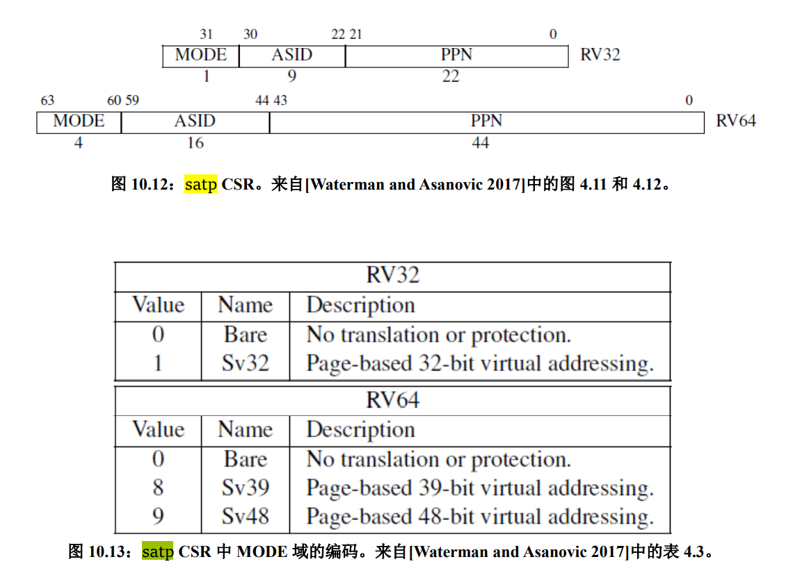

# 实验 4：RV64 用户模式

## 1. 实验目的

* 创建用户态进程，并设置 `sstatus` 来完成内核态转换至用户态。
* 正确设置用户进程的**用户态栈**和**内核态栈**， 并在异常处理时正确切换。
* 补充异常处理逻辑，完成指定的系统调用（ SYS_WRITE, SYS_GETPID ）功能。

## 2. 实验环境

* 计算机系统Ⅱ中说明 wsl 的[实验环境](https://zju-sys.pages.zjusct.io/sys2/sys2-fa22/lab3/) ，如果采用别的环境（如docker），请向助教说明原因。

## 3. 背景知识

### 3.0 前言

在 [lab3](./lab3.md) 中，我们开启虚拟内存，这为进程间地址空间相互隔离打下了基础。之前的实验中我们只创建了内核线程，他们共用了地址空间 （共用一个**内核页表** `swapper_pg_dir` ）。在本次实验中我们将引入用户态进程。当启动用户模式应用程序时，内核将为该应用程序创建一个进程，为应用程序提供了专用虚拟地址空间等资源。因为应用程序的虚拟地址空间是私有的，所以一个应用程序无法更改属于另一个应用程序的数据。每个应用程序都是独立运行的，如果一个应用程序崩溃，其他应用程序和操作系统不会受到影响。同时，用户模式应用程序可访问的虚拟地址空间也受到限制，在用户模式下无法访问内核的虚拟地址，防止应用程序修改关键操作系统数据。当用户态程序需要访问关键资源的时候，可以通过系统调用来完成用户态程序与操作系统之间的互动。

### 3.1 User 模式基础介绍

处理器具有两种不同的模式：用户模式和内核模式。在内核模式下，执行代码对底层硬件具有完整且不受限制的访问权限，它可以执行任何 CPU 指令并引用任何内存地址。在用户模式下，执行代码无法直接访问硬件，必须委托给系统提供的接口才能访问硬件或内存。处理器根据处理器上运行的代码类型在两种模式之间切换。应用程序以用户模式运行，而核心操作系统组件以内核模式运行。

### 3.2 系统调用约定
系统调用是用户态应用程序请求内核服务的一种方式。在 RISC-V 中，我们使用 `ecall` 指令进行系统调用。当执行这条指令时处理器会提升特权模式，跳转到异常处理函数处理这条系统调用。

Linux 中 RISC-V 相关的系统调用可以在 `include/uapi/asm-generic/unistd.h` 中找到，[ syscall(2) ](https://man7.org/linux/man-pages/man2/syscall.2.html)手册页上对RISC-V架构上的调用说明进行了总结，系统调用参数使用 a0 - a5 ，系统调用号使用 a7 ， 系统调用的返回值会被保存到 a0, a1 中。

### 3.3 sstatus[SUM] PTE[U]
当页表项 PTE[U] 置 0 时，该页表项对应的内存页为内核页，运行在 U-Mode 下的代码**无法访问**。当页表项 PTE[U] 置 1 时，该页表项对应的内存页为用户页，运行在 S-Mode 下的代码**无法访问**。如果想让 S 特权级下的程序能够访问用户页，需要对 sstatus[SUM] 位置 1 。但是无论什么样的情况下，用户页中的指令对于 S-Mode 而言都是**无法执行**的。 

### 3.4 用户态栈与内核态栈
当用户态程序在用户态运行时，其使用的栈为**用户态栈**，当调用 SYSCALL时候，陷入内核处理时使用的栈为**内核态栈**，因此需要区分用户态栈和内核态栈，并在异常处理的过程中需要对栈进行切换。

## 4. 实验步骤
### 4.1 准备工程

* 此次实验基于 lab3 同学所实现的代码进行。
* 需要修改 `vmlinux.lds`，将用户态程序 `uapp` 加载至 `.data` 段。按如下修改，其余部分保持不变：
```
...

.data : ALIGN(0x1000){
        _sdata = .;

        *(.sdata .sdata*)
        *(.data .data.*)

        _edata = .;
        
        . = ALIGN(0x1000);
        uapp_start = .;
        *(.uapp .uapp*)
        uapp_end = .;
        . = ALIGN(0x1000);

    } >ramv AT>ram

...
```
* 需要修改 `defs.h`，在 `defs.h` `添加` 如下内容：
```c
#define USER_START (0x0000000000000000) // user space start virtual address
#define USER_END   (0x0000004000000000) // user space end virtual address
```
* 从 `repo` 同步以下文件夹: `user`， `Makefile`，并按照以下文件结构将这些文件正确放置。其中，用新的 `Makefile` 替换原本对应位置的 `Makefile`，新的 `Makefile` 将 `user` 文件夹内编译出的 `uapp.o` 列入 `LD` 链接对象中。
```
.
├── arch
│   └── riscv
│       └── Makefile
└── user
    ├── Makefile
    ├── getpid.c
    ├── link.lds
    ├── printf.c
    ├── start.S
    ├── stddef.h
    ├── stdio.h
    ├── syscall.h
    └── uapp.S
```
* 修改**根目录**下的 `Makefile`，将 `user` 纳入工程管理，在适当位置添加如下内容：

```
${MAKE} -C user all
${MAKE} -C user clean
```

* 在根目录下 `make` 会生成 `user/uapp.o`, `user/uapp.elf`, `user/uapp.bin`。通过 `objdump` 我们可以看到 uapp 使用 ecall 来调用 SYSCALL (在 U-Mode 下使用 ecall 会触发environment-call-from-U-mode异常)。从而将控制权交给处在 S-Mode 的 OS， 由内核来处理相关异常。

```
0000000000000004 <getpid>:                                                                       
  4:   fe010113             addi    sp,sp,-32                                                
  8:   00813c23             sd      s0,24(sp)                                                
  c:   02010413             addi    s0,sp,32                                                 
 10:   fe843783             ld      a5,-24(s0)                                               
 14:   0ac00893             li      a7,172                                                   
 18:   00000073             ecall                               <- SYS_GETPID                        
...

00000000000000d8 <vprintfmt>:
...
60c:	00070513            mv	a0,a4
610:	00068593            mv	a1,a3
614:	00060613            mv	a2,a2
618:	00000073            ecall                               <- SYS_WRITE
...
```


### 4.2 创建用户态进程
* 本次实验只需要创建 3 个用户态进程， `proc.h` 中的 `NR_TASKS` 为4。
* 由于创建用户态进程要对 `sepc`, `sstatus`, `sscratch` 做设置，我们将其加入 `thread_struct` 中。
	* sepc：保存特权态中断处理完毕后sret的返回地址。
	* sstatus：控制信号，控制当前是否中断。
	* sscratch：保存另一个状态的 sp，用于在切换状态时更新sp。
* 由于多个用户态进程需要保证相对隔离，因此不可以共用页表。我们为每个用户态进程都创建一个页表。修改 `task_struct` 如下。
```c
// proc.h 

typedef unsigned long* pagetable_t;

struct thread_struct {
    uint64 ra;
    uint64 sp;                     
    uint64 s[12];

    uint64 sepc, sstatus, sscratch; 
};

struct task_struct {
    struct thread_info* thread_info;
    uint64 state;
    uint64 counter;
    uint64 priority;
    uint64 pid;

    struct thread_struct thread;

    pagetable_t pgd;
};
```
* 修改 task_init
    * 对每个用户态进程，其拥有两个 stack： `U-Mode Stack` 以及 `S-Mode Stack`， 其中 `S-Mode Stack` 在系统二实验六中我们已经设置好了。我们可以通过 `kalloc` 接口申请一个空的页面来作为 `U-Mode Stack` （需要区分好 `U-Mode Stack` 在 `kalloc` 时的地址 / 在用户态下的地址 / 真实物理地址 之间的区别，`kalloc`函数返回的所有地址都为虚拟地址，见下图）。
    * 为每个用户态进程创建自己的页表。首先，通过`kalloc`申请一个空的页面来做页表，并将页表的**物理地址**写入`task_struct`中（因为在进程切换的时候会直接将数值写入satp）。为了避免 `U-Mode` 和 `S-Mode` 切换的时候切换页表，我们将内核页表 （ `swapper_pg_dir` ） 复制到每个进程的页表中（这时可以直接在虚拟地址的空间上赋值，为什么？请在**思考题**中回答）。
    * 将 `uapp` （用户态运行程序）、以及 `U-Mode Stack` 在每个用户态进程新建立的页表里做相应的映射。
    	* uapp函数的起始地址在vmlinux.lds定义过，可以通过和lab3类似的地址引用的方式获得
    * 对每个用户态进程我们需要将 `sepc` 修改为 `USER_START`； 设置 `sstatus` 中的 `SPP` （ 使得 sret 返回至 U-Mode ）， `SPIE` （ sret 之后开启中断 ）， `SUM` （ S-Mode 可以访问 User 页面 ）； `sscratch` 设置为 `U-Mode` 的 sp，其值为 `USER_END` （即  `U-Mode Stack` 被放置在 `user space` 的最后一个页面）。

```
                PHY_START                                                                PHY_END
                         uapp_start   uapp_end
                   │         │            │                                                 │
                   ▼         ▼            ▼                                                 ▼
       ┌───────────┬─────────┬────────────┬─────────────────────────────────────────────────┐
 PA    │           │         │    uapp    │                                                 │
       └───────────┴─────────┴────────────┴─────────────────────────────────────────────────┘
                             ▲            ▲
       ┌─────────────────────┘            │
       │                                  │
       │            ┌─────────────────────┘
       │            │
       │            │
       ├────────────┼───────────────────────────────────────────────────────────────────┬────────────┐
 VA    │    UAPP    │                                                                   │u mode stack│
       └────────────┴───────────────────────────────────────────────────────────────────┴────────────┘
       ▲                                                                                             ▲
       │                                                                                             │

   USER_START                                                                                    USER_END
```

* 修改 __switch_to， 需要加入 保存/恢复 `sepc`, `sstatus`, `sscratch` 以及切换页表的逻辑。（注意和`thread_struct`中定义的顺序一致）

* satp寄存器用于保存根页表的物理地址(PPN)，它以 4 KiB 的页面大小为单位。我们采用的是RV64的Sv39虚拟地址分页模式，因此需要在切换进程时，需要将进程的页表的PPN和MODE同时写入satp寄存器中。

	
	

#### 4.3 修改中断入口/返回逻辑 ( _trap ) 以及中断处理函数 （ trap_handler ）

* 与 ARM 架构不同的是，RISC-V 中只有一个栈指针寄存器( sp )，因此需要我们来完成用户栈与内核栈的切换。

* 由于我们的用户态进程运行在 `U-Mode` 下， 使用的运行栈也是 `U-Mode Stack`， 因此当触发异常时， 我们首先要对栈进行切换 （ `U-Mode Stack` -> `S-Mode Stack` ）。同理，当我们完成了异常处理， 从 `S-Mode` 返回至 `U-Mode`， 也需要进行栈切换 （ `S-Mode Stack` -> `U-Mode Stack` ）。

* 修改 `__dummy`。在 **4.2** 中 我们初始化时， `thread_struct.sp` 保存了 `S-Mode sp`， `thread_struct.sscratch` 保存了 `U-Mode sp`， 因此在用户线程一开始被调度时（一开始用户线程会从 `__dummy` 开始运行，此时处于 `S-Mode`，`sret` 后会进入 `U-Mode`），我们只需要从 `sscratch` 中读取 `U-Mode sp`，将当前 `sp` 寄存器（即 `S-Mode sp` ）写入 `sscratch` ，将 `U-Mode sp` 放入当前 `sp` 寄存器，这样在`sret` 进入 `U-Mode` 时，使用的就会是 `U-Mode Stack`。 这里还需要修改进入`U-Mode`的地址为0地址，即为用户虚拟空间下代码段的起始地址。

* 修改 `_traps` 。同理在 `_traps` 的首尾我们都需要做类似上一步的操作。**注意如果是 内核线程( 没有 U-Mode Stack ) 触发了异常，则不需要进行切换。需要在 `_trap` 的首尾都对此情况进行判断。（内核线程的 sp 永远指向的 S-Mode Stack， sscratch 为 0）**

* `uapp` 使用 `ecall` 会产生 `ECALL_FROM_U_MODE` **exception**。因此我们需要在 `trap_handler` 里面进行捕获。修改 `trap_handler` 如下：
  
    ```c
    void trap_handler(uint64 scause, uint64 sepc, struct pt_regs *regs) {
        ...
    }
    ```
    这里需要解释新增加的第三个参数 `regs`， 在 `_traps` 中我们将寄存器的内容**连续**的保存在 `S-Mode Stack` 上， 因此我们可以将这一段看做一个叫做 `pt_regs`的结构体。我们可以从这个结构体中取到相应的寄存器的值（ 比如 syscall 中我们需要从 a0 ~ a7 寄存器中取到参数 ）。 示例如下图（下图只是一个示例，同学们可以根据自己实现的寄存器与 `sepc` 的存储方式定义 `pt_regs` 结构体）：
    ```
        High Addr ───►  ┌─────────────┐
                        │     sepc    │
                        │             │
                        │     x31     │
                        │             │
                        │      .      │
                        │      .      │
                        │      .      │
                        │             │
                        │     x1      │
                        │             │
                        │     x0      │
     sp (pt_regs)  ──►  ├─────────────┤
                        │             │
                        │             │
                        │             │
                        │             │
                        │             │
                        │             │
                        │             │
                        │             │
                        │             │
        Low  Addr ───►  └─────────────┘
    
    ```
    请同学们根据自己在 `_traps` 中实现的栈存储模式补充 `struct pt_regs`的定义（可以在新增加的 `syscall.h`文件中定义，见 **4.4**）， 以及在 `trap_hanlder` 中补充处理 SYSCALL 的逻辑。

### 4.4 添加系统调用
* 本次实验要求的系统调用函数原型以及具体功能如下：
    * 64 号系统调用 `sys_write(unsigned int fd, const char* buf, size_t count)` 该调用将用户态传递的字符串打印到屏幕上，此处fd为标准输出（1），buf为用户需要打印的起始地址，count为字符串长度，返回打印的字符数。( 具体见 user/printf.c )
    * 172 号系统调用 `sys_getpid()` 该调用从current中获取当前的pid放入a0中返回，无参数。（ 具体见 user/getpid.c ）
    
* 增加 `syscall.c`, `syscall.h` 文件， 并在其中实现 `getpid` 以及 `write` 逻辑。
* 系统调用的返回参数放置在 `a0` 中，注意不可以直接修改寄存器， 应该修改参数 `regs` 中保存的内容。（为什么？请在**思考题**中回答）
* 针对系统调用这一类异常， 我们需要手动将 `sepc + 4` 。（为什么？请在**思考题**中回答）

### 4.5 修改 head.S 以及 start_kernel
* 之前 lab 中， 在 OS boot 之后，我们需要等待一个时间片，才会进行调度。我们现在更改为 OS boot 完成之后立即调度 uapp 运行，即设置好第一次时钟中断后，在 `main()` 中直接调用 `schedule()`。
* 在 start_kernel 中调用 `schedule()` 注意放置在 `test()` 之前。
* 将 head.S 中 enable interrupt sstatus.SIE 逻辑注释，确保 schedule 过程不受中断影响。（为什么？请在**思考题**中回答）

### 4.6 编译及测试
- 由于加入了一些新的 .c 文件，可能需要修改一些Makefile文件，请同学自己尝试修改，使项目可以编译并运行。
- 输出示例
    ```bash
    OpenSBI v0.5 (Oct  9 2019 12:03:04)
       ____                    _____ ____ _____
      / __ \                  / ____|  _ \_   _|
     | |  | |_ __   ___ _ __ | (___ | |_) || |
     | |  | | '_ \ / _ \ '_ \ \___ \|  _ < | |
     | |__| | |_) |  __/ | | |____) | |_) || |_
      \____/| .__/ \___|_| |_|_____/|____/_____|
            | |
            |_|
    
    Platform Name          : QEMU Virt Machine
    Platform HART Features : RV64ACDFIMSU
    Platform Max HARTs     : 8
    Current Hart           : 0
    Firmware Base          : 0x80000000
    Firmware Size          : 116 KB
    Runtime SBI Version    : 0.2
    
    PMP0: 0x0000000080000000-0x000000008001ffff (A)
    PMP1: 0x0000000000000000-0xffffffffffffffff (A,R,W,X)
    ...mm_init done!
    [INIT] ...proc_init called!
    [INIT] ...proc_init done!
    [INIT] ...set_priority done!
     ZJU Computer System III
    [U-MODE] pid: 1, sp is 0000003fffffffe0
    [U-MODE] pid: 2, sp is 0000003fffffffe0
    [U-MODE] pid: 3, sp is 0000003fffffffe0
    ```

## 5. 思考题

结合具体实现，请回答在 **4.2, 4.4, 4.5** 两个小节中出现的 **4** 道思考题，

## 6. 作业提交

同学需要提交实验报告以及整个工程代码。在提交前请使用 `make clean` 清除所有构建产物。


