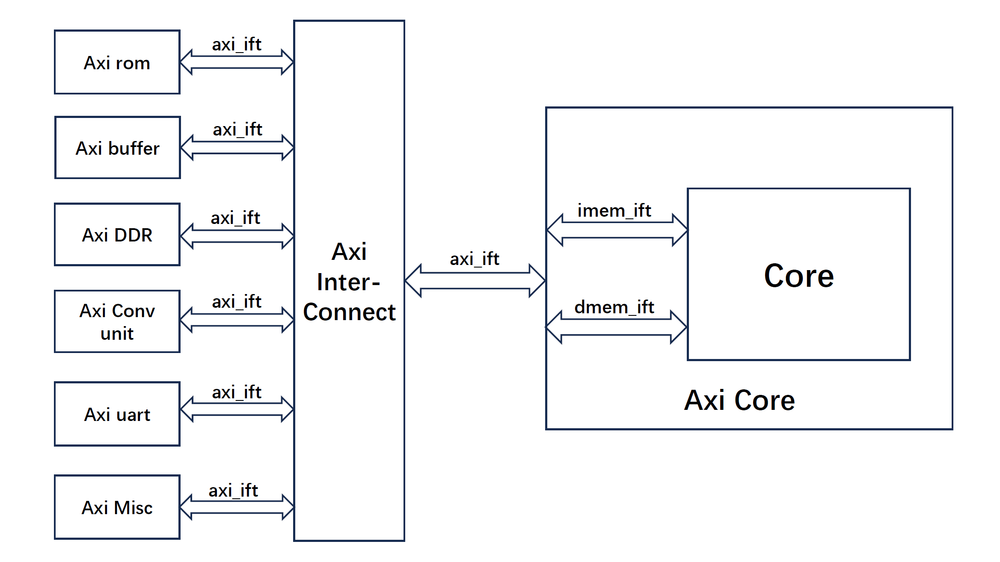
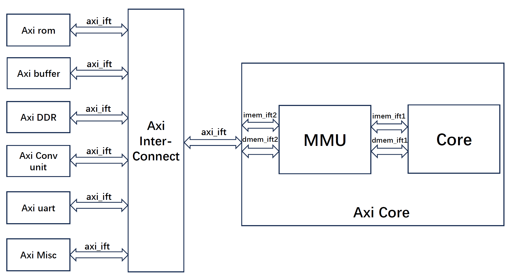
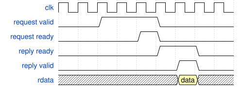
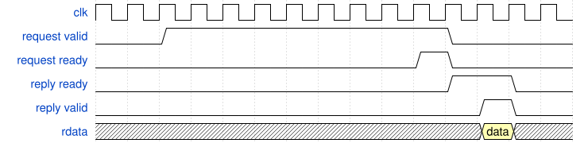

# 实验 6 RV64 软硬件贯通综合实验——MMU & Page Fault

!!! info "25.04.30 发布、25.05.28 之前验收"

## 实验目的

- 理解计算机系统的软硬件协同机制
- 实现具有页表功能和进程切换功能的 kernel
- 为了支持上述的 kernel 设计，完善自己的 CPU Core
- 最终实现将自己设计的 kernel 运行在自己设计的 CPU Core 上
- 需要掌握以下技术：
    - 实现具有页表和进程切换功能的 kernel
    - 设计实现 MMU，了解 RISC-V 架构中 SV39 分页模式，能够实现虚拟地址到物理地址的转换
    - 硬件上需要支持处理 Page Fault 的机制，以便于支持软件的 Fork & COW 机制。

## 实验要求

!!! success "关于小组合作"
    本实验允许小组合作完成，小组最多 3 人，也可独立完成。不会因为组队影响分数，单人完成也没有加分。
    按照惯例，组队实验开始后，助教的角色会慢慢淡出。如果你真的需要求助助教，需要先和小组成员一起讨论，debug，然后把你讨论的过程和结果告诉助教，然后再进行接下来的答疑。

!!! info "5.1 基础地址转换功能的实现 完成之后，就可以运行软件实验的 lab3/lab4"
!!! info "请在 2025.4.30 23:59 之前完成组队"

## 实验环境

- **HDL**：Verilog、SystemVerilog
- **IDE**：Vivado
- **开发板**：Nexys A7
- **软件辅助环境**：Ubuntu 20.04, 22.04

## 前言

在计算机系统Ⅰ、Ⅱ、Ⅲ贯通课程的学习中，我们既学习了处理器架构的设计，设计了基础的 RISC-V 指令，也学习了操作系统的基本原理与设计方法，并在手动编写的 CPU core 上运行编写的简单 kernel。

在这一个实验中，我们将完善自己的 CPU，使其支持虚拟地址转换和缺页异常的发出，运行起 lab 5  kernel。

## 实验原理

### Sv39 分页模式与 MMU

在 [lab3](lab3.md) 中，我们介绍了 RISC-V 的 Sv39 分页模式，并实现了一个创建页表并运行在虚拟地址下的 kernel。关于 Sv39 分页模式我们在这里就不多赘述，大家参考 [lab3](lab3.md) 中的介绍以及 RISC-V 特权级手册即可。

CPU 中 MMU（Memory Management Unit，内存管理单元）是一个不可缺少的部件，其主要有以下三个功能：

- **虚实地址翻译**：在用户访问内存时，将用户访问的虚拟地址翻译为实际的物理地址，以便 CPU 对实际的物理地址进行访问；
- **访问权限控制**：可以对一些虚拟地址进行访问权限控制，以便于对用户程序的访问权限和范围进行管理，如代码段一般设置为只读，如果有用户程序对代码段进行写操作，系统会触发异常。
- **发出缺页异常**：当 Core 违反权限控制对某些内存区域进行访问时，比如访问未经过页表映射的虚拟地址或写入仅可读的地址等情况下，应该抛出缺页异常。CPU 中的异常处理单元

!!! abstract "主要实验目标"
    实现地址转换，使得 CPU 可以运行起lab3 的 kernel。调试 CPU 中特权级处理的部分，使得 CPU 可以运行起 lab4 最终运行 lab5 中编写的 kernel。

## 实验步骤

### 基础地址转换功能的实现

大家可以先实现基础的 MMU 地址转换的功能，成功运行起 lab3 的 kernel 之后，再进一步在基础上实现缺页异常。本节将带领你实现基础的地址转换。



上图为我们之前的整个 CPU 的架构图。核内将访存地址发送到总线上，总线转发到对应的设备：比如核内发起对地址 `0x10000000` 的请求，总线就会转发给 uart，实现对串口的访问；发起对 `0x80200000` 的请求，总线就会将请求转发给 Axi DDR。这部分转发由 Axi Interconnect 完成，对核内是无感的。

即，核内可以感知到的只有两次握手：核内首先发出 `request_valid` 的请求，等待总线回复 `request_ready` 即第一次握手成功，即代表与目标设备的连接已建立；核内开启 `reply_ready` 表示准备好接收数据，总线取好数据将 `reply_valid` 置 1 表示数据有效，这样完成了第二次握手。请注意，**握手需要等待的时间是不确定的**，所以如果你是通过生硬的计数来控制等待的拍数，需要修改逻辑为“握手成功转移状态”来应对接下来的实验。

就如同上文所说的，核内对地址翻译其实是无感的。就如同你写的代码一样，不需要关注地址转换一样。你看到用户态程序的是 PC 从 0 开始执行，但是实际上被加载到物理地址的哪里你不知道，也不需要关心。而且我们也说了，总线根据访存的地址在物理上来转发和握手，这个地址必须是物理地址。那么我们就要发出一个疑问，我在核内根据 PC 发出的取 0x0 地址处指令的操作，到内存里面使用真正的物理地址进行访存，到底经过了什么？

所以我们正式引入了 MMU。MMU 所在的位置如下图所示。他 **“劫持”** 了核内发出的访存请求，经过 **一通操作** 后转化为物理地址，然后真正地将这个物理地址发送到总线上。等到内存根据这个物理地址返回了数据，MMU 又把这个数据送回核内，这样在核内，在编程者看来，就是用一个虚拟的地址取回了对应位置上的数据。



在具体说明如何实现之前，我们先来讲解以下为什么对核内是 **“无感”** 的。无感的意思是，你完全不需要更改 Core 里面的逻辑，也不需要更改之前的握手机制。在核内看来，无非就是握手等待的时间变久了一些，而状态转移的条件依然是两次握手成功就可以取得一个数据。



具体到波形上来说，上图为正常的握手波形。下图为理想中的加了 MMU 的核内看到的波形。第一次握手等待的时间即使做地址转换的时间。

首先，MMU 先把 mem_ift1 和 mem_ift2 断开，自己做地址转换。因为断开之后，mem_ift1 收不到内存传回的握手信号，所以他就一直保持着 `request_valid` 不变。等到地址转换完成，MMU 拿到物理地址了，再把 mem_ift1 和 mem_ift2 连接起来，将 mem_ift1 即核内的访存地址修改为物理地址。内存传回的握手型号核内可以收到，就会做两次握手的状态转移。

这样，在核内看起来就完成了一次用虚拟地址的访存，但是实际上访存过程被 MMU **“劫持”** 了，握手型号和真正的访存地址都受到 MMU 的控制。



那么我们怎么让 MMU 做到 **“劫持”** 来自核内的访存请求，进而做地址翻译呢？

``` SystemVerilog
module MMU(
    input clk,
    input rst,
    ...
    Mem_ift.Slave core_imem_ift,
    Mem_ift.Slave core_dmem_ift,

    Mem_ift.Master mem_imem_ift,
    Mem_ift.Master mem_dmem_ift
);
```

这是 MMU 模块的部分定义，`core_mem_ift` 就是图中的 mem_ift1，`mem_mem_ift` 就是图中的 mem_ift2。我们通过控制这两个总线的断开与连接，就可以实现处理和更改来自核内的内存请求。

接下来我们想知道，断开核内与内存的总线时，MMU 应该去做什么来拿到物理地址？就是通过访问页表，而页表又存在内存中。所以其实 MMU 在做地址翻译的时候，是通过自己发出内存请求实现的。总的来说，为了实现三级页表翻译，我们需要维护以下的状态：

| 当前状态 | 目标状态 | 转移条件               | 需要做的任务 |
| --------| ---------| ----------------------| ------------|
| IDLE    |   DIRECT  | 核内发出的是物理地址   | 无|
| IDLE    |   PTWALK1 | 核内发出的是虚拟地址   | 无 |
| DIRECT  |   IDLE    | 直接内存访问完成      | `mem_mem_ift` 直连 `core_mem_ift`|
| PTWALK1 |  GETDATA  | 只使用一级页表        | 使用 `mem_mem_ift` 访问第一级页表 |
| PTWALK1 | PTWALK2   | 使用三级页表          | 使用 `mem_mem_ift` 访问第一级页表 |
| PTWALK2 | PTWALK3   | 使用三级页表          | 使用 `mem_mem_ift` 访问第二级页表 |
| PTWALK3 |  GETDATA  | 使用三级页表          | 使用 `mem_mem_ift` 访问第三级页表 |
| GETDATA |  IDLE     | 数据取出完成          | 握手信号直连`core_mem_ift`，访存地址改为物理地址 |

下面对每个阶段进行讲解：

- IDLE 阶段，我们根据 `satp` 寄存器的置位以及特权态的输出 `priv` 来判断当前使用物理地址还是使用虚拟地址。如果 `satp` 寄存器未设置，或者特权在 M 态，那么直接使用物理地址访问；如果 `satp` 寄存器已经设置并且当前特权态不为 M 态，那么需要开始进行地址翻译。

- DIRECT 阶段，说明无需地址转换，直接进行内存访问，简单的将 `core_mem_ift` 与 `mem_mem_ift` 直连就好了。

- PTWALK 表示访问页表。第一级页表的物理地址保存在 `satp` 寄存器中。下一级页表的物理地址保存在上一级页表项中。所以我们以物理地址，使用 `mem_mem_ift` 发出访存请求来获得页表项 PTE (Page Table Entry)。

由于每次 `PTWALK` 也是需要向内存发去请求，所以每次 `PTWALK` 需要拆解为两次握手，下面以访问一级页表 `PTWALK1` 为例。

| 当前状态 | 目标状态 | 转移条件               | 需要做的任务 |
| --------| ---------| ----------------------| ------------|
|PTWALK1_1|PTWALK1_2| `mem_mem_ift.request` 握手成功 |保持 `mem_mem_ift.request_valid`  |
|PTWALK1_2|PTWALK2_1| `mem_mem_ift.reply` 握手成功并且取出的的 PTE 不为 Leaf PTE | 保持 `mem_mem_ift.reply_ready`  |
|PTWALK1_2|GETDATA| `mem_mem_ift.reply` 握手成功并且取出来的 PTE 为 Leaf PTE | 保持 `mem_mem_ift.reply_ready`  |

- GETDATA 阶段，不管是使用一级页表也好，使用三级页表也好，到了这个阶段我们都拿到了 LEAF PTE，即最后一级页表项。也就是地址翻译完成，拿到了一开始 `core_mem_ift` 想访问的虚拟地址的物理地址。所以我们这个时候将 `core_mem_ift` 与 `mem_mem_ift` 的握手信号连接上，将 `mem_mem_ift` 的访存地址更改为从 LEAF PTE 中恢复出来的地址，而不是使用 `core_mem_ift` 发出的虚拟地址。这样在 Core 看来，我们就实现了地址翻译的内存访问。至此，一次内存访问完成。

### 用户态实现及异常抛出

完成了 MMU 实现了虚拟地址转换后，我们也只能运行 lab3 中编写的启用了 Sv39 分页的 kernel 代码。更进一步，大家可以调试并完善自己的 CPU，使得其可以运行起 lab4 中添加了用户模式程序，以及 lab5 中处理了缺页异常并实现了 fork 机制的 kernel。

实验框架的 CSRModule 中实现了 sscratch 寄存器，所以如果实现的 MMU 工作正常，是可以直接运行带有用户模式的 kernel 的。接下来为了支持 demand paging 以及 fork 机制，需要 MMU 可以正常识别并抛出 Page Fault 异常。注意触发 Page Fault 有以下几种情况：

- 读取到的 PTE 的 V 位为 0，或者 R 为 0 且 W 为 1（非法 PTE）；
- 读取到的最后一级 PTE 仍不是叶页表项；
- 叶 PTE 的 R/W/X/U 位与当前特权级、SUM 的 MXR 位判断当前访存权限非法；
    - 本实验中不要求考虑 MXR，只需要判断用户态访问页表是否设置了 U 位即可；

正确实现了 Page Fault 异常的抛出就可以运行起带有 demand paging 和 fork 机制的内核了。

在这一部分中，我们需要新增一个处理异常的状态 `PTWALK_EXC`。在前面的页表翻译过程中，如果某一次页表翻译出现了：

* 某一个 PTE 的 V 位为 0 的，说明还页表还未进行映射。

* 某一次写请求，但是 Leaf PTE 的 W 位为 0 的，说明该页不能写，需要 Copy on Write 机制。

就需要将下一个状态设置为 `PTWALK_EXC`。

在这个状态中，我们需要设置好 `except_mmu` 结构体，这个结构体会被传入到 CsrModule 中，用来产生异常，引导控制流到异常处理入口。在这个结构体中有四个成员：

* `except`: 用来表示是否产生异常，如果产生异常就把该位置 1.

* `epc`: 用来记录产生异常的那条 PC。如果是取指访存发生了异常，则应该置为 IF 阶段的 PC；如果是 MEM 阶段访存发生了异常，则应该置为 MEM 阶段的 PC。

* `ecause`: 记录发生异常的原因，请参照手册给出具体数值。我们需要处理的异常有 Instruction Page Fault，Load Page Fault，Store/AMO Page Fault。请根据不同的情况给出这三个数值。

* `etval`: 记录发生访存异常的访存地址，这个地址是核内发出访存请求的虚拟地址。

## 框架代码导读
我们已经将 MMU 在 repo/general/Axi_Core.sv 进行了实例化，并且与 Core 进行了连线。你需要在 Core.sv 中添加以下输入输出。

```verilog title="src/project/submit/Core.sv" linenums="0" hl_lines="5 9-12"
module Core (
    input clk,
    input rst,
    input time_int,
    input CsrPack::ExceptPack except_mmu,

    Mem_ift.Master imem_ift,
    Mem_ift.Master dmem_ift,
    output CorePack::data_t satp,
    output logic [1:0] output_priv,
    output CorePack::data_t pc_if,
    output CorePack::data_t pc_mem,
    output logic cosim_valid,
    output CorePack::CoreInfo cosim_core_info,
    output CsrPack::CSRPack cosim_csr_info,
    output logic cosim_interrupt,
    output logic cosim_switch_mode,
    output CorePack::data_t cosim_cause
);
```

为了支持后续的缺页异常处理，请将你 submit 代码中的 CsrModule.sv 更新为 src/lab6/CsrModule.sv，添加了以下输入。

```verilog title="src/lab6/CsrModule.sv" linenums="0" hl_lines="15 20"
module CSRModule(
    input clk,
    input rst,
    input csr_we_wb,
    input CsrPack::csr_reg_ind_t csr_addr_wb,
    input CorePack::data_t csr_val_wb,
    input CsrPack::csr_reg_ind_t csr_addr_id,
    output CorePack::data_t csr_val_id,

    input CorePack::data_t pc_wb,
    input valid_wb,
    input time_int,
    input [1:0] csr_ret,
    input CsrPack::ExceptPack except_commit,
    input CsrPack::ExceptPack except_mmu,

    output [1:0] priv,
    output switch_mode,
    output CorePack::data_t pc_csr,
    output CorePack::data_t satp,

    output cosim_interrupt,
    output CorePack::data_t cosim_cause,
    output CsrPack::CSRPack cosim_csr_info
);
```

请你将 src/lab6/MMU.sv 完成后放入 src/submit 中，MMU.sv 的接口如下。

```verilog title="src/lab6/MMU.sv" linenums="0"
module MMU(
    input clk,
    input rst,
    input CorePack::data_t satp,        // satp寄存器的值
    input [1:0] priv,                   // 当前特权态
    input switch_mode,                  // 核内发生了特权态的切换
    input CorePack::data_t pc_if,       // IF 阶段的 PC，在发生 Instruction Page Fault 时作为 EPC
    input CorePack::data_t pc_mem,      // MEM 阶段的 PC，在发生 Load/Store Page Fault 时作为 EPC

    output CsrPack::ExceptPack except_mmu,  // 传出异常信息

    Mem_ift.Slave core_imem_ift,        // Core 侧的总线
    Mem_ift.Slave core_dmem_ift,

    Mem_ift.Master mem_imem_ift,        // Axi 侧的总线
    Mem_ift.Master mem_dmem_ift
);

    //TODO: Finish your MMU

endmodule
```
## 编译及测试

### 实验前准备

开始实验前，更新 sys3-sp25 仓库与 repo/sys-project 仓库，在这两个仓库下执行

```bash
git pull
```
### 编译运行

把你要运行的 kernel 放在 src/project 下，运行以下命令即可。

```bash
make kernel
# make kernel 2>/dev/null
```

### 你可能遇到的问题

#### 初始化时间过长

在 `mm_init` 这一步十分耗时，有以下原因

* 在 kernel/arch/riscv/include/private_kdefs.h 中定义了 `PHY_SIZE` 的大小，由于硬件资源有限并且初始化时间过长，需要把这个改小，在一下这个数量级是一个比较合适的数字。

```c
#define PHY_SIZE 0x400000
```

* mm.c 中初始化相关的 `memset` 函数可以去掉，在跑硬件的时候默认已经初始化为0.

* 如果做了以上两步还是很慢，原因是从 sys3 开始，软件实验内存初始化采用了 `buddy system`，在初始化的过程中比较耗时间，所以我们不得不开一次历史的倒车，请你将 mm.c 替换为 sys2 中软件实验用到的 mm.c。至此，初始化慢的问题应该可以得到解决。

#### 提示某些符号找不到

有同学反映在 lab6 编译的时候，找不到 `_suapp` `_euapp` 的符号。产生这个问题的原因是我们使用的连接脚本不再是 vmlinux.lds，而是 repo/sys-project/testcode/testcase.ld 与 repo/sys-project/testcode/link.ld。在repo/sys-project/testcode/Makefile 中体现。针对这个问题已经做了修正，你只需更新以下 sys-project 仓库即可。你有新增的符号也可也自行更新，还有符号的问题可以与助教联系。

## 评分标准
将 lab3 的 kernel 运行起来即可获得 70% 的分数。将 lab4，lab5 的 kernel 运行起来各获得剩余的 15% 的分数。

## 思考题

1，请截图波形，解释完成一次地址翻译的过程，指出哪个是一级 PTE，哪些是二级 PTE，哪些是三级 PTE.

2，计算引入 MMU 后运行 kernel 的 CPI，与 lab0 和 lab2 的进行对比，指出为什么 CPI 会变慢。有什么方法能够加速这个过程？

3，核内发出的 MMIO 地址需要特殊处理吗？如果需要，你是如何处理的。如果不需要，则为什么不需要特殊处理。