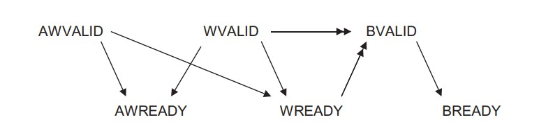
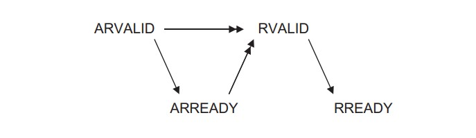

# Xpart：RV64 软硬件贯通综合实验

!!! info "24.05.16 发布、24.06.13 进行展示（四周）"

## 实验目的

- 理解计算机系统的软硬件协同机制
- 实现具有页表功能和进程切换功能的 kernel
- 为了支持上述的 kernel 设计，完善自己的 CPU Core
- 最终实现将自己设计的 kernel 运行在自己设计的 CPU Core 上
- 需要掌握以下技术：
	  - 实现具有页表和进程切换功能的 kernel
	  - 设计实现 MMU，了解 RISC-V 架构中 SV39 分页模式，能够实现虚拟地址到物理地址的转换
	  - 在上述基础上可以进行不同方向的拓展，会在后面的文档中简要阐述

## 实验环境

- **HDL**：Verilog、SystemVerilog
- **IDE**：Vivado
- **开发板**：Nexys A7
- **软件辅助环境**：Ubuntu 20.04, 22.04

## 前言

在计算机系统Ⅰ、Ⅱ、Ⅲ贯通课程的学习中，我们既学习了处理器架构的设计，设计了基础的 RISC-V 指令，也学习了操作系统的基本原理与设计方法，并在手动编写的 CPU core 上运行编写的简单 kernel。

在系统Ⅲ的最后一个实验中，我们将完善自己的 CPU，使其支持虚拟地址转换，运行起 lab 3 及后续编写的 kernel，并且根据大家的兴趣和能力，可以进行更多的不同方向上的扩展，比如功能、性能、安全增强等不同维度。

## 实验原理

### Sv39 分页模式与 MMU

在 [lab3](lab3.md) 中，我们介绍了 RISC-V 的 Sv39 分页模式，并实现了一个创建页表并运行在虚拟地址下的 kernel。关于 Sv39 分页模式我们在这里就不多赘述，大家参考 [lab3](lab3.md) 中的介绍以及 RISC-V 特权级手册即可。

CPU 中 MMU（Memory Management Unit，内存管理单元）是一个不可缺少的部件，其主要有以下两个功能：

- **虚实地址翻译**：在用户访问内存时，将用户访问的虚拟地址翻译为实际的物理地址，以便 CPU 对实际的物理地址进行访问；
- **访问权限控制**：可以对一些虚拟地址进行访问权限控制，以便于对用户程序的访问权限和范围进行管理，如代码段一般设置为只读，如果有用户程序对代码段进行写操作，系统会触发异常。

本次实验中需要实现一个带有虚实地址翻译功能的 MMU。（需要注意的是在 [lab2](./lab2.md) 中已经通过 `Axi_lite_MMUer` 模块接收对于 0x5000000 地址处的读写来进行缓存是否启用的控制，不过该模块的实际功能并不是上面说到的 MMU）

!!! abstract "主要实验目标"
    本实验中大家要实现的是类似于 [lab2](./lab2.md) 中的 Cache 相关模块。在 [lab2](./lab2.md) 中是将 core 中进行的内存访问传给了 Icache 和 Dcache 两个模块，在模块中也有再多次进行访存的操作，这和进行地址翻译的过程很类似。所以本次实验中需要同学们仿照 Cache 相关模块实现一个 MMU 进行虚拟地址的转换和使用虚拟地址的读写操作。（为了简化本部分实验难度，这一目标中不要求加入 Cache）

!!! tip "关于 AXI-lite 总线模型"
    在系统Ⅱ的 lab2 中我们引入了 AXI-lite 总线，不过其中的内存沟通部分一直由实验框架在实现。为了完成此实验，在一次访存过程中，需要先进行虚拟地址的转换，而这个过程中又需要多次的访存操作。所以需要同学们阅读框架中 AXI-lite 总线以及[系统Ⅲ lab2](./lab2.md) 中 Cache 部分相关的代码，理解内存部分的握手，方便后续编写 MMU 时进行内存读取。

    ??? note "简要介绍"
        Axi-lite 协议是 Axi-full 协议的简化版，它的数据总线的宽度只能是 32 位或者 64 位，一次总线传输只进行一个数据的读写。Axi-lite 一共有五条 valid-ready 握手的传输通道，介绍如下：

        1. 写地址通道：用于 Master 设备向 Slave 设备传输写入内存的地址。该通道由握手信号 awvalid、awready 和写地址数据 awdata、写访问权限 awport 组成，当 awvalid 和 awready 同时为 1，awdata、awport 有效，awport 一般设为 4'b0000 且被忽略。
        2. 写数据通道：用于 Master 设备向 Slave 设备传输写入内存的数据。该通道由握手信号 wvalid、wready 和写数据 wdata、字节写使能信号 wstrb 组成，当 wvalid 和 wready 同时为 1，wdata、wstrb 有效，wstrb 指示 wdata 的哪些 byte 需要被改写。
        3. 写回应通道：用于 Slave 设备向 Master 设备返回写操作的执行情况。该通道由握手信号 bvalid、bready 和写应答结果 bresp 组成，当 bvalid 和 bready 同时为 1，bresp 有效。bresp 值为 2'b00 说明内存访问正确，不然内存访问错误。
        4. 读地址通道：用于 Master 设备向 Slave 设备传输读内存的地址。该通道由握手信号 arvalid、arready 和写地址数据 ardata、写访问权限 arport 组成，当 arvalid 和 arready 同时为 1，ardata、arport 有效，arport 一般设为 4'b0000 且被忽略。
        5. 读数据通道：用于 Slave 设备向 Master 设备返回读出数据和读操作情况。该通道由握手信号 ralid、rready 和读数据 rdata、读响应信号 rresp 组成，当 rvalid 和 rready 同时为 1，rdata、rresp 有效。rresp 为 2'b00 表示访问成功，反之读操作失败。

        当通过 Axi-lite 协议执行写事务时，Master 首先通过写地址通道和写数据通道的 ready-valid 握手将写地址 awdata、写权限 awport、写数据 wdata、字节写使能 wstrb 发送给 Slave。之后 Slave 设备通过写响应通道的 valid-ready 握手将写情况 wresp 反馈给 Master，一次写事务执行完成。valid、ready 握手信号之间的先后关系可以参看下图，其中单箭头是供参考的先后关系，双箭头是必须保证的先后关系。

        

        当通过 Axi-lite 协议执行读事务时，Master 首先通过读地址通道的 ready-valid 握手将写地址 awdata、写权限 awport 发送给 Slave。之后 Slave 设备通过读数据通道的 valid-ready 握手将读到的数据 rdata 和读数据情况 rresp 反馈给 Master，一次读事务执行完成。valid、ready 握手信号之间的先后关系可以参看下图，其中单箭头是供参考的先后关系，双箭头是必须保证的先后关系。

        

### TLB 地址转换缓冲器

在实现了上面的 MMU 的基础上，由于每次取指、访存都会进行很多次对于页表的读取操作，会消耗非常多的周期，导致系统运行效率非常低。我们可以采用 TLB，以及加入 Cache 等操作来提升地址翻译以及访存效率。

TLB（Translation Lookaside Buffer，地址转换后援缓冲器）也称为快表。简单地说，TLB 就是页表的 Cache，其中存储了当前最可能被访问到的页表项，其内容是部分页表项的一个副本。只有在 TLB 无法完成地址翻译任务时，才会到内存中查询页表，这样就减少了页表查询导致的处理器性能下降。

!!! note "关于 TLB 刷新"
    我们知道不同的进程之间看到的虚拟地址范围是一样的，所以多个进程下，不同进程的相同的虚拟地址可以映射不同的物理地址。这就会造成歧义问题。例如，进程 A 将地址 0x2000 映射物理地址 0x4000。进程 B 将地址 0x2000 映射物理地址 0x5000。当进程 A 执行的时候将 0x2000 对应 0x4000 的映射关系缓存到 TLB 中。当切换 B 进程的时候，B 进程访问 0x2000 的数据，会由于命中 TLB 从物理地址 0x4000 取数据。这就造成了歧义。如何消除这种歧义，我们采用 sfence.vma 指令可以刷新 TLB，以保证在进程切换时将整个 TLB 无效。切换后的进程都不会命中 TLB，但是会导致性能损失。

!!! abstract "主要实验目标"
    本次实验中大家可以仿照 Cache 实现一个直接映射/组相连的 TLB，并实现在 TLB miss 或进程切换时运行 sfence.vma 的 TLB 刷新。有兴趣的同学还可以研究 sfence.vma 的参数，通过 ASID 等方式来减少 TLB 的刷新。

    更进一步地提升效率，大家还可以将 [lab2](./lab2.md) 中实现的 Cache 同时接入到 CPU 中。并通过 CPI 等指标进一步衡量 CPU 的优化程度。

### 用户态实现及中断完善

完成了 MMU 实现了虚拟地址转换后，我们也只能运行 lab3 中编写的启用了 Sv39 分页的 kernel 代码。更进一步，大家可以调试并完善自己的 CPU，使得其可以运行起 lab4 中添加了用户模式程序，以及 lab5 中处理了缺页异常并实现了 fork 机制的 kernel。

实验框架的 CSRModule 中实现了 sscratch 寄存器，所以如果实现的 MMU 工作正常，是可以直接运行带有用户模式的 kernel 的。接下来为了支持 demand paging 以及 fork 机制，需要 MMU 可以正常识别并抛出 Page Fault 异常。注意触发 Page Fault 有以下几种情况：

- 读取到的 PTE 的 V 位为 0，或者 R 为 0 且 W 为 1（非法 PTE）；
- 读取到的最后一级 PTE 仍不是叶页表项；
- 叶 PTE 的 R/W/X/U 位与当前特权级、SUM 的 MXR 位判断当前访存权限非法；
    - 本实验中不要求考虑 MXR，只需要判断用户态访问页表是否设置了 U 位即可；
- 是 superpage 的情况但 superpage 没有对齐。

正确实现了 Page Fault 异常的抛出就可以运行起带有 demand paging 和 fork 机制的内核了。

!!! abstract "主要实验目标"
    调试 CPU 中特权级处理的部分，使得 CPU 可以运行起 lab4 或 lab5 中编写的 kernel。

### MMIO 与外设

在系统二 lab6（即 [lab0](./lab0.md)）以后的框架中，我们通过 MMIO 实现了 Displayer 和 Uart 等模块。MMIO 即通过特定地址的内存读写来进行 I/O 操作。框架中实现了 Displayer 的部分，即如果检测到对 0x3000000 地址的写入，则在仿真时通过 \$display 或 \$write 来输出字符，在上板时通过 IO 模块来显示到 LED 上。

[lab0](./lab0.md) 的实验框架并没有实现 Uart 部分，UART（Universal Asynchronous Receiver/Transmitter，通用异步收发器）是一个串行、异步、全双工的通信协议，通常称为串口。最常用的形式是通过 USB 来进行数据的传输。框架中在 io.sv 中创建了对 `io_Uart.sv` 的调用，不过其中是空模块。同学们可以自行学习 UART 协议，并完成 `io_Uart` 模块，实现对于 TXD 的输出，并在 xdc 引脚约束中添加对于 USB 部分的传输。完成后可以通过 MobaXterm 等软件来对连接到 FPGA 板子的 USB 串口进行监听，在运行时即可通过串口输出内容到 MobaXterm 终端中显示。

有兴趣的同学还可以修改并完善框架 io 的 VGA 部分，来实现更多功能的显示输出。

!!! abstract "主要实验目标"
    实现更多的外设，比如完成 UART 模块实现串口输出，完善 VGA 部分实现显示。

## 实验要求

!!! success "关于小组合作"
    本实验允许小组合作完成，小组最多 3 人，也可独立完成。若小组合作完成，则需要讲清楚每个人的工作量和贡献，如果最终没有工作量的同学，分数会受到影响。

本次实验基于 [lab2](./lab2.md) 完成，没有更多的硬件框架指导，需要大家自行研究实现本次实验的任务。

本次实验有必做和选做两个部分，实现进行虚拟地址转换（直接模式和 Sv39 模式）的 MMU 是本次实验的必做部分，完成这个模块就可以拿到大部分分数，选做部分在后面的分数分配中描述。

### 分数分配

| 实验成果                                         | 分数                         |
| ------------------------------------------------ | ---------------------------- |
| 实现 MMU，运行 lab3 的 kernel | 80 分（必做部分） |
| 在 MMU 基础上添加分支预测模块或 Cache 模块 | 分别为 10 分、20 分 |
| 实现 TLB 模块，加速地址转换过程 | 20 分 |
| 完善特权级部分，运行 lab4 或 lab5 的 kernel | 20 分 |
| 实现外设，比如 UART 模块等 | 20 分 |
| 在内核中添加输入输出功能，实现 execve 等功能（不需要配合硬件） | 分别为 10 分、20 分 |
| 其他想法，请联系老师或助教 | 待评估 |

PS：多余的分数会以**非等值**的方式计入 bonus。

### 实验提交

本次实验采用答辩的方式，不进行额外的验收和代码提交。目前计划在最后一节实验课上进行小组的最终答辩，需要展示自己所做的全部成果，每组有 5 分钟的展示时间和 3 分钟的提问时间。

最后请务必尽快组队并尽快确定分工开始实验，祝大家好运！