# Xpart：RV64 软硬件贯通综合实验

!!! warning "本实验尚未修改完成"

## 实验目的

- 理解计算机系统的软硬件协同机制
- 实现具有页表功能和进程切换功能的Kernel
- 为了支持上述的Kernel设计，完善自己的CPU Core
- 最终实现将自己设计的Kernel运行在自己设计的CPU Core上
- 需要掌握以下技术：
	- 实现具有页表和进程切换功能的Kernel
	- 实现基于RV64指令集的CPU Core
	- 设计实现MMU，了解RISC-V 架构中 SV39 分页模式，能够实现虚拟地址到物理地址的转换
	- 在上述基础上可以进行不同方向的拓展，会在后面的报告中详细阐述


## 实验环境

- **HDL**：Verilog
- **IDE**：Vivado
- **开发板**：Nexys A7
- **软件辅助环境**：Ubuntu 20.04, 22.04


## 背景知识

### 前言

在计算机系统Ⅰ，Ⅱ，Ⅲ贯通课程的学习中，我们对计算机系统有了进一步的认识，设计了自己的 CPU Core 和Kernel 。在最后一个xpart综合实验中，我们要尝试将一个自己实现的简单Kernel（ 如64 位 ELF 程序—— lab5 中实现的内容）运行在自己编写的 CPU Core 上。

在系统III的Lab3中，已经学习了 OS 如何开启虚拟地址以及通过设置页表来实现地址映射和权限控制。本实验将完成内存管理单元协同开启虚拟地址。

接下来介绍本实验涉及到的一些背景知识。


### RISCV64

RV64 和 RV32 非常兼容。如果程序不依赖于隐式 32 位模运算并且所有地址都适合 32 位，则机器代码可能是相同的。

64 位 ISA只添加了少数指令。指令集只添加了 32 位指令对应的字(word)，双字(doubleword)和长整数(long)版本的指令，并将所有寄存器（包括 PC）扩展为 64 位。因此，RV64I 中的 sub 操作的是两个 64 位数字而不是 RV32I 中的 32 位数字。RV64 很接近 RV32，但实际上又有所不同;它添加了少量指令同时基础指令做的事情与 RV32 中稍有不同。


### MMU

MMU(Memory Management Unit)，即内存管理单元，是现代CPU架构中不可或缺的一部分，MMU主要包含以下几个功能：

- 虚实地址翻译

在用户访问内存时，将用户访问的虚拟地址翻译为实际的物理地址，以便CPU对实际的物理地址进行访问。

- 访问权限控制

可以对一些虚拟地址进行访问权限控制，以便于对用户程序的访问权限和范围进行管理，如代码段一般设置为只读，如果有用户程序对代码段进行写操作，系统会触发异常。


### RISC-V Sv39 Virtual Address and Physical Address

```
     38        30 29        21 20        12 11                           0
     ---------------------------------------------------------------------
    |   VPN[2]   |   VPN[1]   |   VPN[0]   |          page offset         |
     ---------------------------------------------------------------------
                            Sv39 virtual address
```

```
 55                30 29        21 20        12 11                           0
 -----------------------------------------------------------------------------
|       PPN[2]       |   PPN[1]   |   PPN[0]   |          page offset         |
 -----------------------------------------------------------------------------
                            Sv39 physical address
```


- Sv39 模式定义物理地址有 56 位，虚拟地址有 64 位。但是，虚拟地址的 64 位只有低 39 位有效，通过 虚拟内存布局图我们可以发现 其 63-39 位 为 0 时代表 user space address， 为 1 时 代表 kernel space address。Sv39 支持三级页表结构，VPN[2-0](https://parfaity.gitee.io/sys3lab-2023-stu/lab3/Virtual Page Number)分别代表每级页表的 `虚拟页号`，PPN[2-0](https://parfaity.gitee.io/sys3lab-2023-stu/lab3/Physical Page Number)分别代表每级页表的 `物理页号`。物理地址和虚拟地址的低12位表示页内偏移（page offset）。
- 具体介绍请阅读 [RISC-V Privileged Spec 4.4.1](https://www.five-embeddev.com/riscv-isa-manual/latest/supervisor.html#sec:sv39)


### TLB

TLB是translation lookaside buffer的简称。首先，我们知道MMU的作用是把虚拟地址转换成物理地址。虚拟地址和物理地址的映射关系存储在页表中，页表储存在内存中，在三级页表的结构，需要读取三次内存中的数据才可以完成从虚拟地址到物理地址的转换，对于流水线来说，非常影响性能。为了提升地址翻译效率，我们在MMU中设置一个TLB。TLB其实就是一块储存地址的Cache。

TLB中的下标一般是虚拟地址，数据是物理地址，因为一个物理地址一定对应一个数据，但是不同的物理地址可能存储相同的数据。也就是说，物理地址对应数据是一对一关系，反过来是多对一关系。由于TLB的特殊性，存储的是虚拟地址和物理地址的对应关系。因此，对于单个进程来说，同一时间一个虚拟地址对应一个物理地址，一个物理地址可以被多个虚拟地址映射。

我们知道不同的进程之间看到的虚拟地址范围是一样的，所以多个进程下，不同进程的相同的虚拟地址可以映射不同的物理地址。这就会造成歧义问题。例如，进程A将地址0x2000映射物理地址0x4000。进程B将地址0x2000映射物理地址0x5000。当进程A执行的时候将0x2000对应0x4000的映射关系缓存到TLB中。当切换B进程的时候，B进程访问0x2000的数据，会由于命中TLB从物理地址0x4000取数据。这就造成了歧义。如何消除这种歧义，我们采用`sfence.vma`指令可以刷新TLB，以保证在进程切换时将整个TLB无效。切换后的进程都不会命中TLB，但是会导致性能损失。


## 基本部分

### Kernel的功能要求（页表的设置与开启、进程的切换）

本次实验的Kernel设计需要实现页表的设置和开启，进程的切换。我们给出的kernel文件实现了最简单的逻辑，仅保留了设置页表，开启页表，进程切换的功能，kernel可以在[仓库]([src/xpart · Parfait-ty/sys3lab-2023-stu - 码云 - 开源中国 (gitee.com)](https://gitee.com/Parfaity/sys3lab-2023-stu/tree/master/src/xpart))中下载到。同学们也可以从[仓库]([src/xpart · Parfait-ty/sys3lab-2023-stu - 码云 - 开源中国 (gitee.com)](https://gitee.com/Parfaity/sys3lab-2023-stu/tree/master/src/xpart))中下载Makefile并替换，自行编译生成kernel。

PartX的基础要求是，你需要运行成功具有页表功能和进程切换功能的软件kernel，使得你设计的CPU Core可以支持你设计的Kernel在其上运行。进阶要求，你可以在kernel中增加用户态代码，为每个用户态进程分配独立页表，将其自行编译后成功运行在硬件上。

1. 注意：由于我们的硬件上没有符号表的处理，由于在RAM中函数和全局变量在数据段的地址是固定的，建议大家在硬件出现ld读取符号表时，将其软件部分地址写为固定地址。

	- 补充（更新于6.14）：在Makefile中添加`-fno-pic`可以在生成汇编时不生产符号表，不需要通过ld指令去符号表里面读取，最新版本的Makefile和相关coe等文件已更新。在dump文件中，会发现地址都是虚拟地址，这是dump的问题，实际程序开始的地址是80200000，且开启虚拟地址之前的汇编里的数据都是物理地址（大家可以通过机器码反汇编查看具体地址）。

	

2. 注意（更新于6.14）：虚拟页表开启（写完satp后），需要经过一个ret，pc才会从物理地址转换为虚拟地址，并且在虚拟地址上读取数据。同学们可以选择以下方式避免ret指令的取指令失败：

	- 在硬件MMU中，设置好satp后延迟一定时钟周期开启虚拟地址和物理地址的转换

	- 在页表设置时完成一次等值映射，这样经过MMU翻译，用和物理地址一致的虚拟地址也能正确访问到指令。

	- 完善硬件报错机制和软件异常处理机制，在设置好了 satp 且 pc 还停留在物理地址时，通过异常直接跳到 stvec 里设置的虚拟地址。
	
3. 注意（更新于7.5）：根据官网资料，板子上的Block RAM是4,860 Kb。PHY_SIZE改为3\*1024\*1024是可以正常运行的，修改过后的coe等文件更新在/src/xpart/build_ram_3mb中。


### 处理器的设计要求

#### （1）将流水线改为64位

本实验可基于系统三lab0 / lab1 / lab2中同学们所实现的代码进行。为了支持基于RV 64架构的kernel运行，将处理器设计部分改写成64位。

补充（更新于6.14）：有同学希望使用框架代码进行实现，这也是被允许的。建议在最终答辩时分析清楚框架代码和自己设计的流水线之间的不同，经过对比为什么会选用框架代码，从框架代码中有没有学习到什么硬件设计思路。

64位RISCV和32位RISCV的指令基本一致，因此流水线中指令（inst）相关的寄存器仍然保持32位，其余涉及数据流的寄存器需要都改为64位。更改完成后可以用64位编译工具链重新编译原来32位的测试程序，测试运行以保证扩充数据宽度后的正确性。


#### （2）在流水线中增加指令

根据我们生成的asm，本次实验需要添加以下指令:

- 访存指令：lbu, sb, ld, sd
- 计算指令：addw, addiw, slliw, srli
- 跳转指令：bge, blt, bltu

指令集手册：http://staff.ustc.edu.cn/~llxx/cod/reference_books/RISC-V-Reader-Chinese-v2p12017.pdf

ISA介绍：https://www.five-embeddev.com/riscv-isa-manual/latest/machine.html#otherpriv

32位和64位不同类别的指令手册：https://jemu.oscc.cc/SLLI


##### 访存指令

- 增加lbu，sb，ld，sd指令，可以参照lab1，lab2给定框架中的实现方式。

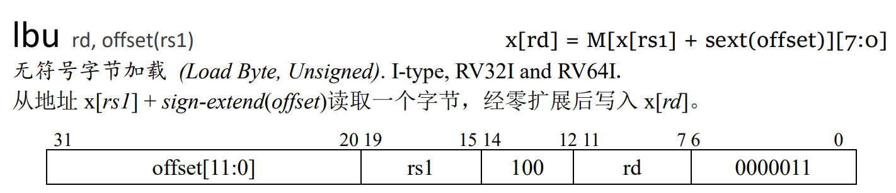

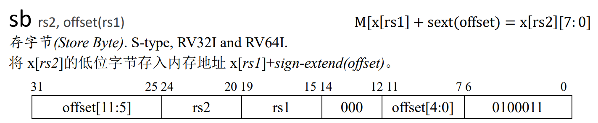

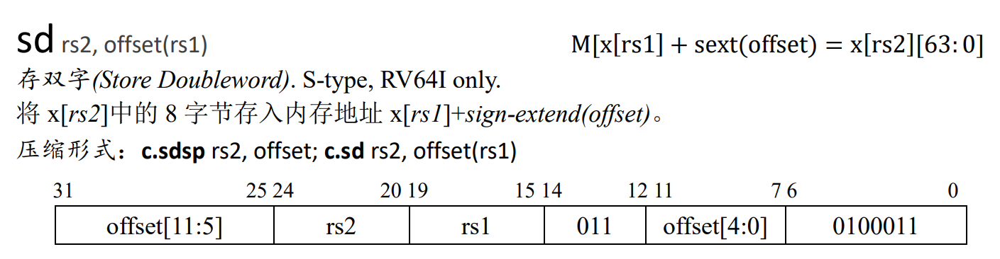

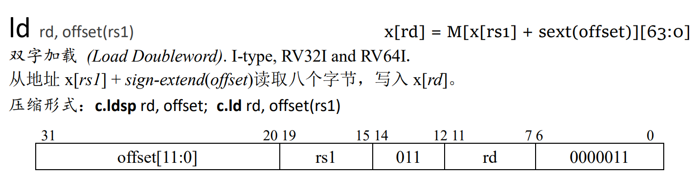

- 将lw，sw修改为64位环境下，取数据的低32位进行存入写出。

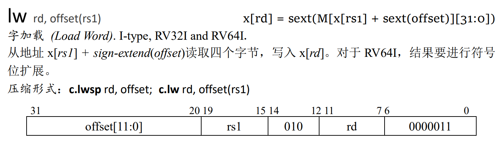

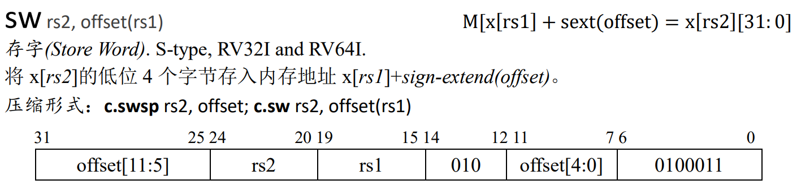


##### 计算指令

- 原有的 `add, addi, sub, and, andi, or, sra, lui, slli, xori(not)` 指令在64位和32位中运行逻辑和汇编代码都一致，可不用更改。

- 新增：addw, addiw, slliw, srli

	（经同学指正，srli在rv64中不限制shamt[[5]=0）

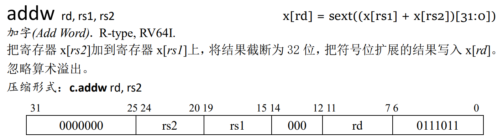

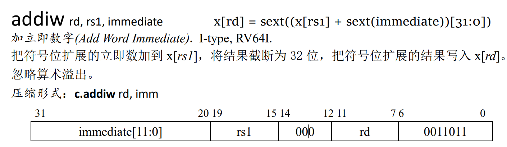

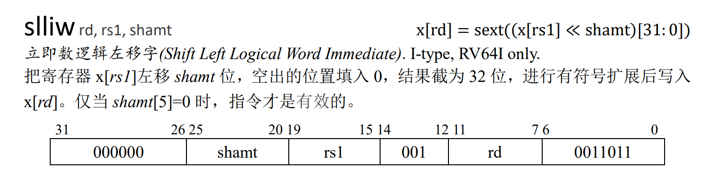


##### 跳转指令

目前已实现的指令：beq, bne, bgeu

需要增加的指令：bge, blt, bltu

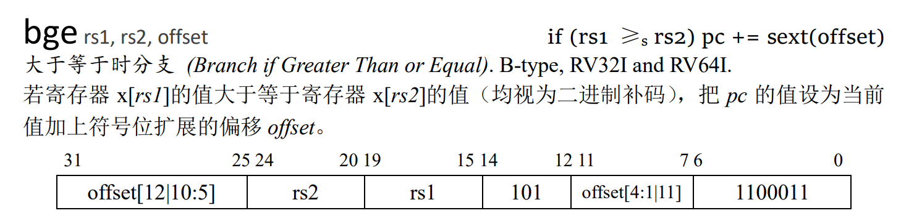

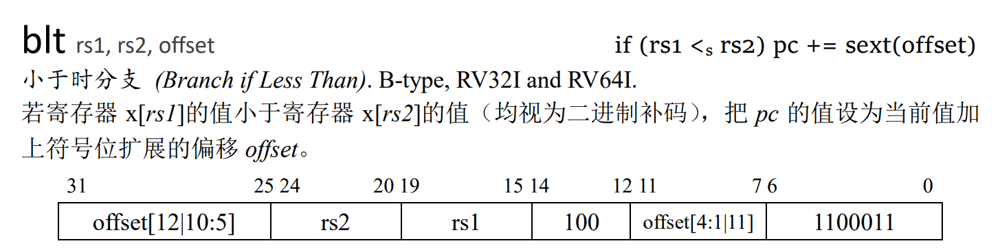

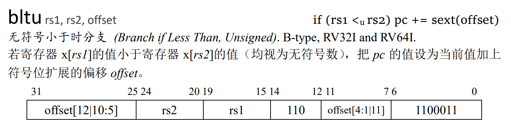


#### （3）修改特权态代码

本次实验需要将原来M态的寄存器（mtvec, mepc, mstatus），改为S态的寄存器（stvec, sepc, sstatus）。新增至少2个CSR寄存器：scause，satp，以保证程序的正确执行，特权寄存器仅发生读和写。CSR寄存器的长度为 64 bits。

本次实验需要将lab0中的M态指令修改为S态，增加`sret`指令（和`mret`功能一致），在执行指令`sret`后会从Trap中返回到正常的代码执行流中，即寄存器`sepc`所储存的地址。

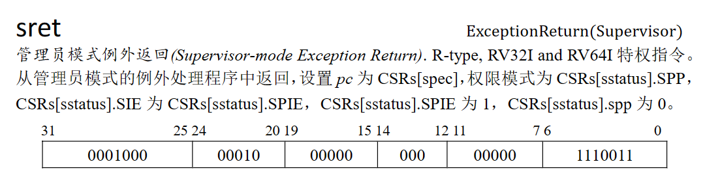

sfence.vma指令：若实现tlb，则本条指令需要实现的内容是将tlb清空；若未实现，可将其当作nop处理。

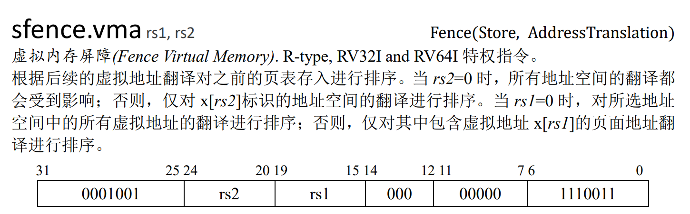


#### （4）MMU

内存管理单元（Memory Management Unit，以下简称为MMU），它是一种负责处理CPU的内存访问请求的计算机硬件。它的功能主要有虚拟地址到物理地址的转换、内存保护和Cache控制。

我们已经学习了虚拟内存的相关知识，在前面的实验中实现了物理地址到虚拟地址的切换。在开启虚拟内存后，CPU处理的地址均变为虚拟地址。此时，CPU给出的地址并不能直接给Memory使用，我们需要引入MMU实现从虚拟地址到物理地址的转换。

MMU在CPU和Memory之间，对于传入传出的地址进行更改。MMU内部的处理逻辑非常简单，虚拟地址转化为物理地址流程图如下，具体描述见 [RISC-V Privileged Spec 4.3.2](https://www.five-embeddev.com/riscv-isa-manual/latest/supervisor.html#sv32algorithm) :

```txt
                                Virtual Address                                     Physical Address

                          9             9            9              12          55        12 11       0
   ┌────────────────┬────────────┬────────────┬─────────────┬────────────────┐ ┌────────────┬──────────┐
   │                │   VPN[2]   │   VPN[1]   │   VPN[0]    │     OFFSET     │ │     PPN    │  OFFSET  │
   └────────────────┴────┬───────┴─────┬──────┴──────┬──────┴───────┬────────┘ └────────────┴──────────┘
                         │             │             │              │                 ▲          ▲
                         │             │             │              │                 │          │
                         │             │             │              │                 │          │
┌────────────────────────┘             │             │              │                 │          │
│                                      │             │              │                 │          │
│                                      │             │              └─────────────────┼──────────┘
│    ┌─────────────────┐               │             │                                │
│511 │                 │  ┌────────────┘             │                                │
│    │                 │  │                          │                                │
│    │                 │  │     ┌─────────────────┐  │                                │
│    │                 │  │ 511 │                 │  │                                │
│    │                 │  │     │                 │  │                                │
│    │                 │  │     │                 │  │     ┌─────────────────┐        │
│    │   44       10   │  │     │                 │  │ 511 │                 │        │
│    ├────────┬────────┤  │     │                 │  │     │                 │        │
└───►│   PPN  │  flags │  │     │                 │  │     │                 │        │
     ├────┬───┴────────┤  │     │   44       10   │  │     │                 │        │
     │    │            │  │     ├────────┬────────┤  │     │                 │        │
     │    │            │  └────►│   PPN  │  flags │  │     │                 │        │
     │    │            │        ├────┬───┴────────┤  │     │   44       10   │        │
     │    │            │        │    │            │  │     ├────────┬────────┤        │
   1 │    │            │        │    │            │  └────►│   PPN  │  flags │        │
     │    │            │        │    │            │        ├────┬───┴────────┤        │
   0 │    │            │        │    │            │        │    │            │        │
     └────┼────────────┘      1 │    │            │        │    │            │        │
     ▲    │                     │    │            │        │    └────────────┼────────┘
     │    │                   0 │    │            │        │                 │
     │    └────────────────────►└────┼────────────┘      1 │                 │
     │                               │                     │                 │
 ┌───┴────┐                          │                   0 │                 │
 │  satp  │                          └────────────────────►└─────────────────┘
 └────────┘
```

在数据正式读取内存之前，会经过三次访问页表，可以使用信号来控制三次读取完成，在MMU翻译地址期间将CPU阻塞。

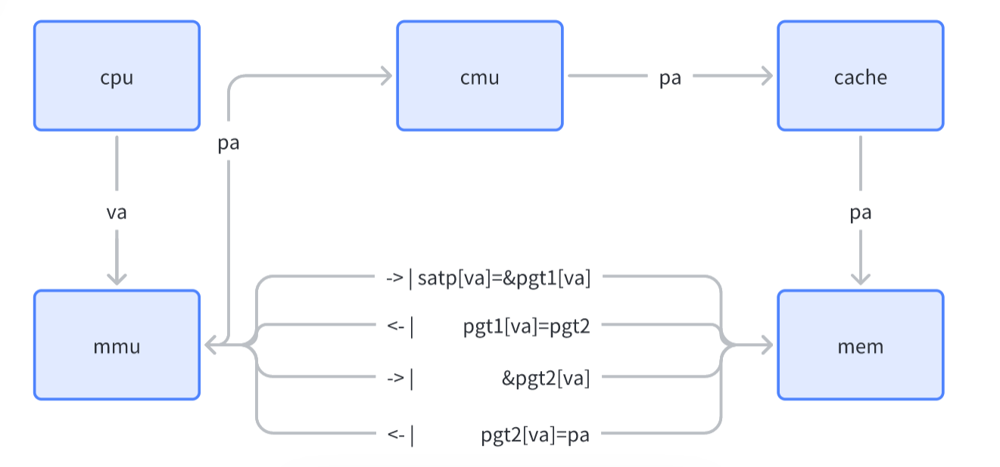

因此，PartX的基础要求是，你需要实现一个MMU，使得你的硬件设计可以支持你在软件部分的实验结果。你的MMU至少需要满足：

- 根据特权寄存器satp中的mode分别选择模式

- 支持Sv39和物理地址直接访问两种方式

如果你还有兴趣，你还可以考虑实现：

- 对访问权限的检查

- 实现TLB


## 扩展部分

### TLB

**页表**一般都很大，并且存放在内存中，所以处理器引入MMU后，读取指令、数据需要访问两次内存：首先通过查询页表得到物理地址，然后访问该物理地址读取指令、数据。为了减少因为MMU导致的处理器性能下降，现代CPU引入了TLB。

TLB是Translation Lookaside Buffer的简称，可翻译为“地址转换后援缓冲器”，也可简称为“快表”。简单地说，TLB就是页表的Cache，其中存储了当前最可能被访问到的页表项，其内容是部分页表项的一个副本。只有在TLB无法完成地址翻译任务时，才会到内存中查询页表，这样就减少了页表查询导致的处理器性能下降。

因此，PartX的进阶要求是，你需要实现一个TLB。你的TLB至少需要满足：

\* 直接映射组织方式

\* 支持至少两种TLB刷新——TLB miss和进程切换时的TLB刷新

如果你还有兴趣，你还可以考虑实现：

\* 实现组相连/全相连等其他组织方式

\* 通过ASID等方式减少TLB刷新


### 其他功能

本实验可基于系统三lab0 / lab1 / lab2中同学们所实现的代码进行。流水线以及kernel部分功能越完善，性能越好，功能越多，最终分数越高。其他可加功能有：

1. 在硬件框架中实现lab1中的分支预测部件 / lab2中的cache部件
2. 在软件框架中实现lab3中的用户态程序 / lab4中的用户态页表
3. 在mmu中实现tlb模块（要注意指令对于tlb模块的影响），要增加sfence.vma的控制逻辑。tlb有很多可以优化的地方，可自行搜索进行拓展
4. 加外设，增加一些有趣的功能（咨询徐金焱学长）
5. 其余想法（比如实在是做不出来以上内容了），请联系老师或助教


## 分数分配

| 实验结果                                         | 分数                         |
| ------------------------------------------------ | ---------------------------- |
| 完成64位流水线CPU，增加指令，实现MMU，运行kernel | 80分（必做部分，拿到基础分） |
| 分支预测模块，Cache模块                          | 完成其一20分，完成两个30分   |
| 在软件部分增加用户态，每个用户态分配独立页表     | 完成其一20分，完成两个30分   |
| 在MMU中实现TLB模块                               | 20分                         |
| 增加外设，增加一些有趣的功能                     | 20分                         |
| 其他想法，请联系老师或助教                       | 待评估                       |


## 注意事项

### Milestone

xpart实验将采取答辩的形式进行验收，答辩将在考试周之后7月6日进行，距发布日有五周的时间。**无特殊原因，结课答辩所有人必须参加**。

在第八周周四（6月15日）的实验课上，将对每组的实验情况进行中期验收，请确保你们至少完成了基础部分2/3的工作量。


### 小组合作

本实验允许小组合作完成，小组最多3人，也可独立完成。若小组合作完成，则需要讲清楚每个人的工作量和贡献，如果最终没有工作量的同学，分数会受到影响。